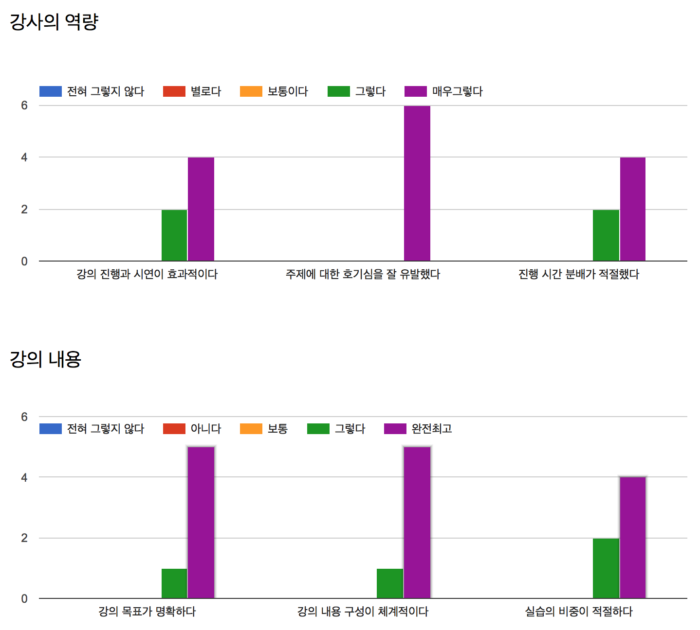
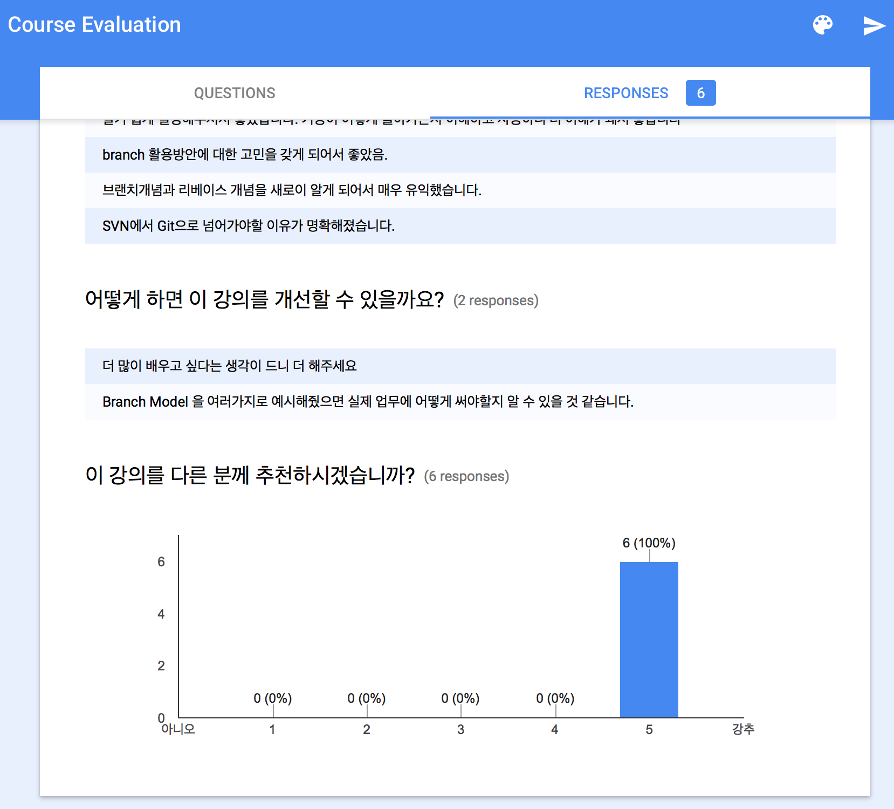

# Git Kickstart 발표 후기

제주에 살며 아쉬운 점 하나는, 개발 모임이나 행사가 거의 없다는 점이다. 서울에 살 때 개발 모임에 잘 참석하는 성격은 아니었지만, 갈 수 있는데 안 가는 것과 가고 싶어도 못 가는 것은 차이가 있다. 개발 모임에 대한 아쉬움이 커지던 차에, 이런 생각이 들었다.

> "누가 모임을 열어주길 기다리며 불평하지 말고, 내가 직접 모임을 열어보면 어떨까?"

그래 뭐 까짓거 한번 해보자. 생각해보니 진행해 보고 싶은 스터디 주제는 "클로저 프로그래밍"이지만, 그런 주제로 모임을 열었다가는 단 한 명의 참가자도 얻지 못할 것 같다. 그다음으로 해볼 만한 주제를 고민했더니, "Git 버전 관리 기초"가 떠올랐다. 개발자는 각자 자신이 선호하는 프로그래밍 언어나 프레임워크별로 세분(파편화)돼 있지만, 적어도 Git은 모든 개발자가 쓰는 현실이니, 공통분모로 삼아서 모임의 모수를 키울 수 있을 것 같다.

## 불필요한 완벽주의

막상 발표 공지를 내고, 자료를 준비하자니, 또 발표전 스트레스가 몰려왔다. 나름 Git에 관심이 많긴 하지만, 고급지게 잘 쓰는 수준은 아니다. 그리고, 평소 발표라 하면, 유명 인사의 키노트처럼 완벽한 수준을 기대하게 되는 것 같다.

> 과연 내가 이 주제로 사람을 모아 발표를 해도 되는 걸까?

근데 사실 뭐 이게 다 쓸데없이 눈만 높은 거다. 발표 역량을 놓고 보자면 내가 뛰어난 분들 만큼의 노력을 한 것도 아니고, 받쳐주는 천부적 재능이 있는 것도 아니면서 빼어난 수준을 기대하는 것부터가 지나치게 당돌한 거다.

그저 내 발표 역량 그대로를 편하게 바라보면 어떨까? 어차피 무료로 간단히 기초 실습을 하는 것뿐이다. 이거 잘했다고 누가 상을 주지도 않고, 못했다고 잡아먹지도 않는다. 제주 특성상 이런 모임을 여는 것 자체만으로도 칭찬받을 일이다. 발표라는 것도 결국 자꾸 해보고 노력을 해봐야 느는 거지, 가만 앉아서 "왜 또 이런 걸 한다고 나섰을까?"라며 후회하는 짓은 아무런 도움이 되지 않는다.

어차피 이런 완벽주의는, 나 스스로가 뭔가 대단한 사람이라는 착각에서 비롯되는 것일지도 모른다. 대단한 사람이니까 잘해야 한다는 착각인 거다.

## 참가 신청

모임 장소를 예약하고, 맥북용 HDMI 커넥터도 새로 샀고, 모임 공지를 냈다. 다행히 열 분 넘게 참가 신청을 했다. 한 분만 오셔도 진행할 마음이었지만, 생각보다 관심 가져주신 분이 많아서 더 의욕이 났다. 심지어 걱정도 들었다. 예약한 회의실은 15인 규모라서, 너무 많이 오셔도 곤란하니까 말이다, 풉.

## 발표자료 준비

예전에는 발표자료를 OS X의 키노트로 만들었다. 그러다 지난번에 [Netty 강의](https://medium.com/happyprogrammer-in-jeju/netty-기초-강습-후기-8ba4fdee2518)를 할 때는 [reveal.js]라는 웹 프레젠테이션 툴을 써봤다. HTML/CSS만으로 발표자료를 만들어 보일 수 있어서, 발표 참가자들도 즉석에서 각자 노트북으로 함께 보기에 좋고, 발표 후 자료를 온라인에 남겨 공유하기도 좋더라. CSS3 세상에 걸맞게 애니메이션도 훌륭했다. 슬라이드 본문을 마크다운으로 작성할 수도 있다. 그리고 결국 평범한 웹페이지니까, [GitHub Pages]에 올려놓으면, 누구라도 쉽게 접근해서 함께 볼 수 있다.

그런데 한 가지 아쉬운 점이 있다면, 이게 HTML을 기본으로 하고, 편의상 마크다운 문법을 지원하는 상황이라, 대부분은 일일이 HTML로 작성해야 한다는 게 불편했다. 슬라이드마다 별도 태그 블록으로 구분해야 하고, 그 태그 안의 내용이 마크다운으로 작성된 거라는 표시를 해줘야 한다.

그런데, 비슷한 툴인 [remark.js]는 더 편했다. 이것도 마찬가지로 HTML/CSS만으로 프레젠테이션 자료를 만들어 쓰는 툴인데, 마크다운 형식을 기본으로 쓴다. 마크다운의 `---` 표기를 슬라이드 구분자로 쓴다. 그리고, `.md` 파일도 아예 따로 분리해서 작성할 수 있어서, HTML/CSS/md 파일을 명확히 구분해서 쓰기 좋았다. 발표 자료 본문은 마크다운으로만 집중해서 쓸 수 있다.

[][remark.js]

와 좋다! 기본값으로는 슬라이드 전환 애니메이션이 없어서 좀 심심하지만, 사실 넣고 싶다면 CSS3로 살짝 처리하면 될 듯하다. 꼭 있어야 하는 것도 아니고, 제일 중요한 것은 본문 내용이니까.

## 발표 전날

늘 발등에 불이 떨어져야만 퍼포먼스가 나는 게으른 늑장쟁이라서 이번에도 여지없이 발표 전날이 돼서야 발표 자료를 완성했다. 밤에 제주에는 비도 많이 오고 거센 돌풍이 불었다. 저녁때부터는 항공편도 결항됐다고 한다. 밤은 깊었는데 창문이 돌풍에 흔들리는 소리가 거셌다.

매번 이렇게 뒤늦게 쫄려서 허둥지둥 준비할 바에야 다음부터는 미리미리 조금씩 준비하자고 마음먹기도 하지만, 마음대로 되는 적은 없던 것 같다. 그냥 이제 받아들이자. 그냥 난 발등에 불이 떨어져야 해내는 사람이다.

## 발표 날

발표 장소에서 리허설을 하면 좋은데, 장소를 마음껏 활용할 상황은 아니라, 두어 시간 일찍 가서 준비하려 했다. 그런데 아뿔싸, 이전 시간에 회의실이 사용 중이고, 열심히 회의 중이다. 발표 시간인 3시까지 꽉 채워야 회의실에 들어갈 수 있을 것 같다. 다음부터는 회의실 잡을 때, 모이는 시간보다 앞서 예약하자. 적어도 30분이나 한시간 정도, 혼자 준비할 시간을 확보하자.

발표 시간이 다 돼서야 회의실에 들어갈 수 있었는데, 스크린에 연결하는 케이블이 일반 VGA 케이블이었다. 꽤 최근에 만들어진 공간인데 HDMI가 아니라니... 이럴 수가... 다행히, 발표에 참석하신 한 분이 VGA 커넥터를 갖고 계셔서 그분의 맥프레로 발표 화면은 보일 수 있었다. 평소 발표할 일이 잦아서 발표용 커넥터를 들고 다니신다 한다. 대다나다! (그나저나, 난 괜히 값 비싼 HDMI 커넥터를 산 건가?)

몇 분은 못 온다는 말씀을 남겼고, 또 몇 분은 별다른 말씀 없이 불참하셨지만, 무려(?) 여덟분이나 참석해주셨다. 뭐 언제나 그렇듯, 참가한다는 "얘기" 자체는 크게 귀 기울일 필요 없다. 실제 참석하는 행동이 이뤄져야 진짜인 거니, 그전까지는 너무 의존해서는 안된다. 개인 사정은 여러 가지니까. 그래서 자리의 제한이 있는 모임은 적게나마 참가비를 받지 않던가? 정말 올 수 있는 사람만 신청을 받는 효과를 기대할 수 있으니 말이다.

어쨌든, 기대만큼 "완벽한(?) 발표"는 아니었지만, 그래도 그럭저럭 열심히 얘기했다. 참가자분들도 꽤 경청해 주셨다.

## 발표 끝

발표를 끝내고 질문도 받고, 마지막으로 참가자분들에게 미리 [구글 폼](Google Forms)으로 작성해둔 설문지 작성을 부탁드렸다.

질문이 모호한 데다, 아무리 익명이라도 얼굴 앞에서는 좋게 평가하게 되는 경향이 있어서, 더 솔직한 피드백을 받지 못해서 아쉽다. 그래도 해석해보자면, 강의 목표를 명확히 잡는 것과 호기심을 유발하는 것은 성공적이었지만, 시연하는 방법과 시간 분배는 조금 조정할 필요가 있겠다. (어떻게 조정해야 할지 답을 못 찾은 것은 질문 구성이 형편없었기 때문이다.)

결국, 발표의 성패는 마지막 질문의 결과로 미뤄 볼 수 있었는데, "친구에게 이 발표를 추천할지 말지"를 물어보면 된다. 다행히 강추하신다고 하니, 그럭저럭 발표는 잘한 것 같다. (설문에 불응하신 분들도 있다는 점도 참고해야겠다.)

### 잘한 점과 개선할 점

* 발표 자료를 꾸미는 일은 최대한 늦게까지 미룬 점.
* 구글 폼을 활용해 강의 평가 설문을 받은 것.
* 미리 발표 장소에 가서 발표 여건(장비)을 확인하자.
* 평가 설문내용을 다듬자.

예전에는 발표자료를 만들 때, 화려하고 예쁘게 만들겠다는 욕심이 앞서서, 내용보다 글꼴이나 색상을 고르는 데 많은 시간을 낭비했었다. 이번엔 애초에 그런 욕심(!)은 버리고, 내용만 작성하기로 마음먹었다. 어차피 내가 꾸며봤자 그다지 예쁜 슬라이드가 나오지는 않는다. 내용에 더 충실하자는 생각이 들었고, 이 점은 잘한 것 같다. 다음에도 이런 순서로 해야겠다. 발표 내용 먼저 완성하고, 마지막에 꾸미는 작업하기로.

또, 구글 폼으로 평가 설문을 받은 점은 좋았다. 뭘 하고 나면 피드백을 참고로 회고하는 것은 다음의 발전을 위해 중요한 일이니까 말이다. 다만, 다음에는 조금 질문을 다듬어서, 실질적 도움이 되는 따끔한(?) 피드백을 받을 수 있도록 하면 좋을 것 같다.

그리고 다음에는, 발표 장소에서 미리 가보고 장비를 확인하자. 발표 시간 앞뒤로 회의실 예약도 여유롭게 하고.

## 요약

* 완벽주의는 내다 버리자.
* 발표자료 만들기에 [remark.js] 좋더라.
* 강의평가서 받기에 [구글 폼][Google Forms] 좋더라.
* 뭐든 말보다 행동이 중요하다.

## 마무리

발표를 하다 보면, 재밌고 유익한 발표를 하고 싶다는 욕심이 생기는데, 그에 필요한 노력은 딱히 하지 않았다. 다음에 또 어떤 발표를 하게 될지 모르겠지만, 그런 기회를 또 만든다면, 완벽하지는 못하더라도, 이번 발표보다 조금씩 나아진 수준으로 나아갈 수 있기를 기대한다, 부디.

그럼, 이제 다시 일상으로 돌아가야지.

[GitHub Pages]: https://pages.github.com
[reveal.js]: https://github.com/hakimel/reveal.js/
[remark.js]: http://remarkjs.com/
[Google Forms]: https://www.google.com/forms/about/
