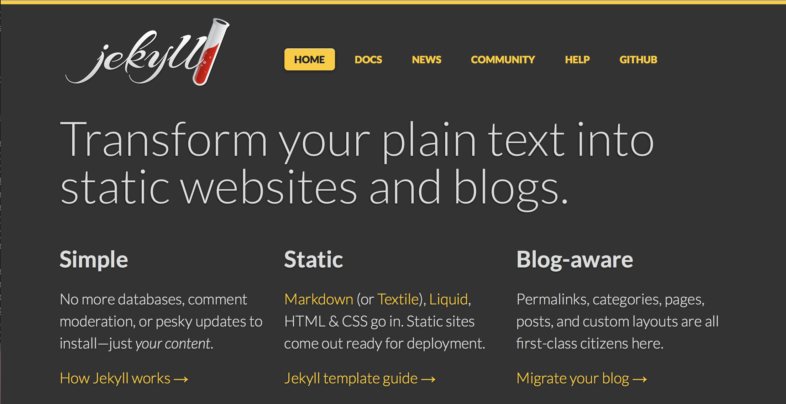
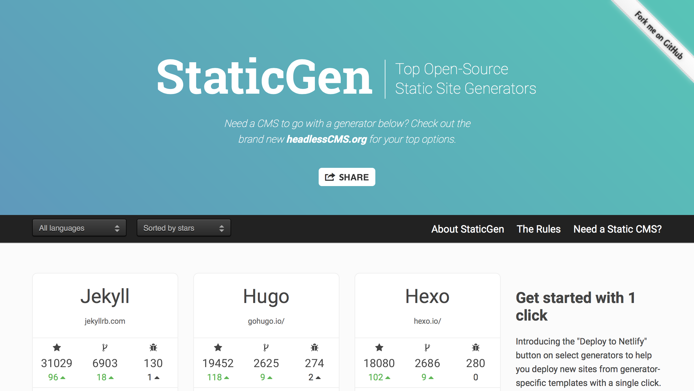
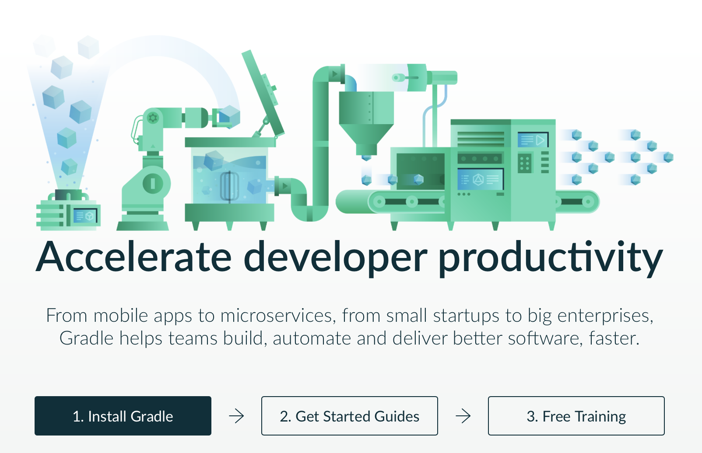
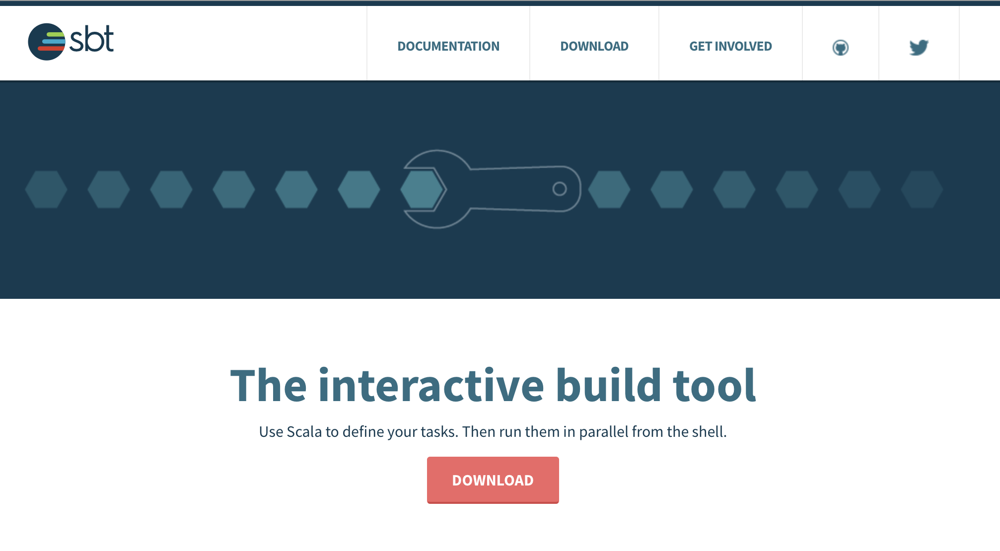
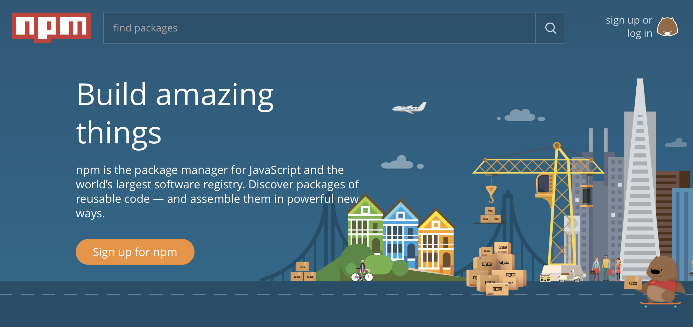
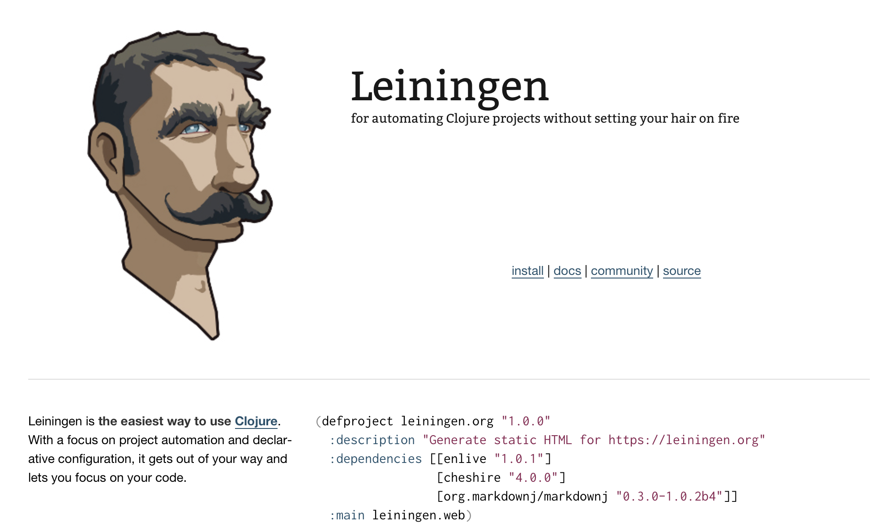
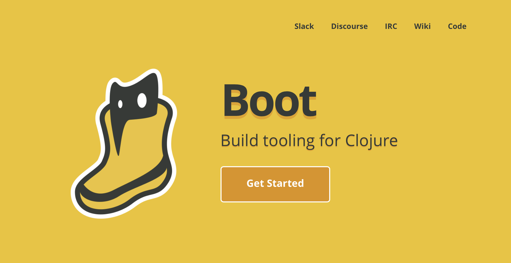
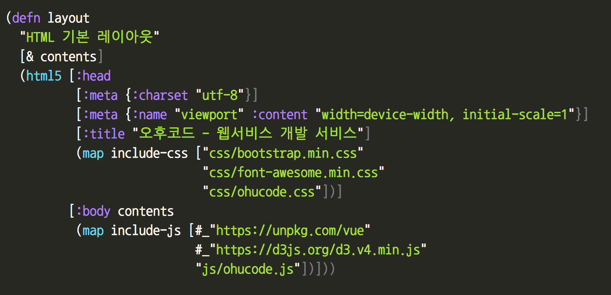
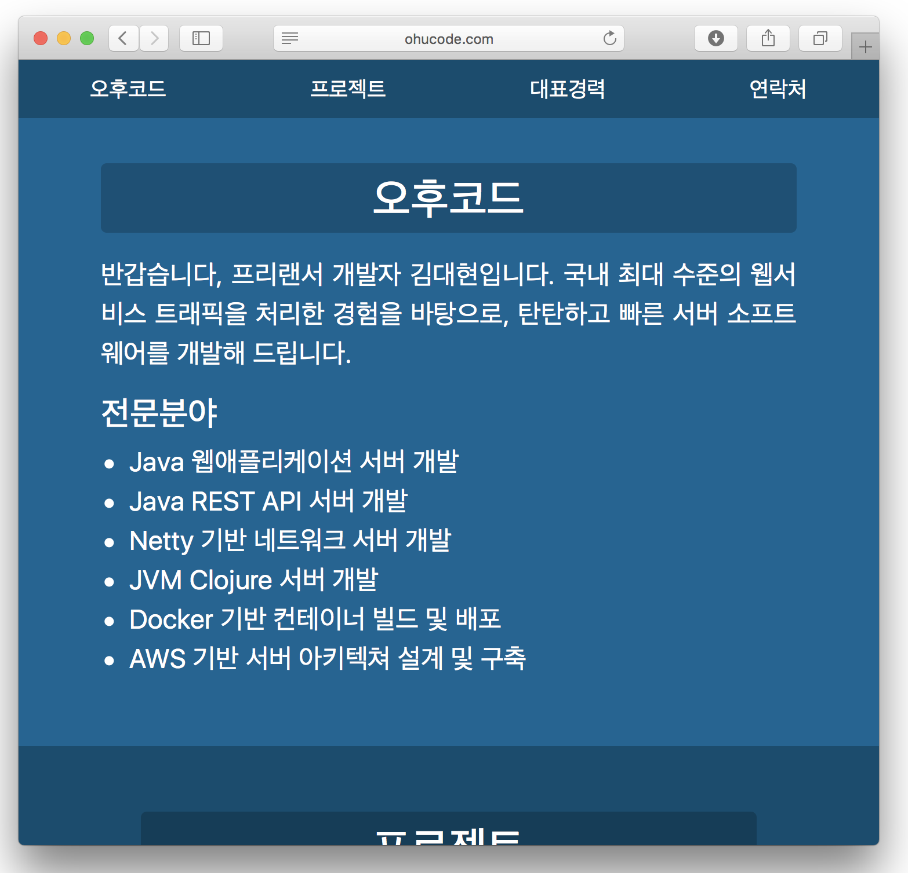

# 개발자가 글을 올리는 방법들

> 개발자가 블로그를 운영하든, 마구잡이 개발 노트를 남기든, 아니면 간단하게나마 웹 사이트를 만들어 온라인에 남길 때 마땅한 방법은 무얼까요? 이게 가장 좋은 방법이라 말할 수는 없지만, 최근 생각을 정리합니다. 읽어보시고, 여러분이 쓰시는 좋은 방법을 답글로 공유해주셔도 좋을 것 같습니다.

## 요약

* 개발을 주제로 한 글을 올리는 방법이 다양하지만 아쉬운 경우가 있다.
* Jekyll 같은 정적 사이트 생성기로 만들어서 쉽게 온라인에 올려둔다.
* 음? 그런데 가만 보니 정적 사이트 생성기가 하는 일을 보통 빌드 툴로 해도 되겠다.
* Clojure 환경의 빌드 툴인 boot를 써서 개인 웹사이트를 만들어 봤다.
* 결국 개발자들은 자기가 주로 쓰는 언어 환경의 빌드 툴로 웹사이트를 만들어도 좋다.

## 개발자가 글을 올리는 평범한 방법들

1. 트위터나 페이스북에 단문 남기기
1. 티스토리, 미디엄 등 전문 웹사이트 서비스 이용
1. 워드프레스 같은 엔진등을 써서 직접 구축 운영
1. Jekyll 같은 정적(static) 웹 사이트 생성기 사용

개발자가 글을 공유하는 여러 방법 중, 먼저, 간단하게 SNS이용하는 방법으로 트위터나 페이스북 등에 가벼이 링크나 글을 남기는 것이 가장 쉽습니다. 가볍게 짧은 글이나 링크를 남기고 공유하고 소통하기는 참 편리합니다만, 긴 글이나 오래 남겨두었다가 다시 보기에는 부적절하지요. 그저 그냥 타임라인에 흘러가는 데이터로 적합해 보입니다.

두 번째로, 전문 서비스 업체가 운영해주는 블로그 서비스등을 이용하면 긴 글을 남기기 좋아보입니다. 비교적 오래 데이터가 유지되고, 그럭저럭 검색해서 찾아볼 수 있죠. 아쉬운 점은, (1) 뭔가 웹 개발을 공부하다 데모로 직접 HTML/CSS/JavaScript 등을 건드려서 보여주려면 제약이 있고, (2) 무엇보다, 서비스 주체의 생명이 생각보다 짧다는 점입니다. 대개는 우리가 글을 쓰려는 기간보다, 서비스 유지 기간이 짧은 것 같습니다.

툭하면 접어요.

세 번째로, 블로그 엔진 등을 써서 직접 구축하는 방법도 빼놓을 수 없습니다. 이미 잘 갖춰진 엔진에 기능들을 자유롭게 붙여가며 표현할 수 있겠지요. 만약 워드프레스를 쓴다면, 기본을 공부하고, 누군가 잘 만들어 놓은 테마나 플러그인 같은 것들을 잘 골라서 조합하면 훌륭한 결과를 뽑을 수 있을 것 같습니다. 다만 아쉬운 점은, (1) 잘 갖춰진 엔진을 고르고 익히는 노력도 만만치 않다는 점. (2) 그걸 어딘가 올려서 운영하는 일이 아주 번거롭다는 점이 문제입니다.

에잇, 귀차나 귀차니즘

네 번째로, 정적 사이트 생성기를 써서, HTML문서를 편하게 만들어 내서, GitHub Pages나 Netlify 같은 서비스에 얹어 놓는 방법이 있습니다.  제 경우 개인 웹사이트를 만들어 올릴 때는, 일방 소통도 괜찮은 것 같습니다. 어차피 별다른 피드백이 없는 경우가 많고, 혹시나 양방향으로 무언가 사용자의 액션을 남기거나 로그인 처리를 한다거나 하는 등의 처리를 서버사이드에서 직접 할 필요는 없습니다. 댓글 남기는 기능이나 공유하는 기능 정도가 필요할 텐데, 그런 일반적인 기능들은 Disqus등의 서비스로 붙일 수 있으니, 개발자가 직접 백엔드 서비스를 운영할 필요는 없잖아요. 그러니, 아예, 로컬 머신에서 각자 편한 툴을 써서 HTML 페이지를 다 생성해 두고, 온라인에는 파일로 올려두는 방법인 거지요. 정적(static) HTML 페이지만 올려두면 되기 때문에 간단하고, 오래가고, 경제적(무료)입니다.

## Medium도 좋더라

저는 앞서 언급한 방법 중에, 지금 보시는 Medium을 쓰고 있습니다. 장문의 글을 남기기도 편하고, 검색도 잘 되고, 외부 서비스와 연동도 잘되며, 한국 이용자도 많기 때문에, 제 재미 없는 글에도 과분히 많은 분들이 읽어주시고, 피드백도 주십니다. 통계 기능도 잘돼 있어서, 어떤 글이 얼마나 좋은 반응을 보이는지도 잘 드러납니다.  글을  편집하는 툴도 매우 훌륭하고, 창업자의 서비스 철학도 훌륭하다 생각해서, 앞으로도 꽤 흥할 서비스라고 생각합니다.

더불어 국내판으로, 카카오에서 개발 운영하는 브런치(https://brunch.co.kr) 서비스가 더 훌륭할지도 모릅니다. 다만, 개인적인 경험상, 서비스 주체(회사)의 주 수익원과 거리가 먼 서비스일수록 추진력을 잃는 걸 몇 번 목격해서, 미디엄에 비해 오래가지 못할 것이라고 생각하기에 안쓰는 것 뿐입니다. 그래도 어차피 한글로 글을 쓰고 한국 사람들과 소통하는 상황이니 브런치가 더 좋아보이기도 합니다.

그러나, 미디엄이나 브런치도 언젠가는 서비스를 접겠지요? 그때가 되면, 분명 이용자들에게 본인의 글을 한꺼번에 백업받을 수 있는 방법을 제공하겠지만, 그걸 내려받아서 또 어딘가에 나름의 방법으로 올리는 것도 아주 부지런해야 할 수 있는 일이니 그것만 믿고 있을 수는 없습니다. 그래서 저는, 제 랩탑에서 제게 젤 편한 텍스트 에디터로, 마크다운(markdown) 포맷으로 글을 마구 적어서, GitHub에 올려둡니다. GitHub은 마크다운 문서를 HTML로 렌더링해서 보여줘서 편합니다. 내게 편한 텍스트 에디터로 본문을 작성해서 기본적인 맞춤법 검사를 하고 퇴고를 마치면, GitHub에서 보여주는 포맷을 그대로 복사해서 미디엄에 붙여넣습니다. 이미지 파일도 따로 올리지 않고도 복붙이 잘 돼서 꽤 편리합니다. 이러니, 언젠가 미디엄이 없어져도 전 별도로 Markdown 문서를 이미 잘 보관하고 있으니, 어딘가 다른 곳에 이동하는 것이 상대적으로는 쉽지 않을까 기대합니다. 사실 미디엄 정도의 서비스가 쉽게 접지는 않겠지만, 불안한 마음을 줄일 수 있는 보험인 거지요.

## 정적 웹 사이트를 만드는 방법 1

대부분 미디엄을 쓰는 것으로도 충분해 보입니다만, 때로는 직접 웹 사이트를 만들어야 할 때도 있습니다. 예를 들어, 어쩌다 D3.js로 나만의 데모 웹 페이지를 보이고 싶은데, 미디엄에서 기본으로 지원하지 않는다면 말이죠. 사실, 미디엄에 직접 보이지 않고도, 필요한 기능을 제공하는 외부 사이트에 올리고, 미디엄에는 캡처한 이미지와 링크를 걸면 충분한 경우가 많습니다만 말이죠.

이럴때, 정적 사이트 생성기를 이용하면 좋은 것 같습니다. 앞서 언급한 GitHub Pages는 `Jekyll`이라는 툴을 기본으로 지원해서, 이 경우 GitHub 저장소에 `Jekyll` 기반 소스파일만 올리면(git push) 깃헙이 알아서 HTML 파일까지 자동으로 변환해서 웹사이트로 만들어주니 매우 편리합니다.

혹시나 루비 언어를 바탕으로 하는 Jekyll이 마음에 들지 않는다면, 다른 정적 사이트 생성기 중에 마음에 드는 걸 골라서 써도 됩니다. 워낙 많기 때문에, 내가 즐겨쓰는 프로그래밍 언어로 만든 생성기 중에서 고른다면, 무언가 조금 고쳐써야 할 때에 큰 어려움 없이도 작업할 수 있겠습니다. 아니면, 내가 새로 익히려고 하는 언어의 생성기를 쓰면서, 새 언어에 더 익숙해지는 것도 좋은 방법입니다. 생성기가 하는 일이 워낙 뻔하니까 어려운 내용은 없을 거고, 적당히 도전적으로 새 언어를 익혀보는 방법의 하나인 거죠.

* <https://www.staticgen.com>

한 번 들어가 보세요, 정말 많죠?

## 정적 웹 사이트를 만드는 방법을 달리 해보자

이미 잘 만든 생성기를 사용해서, 유용한 플러그인을 추가하며, 없는 플러그인은 직접 플러그인을 만들어서 작업하는 것이 "웹 사이트를 만드는 방법"으로는 가장 효과적일 테지요. 그런데, 적절한 툴을 고르기 힘들고, 막상 선택한 툴이 어떤 기능을 제공하지 않거나, 마땅한 플러그인도 없어서, 건드릴 코드 분량이 많다면, 그리고 전체 구조를 쉽게 파악하기 힘든 상황이라면 어찌할까요?

저는 클로저를 공부하면서, 클로저로 된 정적 생성기를 찾아봤습니다. 꽤 좋은 생성기들이 있어서 그 중 아무거나 골라도 꽤 좋은 선택일 것 같았습니다. 그러다가 한편 다른 생각이 들었습니다.

사실 정적 생성기를 만드는 작업은 기본적으로 문서를 변환하는 작업입니다. HTML 문서를 직접 일일이 작성하려면, 다소 장황하고 불필요한 중복 작업이 많이 발생하기 때문에 번거로우니, 그 중복을 줄이고 간단한 포맷으로 작성하기 위해 마크다운이나 다른 선호하는 포맷의 문서로 작성한 다음에 변환하는 거잖아요?

소스파일(.md) -> 목적파일(.html)

이런 상황인데, 이 상황이 가만 보면 꽤 익숙합니다. 뭐냐면, 우리가 프로그램을 작성하면서 늘 하는 일이,

소스파일(.java) -> 목적파일(.class)

처럼 컴파일하고 빌드하는 작업과 마찬가지 상황인 거죠. 다만, 소스와 결과의 포맷이 다를 뿐, 그 행위의 흐름은 꽤 일치합니다. 그러면, 이럴 때 쓰는 강력한 도구들이 이미 있잖아요? Java환경이라면 maven이나 gradle들이 있고, Scala라면  sbt,  Node.js라면 npm, 제가 쓰는 Clojure라면 leiningen이나 boot가 이미 강력한 관련 기능을 모두 담고 있고 완성도가 높단 말이죠. 패키징하거나 배포하는 작업들도 기본 지원하거나 이미 플러그인이 잘 나와 있고요.

https://maven.apache.org

https://gradle.org

http://www.scala-sbt.org

https://www.npmjs.com

https://leiningen.org

http://boot-clj.com

그렇다면, 정적 웹사이트 생성기를 하나 골라서 익히고 플러그인을 찾아 쓰는 수고 대신에, 내가 평소 쓰는 빌드 툴에 플러그인을 넣어서도 만들 수 있는 거 아닌가요? 어차피 만날 하는 개발 작업에 꼭 쓰는 빌드 툴을 쓰는 거니 이미 (상대적으로) 익숙한 작업이잖아요. 대신 전체 글 목록, 태그 클라우드, Atom 피드를 만드는 작업 같은 건, 라이브러리를 쓰든 직접 코딩을 하든, 만들어 붙여야 하는 단점이 있지만요.

## 클로저와 boot로 웹사이트를 만들어 보니

직접 만들어야 할 게 많아서 수고롭긴 하지만, 그래도 한번 만들어 보는 것도 재밌겠다 싶어서, 클로저의 빌드 툴 중 하나인 boot를 써서 웹사이트를 생성해 봤습니다. 클로저에서 HTML 문서를 생성하는 라이브러리 중 하나인 hiccup을 써서, 클로저 기본 자료구조 (vector, map, list 등)을 써서 문서를 표현하고, 그걸 hiccup의 `(html)` 함수로 간단히 HTML 문서로 변환합니다.

그렇게 제 개인사업자 웹페이지를 간단히 만들어 봤습니다. 아래는 hiccup으로 표현한 (그래서 평범한 클로저 자료 구조인) HTML 레이아웃 코드입니다.

클로저 문법에 생소하신 분들이 많겠지만, 간단히 요약하면 어떤 HTML 본문을 감쌀 HTML5 골격입니다. 평범한 클로저 코드로 표현한 것이기에, 중간중간, 클로저 문법 그대로 편하게 표현하는 부분이 있습니다. 템플릿을 위한 별도의 언어를 익힐 필요가 없지요. 게다가 이 레이아웃 코드 자체가 스스로 평범한 클로저 함수이기 때문에, 다른 코드와 엮어서 쓰는 것이 편합니다. 이 방법이 제일 좋다는 주장은 아니고, 단지 본인이 각자 좋아하는 프로그래밍 언어환경에서 가장 선호하는 템플릿 엔진을 골라서 쓰기 좋다는 뜻입니다.

아주 간결한 문법으로 단순한 구조적 문서를 만들 수 있는 마크다운(markdown)을 좋아하는 개발자가 많습니다. 저도 물론 마크다운 너무 좋아합니다. 저는 마크다운의 기본 철학을, "이메일에 평문을 쓰듯 텍스트를 적으면서 아주 간단게만 꾸미고, 조금 복잡한 꾸밈이 필요하다면, 그냥 HTML 태그를 직접 넣으라"는 것으로 이해했습니다. 기본적으로 HTML을 목표로 하는 것까지도 좋습니다.

그냥 그대로 써도 되는데, 그냥 단순한 문서에서 약간의 처리를 더하려고 하니, 마크다운 문서를 파싱한 내용을 조금 건드리면 좋을 것 같았습니다. 그래서 마크다운 파싱 결과를 직접 조작해 보면 좋을 거 같습니다. 생각해 보니, [작년에 Tufte-CSS를 적용하기 위해 마크다운 파서를 직접 만들었던 작업](https://medium.com/happyprogrammer-in-jeju/마크다운-파서-만들기-4-마무리-및-회고-a63dd9ef3a33)이 기억납니다. 그때는 클로저스크립트 버전으로 만들어서 웹 브라우저에서 곧바로 돌렸지만, 지금 로컬에서 클로저로 돌려도 하등 문제가 없는 코드입니다. 그래서 그 마크다운 파서를 조금 손봐서, 모든 큰 제목을 뽑아 HTML의 `<section>`태그로 나눠서 구성하도록 만들었습니다. 그때는 마크다운 문서를 파싱해서 곧바로 HTML 문자열을 찍어냈는데, 이번에는 hiccup 표기용 클로저 자료구조로 변환했습니다. 그러면 클로저에서 뭔가 다른 변환작업을 하기도 편리하더라구요. 그다음 hiccup한테 최종 HTML문서를 만들어달라 요청했고요. 재미삼아, 보통 마크다운 파서에는 없는 커스텀 마크업 `@fa{send}`을 추가해서 폰트어썸(FontAwesome)의 아이콘을 추가해 보기도 했어요.

그렇게 만든 사이트의 화면입니다. 첫페이지의 전체가 `index.md` 파일 하나로 부터 생성됩니다.

<http://ohucode.com>

## 마무리

어떠신가요? 개발자가 웹사이트를 만드는 방법의 하나로 제안한, 그냥 프로그래밍 빌드툴을 써서 직접 HTML 웹사이트를 생성해 내자는 이야기, 할 일이 많을 것 같지만, 그래도 재밌을 것 같지 않나요? 적어도 저는 당분간 좀 더 파 볼 것 같습니다. 클로저와 boot로 찍어내는 개인 웹사이트인 건데, 앞으로 간단한 블로그 엔진이나, 나름의 사이트를 만드는 데 활용하기 좋을 것 같아요. 보통의 글은 지금처럼 미디엄에 쓰고, 간혹 웹페이지 데모가 필요할 때만 별도 사이트로 튕겨도 좋을 것 같구요.

긴 글 읽어주셔서 고맙습니다. 의견 있으시면 편하게 댓글 남겨주세요.
