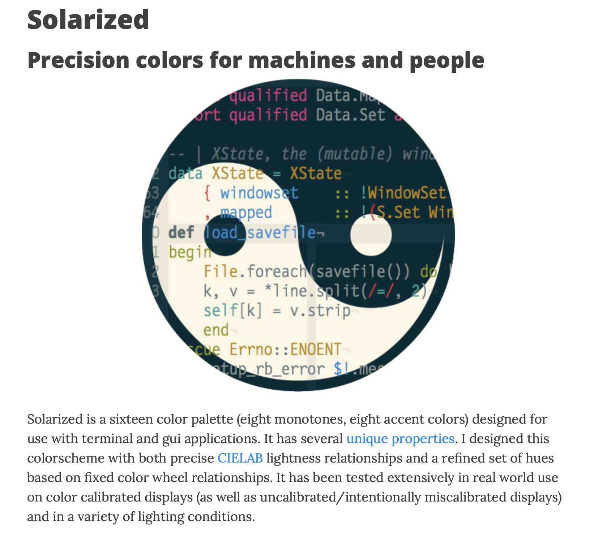

# ColorLog - "로그 파일 색칠러" 개발기

톤 앤 매너. 이야기하듯이.

배운점
-------
- Go언어 리눅스/맥 배포에 딱 좋다.
- 절차형이 꼭 나쁘다는 건 아니다.
- CLI 앱에는 Go가 최고인듯 하다
- ANSI 256 색상 테이블
- 색상 고르기 어렵다

흥밋거리
-------
- 모래 사장에서 바늘찾기. 그런데 찾는다.
-

행동유도
-------
- 절차형과 화해하자.
- 함수형을 배워보자.
- 미디엄 좋아요와 깃헙 Star를 누르라.

할 얘기
---------

> 다섯 살 딸아이가 빠져있는 놀이는 아빠랑 같이 엘사 공주 색칠하기입니다. 한가지 색깔로 너무 많이 색칠하면 안되고 최대한 다양한 색깔로 알록달록 칠해야 혼나지 않습니다.

다시 서비스 운영을 하게 됐습니다. 개발하는 순간에는 디버거가 유용하지만, 이미 운영 중인 서버 시스템에는 로그 파일의 내용을 바탕으로 사후 디버깅을 하게 되죠. 그래서 로그를 너무 적게 찍으면, 나중에 문제를 추적해서 문제 상황을 추릴 재료가 없게 되고, 반대로 너무 많이 남겨두면 노이즈가 많아서 유용한 정보를 거르기 힘드니 그 분량을 잘 조절해야 하겠습니다.

아무튼, 저같은 서버 개발자는 아무래도 서버에 남겨둔 로그 파일을 뒤지거나, 아니면 지금 서버 프로세스가 남기고 있는 로그를 계속 따라가며 보는 일이 잦습니다. 며칠 전, 한 팀 동료 자리에서 운영 중인 시스템의 로그 파일을 째려보다가, 새삼 눈이 아팠습니다. 동료의 모니터는 일반 쭈끄리 모니터였기 때문이라 여겨져, 제 레티나 모니터가 자랑스럽기도 했습니다.

4K 모니터는 개인 돈으로 살만 하다. 아깝지 않은 투자다.

그런데, 꼭 해상도의 문제는 아닌 것 같기도 합니다. 90년대스러운 흑백의 로그를 보면서 공백, 따옴표, 대괄호 등으로 경계를 끊어서 어디가 어떤 부분인지 보기가 힘들었습니다. 프로그램 소스코드도 단색으로 작성하는 사람이 요새도 있습니다만, 전 적어도 다양한 색으로 구분된 코드가 아니면 코딩 불능 상태에 빠지는 사람인 것 같습니다. 칼라풀한 소스 코드처럼 로그 텍스트도 좀 특정한 구분별로 색상을 나눠주면 어떨까요?

프런트엔드 개발자들은 크롬 개발자 도구에서 깔끔하게 떨어지는 콘솔 로그를 보며 개발하는데, 제 주변 백엔드 개발자들은 왜 그토록 단색 텍스트를 스릉하는지 답답하게 느껴지기까지 했더랍니다.

그래서,...

까짓 거 하나 만들었습니다. 이름하여....

## 로그 파일 색칠러

제가 흔히 보는 로그 파일은 nginx가 찍는 HTTP/S 접근 로그와, 자바 애플리케이션이 찍는 애플리케이션 로그입니다. 로그 파일에 남기는 주요 정보는, 시간 / 숫자 / IP / User-Agent처럼  따옴표로 묶은 문자열 / UUID / JSON 데이터 등이 있습니다. 시간이랑 IP 정도만 구분해서 보여줘도 한결 눈이 편해질 것 같습니다. 로그 텍스트가 마치 소스 코드인냥, 문법 하일라이팅을 해보는 거죠. 차이가 있다면, 소스 코드는 문법이 딱 정해져 있지만, 로그 파일은 그저 사람이 보는 아무런 형식의 텍스트라는 건데요, 어쨌건 문법 강조기능은 사람이 보기 편하게 한다는 점에서 동일합니다.

아마, 이럴 때 쓰는 프로그램이 어딘가 더 좋은 게 있을 겁니다. 그래도 한번 만들어 보기로 했습니다. 직접 만드는 게 평소 컨셉이라 허풍치면서 말이죠. 이 기회에 드디어 Go언어를 써보기로 합니다. Go언어로 작성해서 빌드하면 제가 원하는 OSX와 리눅스용 바이너리를 쉽게 만들 수 있고, 별도의 의존성 없이 실행 파일만 복사하면 되니 참 매력적입니다. 흔히 이런 단순한 텍스트 처리에는 스크립트 언어가 제격인 것 같지만, 인터프리터를 깔고 의존성을 맞춰주는 것이 참 번거롭습니다.

하지만, Go언어는 컴파일한 실행 파일만 떨렁 복사하면 끝!

> 개발을 시작할 무렵, 이참에 본격 함수형 프로그래밍 언어인 Haskell을 배워보며 해볼까 고민했지만, 그래도 Go로 결정했습니다. 안그래도 최근 절차형 개발로 실무를 하느라 함수형 프로그래밍에 대한 향수가 짙은 마당이라, 더 향수병이 도질 것 같아서 말이죠. 이참에 아주 절차형의 끝을 봐 봅시다.

때마침 잦은 야근 중 대기 시간이 많았고, 그 시간을 이 프로그램을 뚝딱뚝딱 만들며 보냈습니다. 대기 시간에 일을 더 하면 바람직하겠지만, 이미 저녁시간까지 종일 일만 했는데, 야근 대기 시간마저 일하기가 싫었습니다.

싫어! 싫다구!!!!

이 시간엔 자기계발로 소프트웨어 개발을 하겠어! 이어서, 이렇게 만들기 시작한 "로그파일러 색칠러"를 만든 과정을 공유할게요.

### 1단계. 첫 도전

제가 다루는 로그 텍스트는 줄 단위이기 때문에 우선 줄 기준으로 자릅니다. 그다음, 그 줄을 공백으로 짤랐습니다. 그래서 나온 여러 문자열들을 각각 정규 표현식으로 검사하는 방법으로 처리했지요. 그렇게 0.0.1버전을 만들어서 제가 다루는 시스템에서 로그를 찍어봤습니다. 그럭저럭 다양한 색으로 나옵니다. 같은 팀 친구자리에 놀러가서 써보라 했습니다. 그 친구의 nginx 로그를 보니, 아직 색칠하지 못하는 부분이 많습니다. 무엇보다, User-Agent에는 공백문자가 중간중간 들어가 있어서, 한눈에 보기가 (정확히 말하자면 한눈에 안 보고 건너 뛰기가) 쉽지 않습니다. 그래도 그럭저럭 쓸만해서 만족스럽습니다.

### 2단계. 따옴표를 묶자

방금 드러난 문제를 해결하려면, 줄에서 단어를 추릴 때, 공백 문자로 추리면 불편합니다. 어떻게 할까 잠시 고민하다, 한 줄 단위로 토큰을 자를 수 있는 스캐너를 만들기로 합니다. 스캐너를 짜려니, lex같은 스캐너 제네레이터를 써야 할 것 같아서, Go에서 쓰는 스캐너가 뭐가 있나 좀 찾아봤습니다. lex처럼 별도의 문법 텍스트를 작성한 걸 기준으로 Go 소스파일을 생성해 내는 방식이 있고, 아니면 Go 문자열로 문법 구문을 작성하는 방식이 눈에 띄었습니다. 하지만, 양쪽 다 제가 하려는 단순한 일에 비해서는 복잡해 보이는 군요.

그래, 뭐 별 것도 아닌데 스캐너 그냥 한번 짜보자. 그래서 한 줄 내에서 원하는 토큰으로 자를 수 있는 스캐너 코드를 작성합니다. 함수형 스타일로는 어떻게 짤까 궁금하기도 했지만, 전 다행히 절차형의 끝을 보기로 했습니다. for루프에다가 case문을 떡칠하고 심지어 레이블까지 달아서 점프를 해댑니다.

학창시절 컴파일러 수업시간에나 해봤을 법한 한땀한땀 수제작한 스캐너입니다. 한번에 제대로 돌리가 없는데, 워낙 간단한 스캐너라서인지 그래도 몇 번만에 잘 돌기 시작합니다. 지극히 절차형 접근이었지만, 절차형의 장점이 있기도 했습니다. 큰 범위에서 자칫 한 수 틀리면 크게 어긋나기에 완전히 집중해서 코딩하느라 몰입도가 높았습니다. 진정 이게 장점인지 모르겠지만, 그래도 그냥 장점이라 여기고 계속합니다.

수제작한 스캐너는 단순히 공백으로 자르는 게 아니라, 따옴표가 시작되면, 따옴표가 끝날 때까지, 그리고 중괄호류가 시작되면, 그 중괄호류가 끝날 때까지, 그리고 중첩해서 열렸다면, 중첩이 모두 닫길 때까지 읽어서 토큰을 나누었습니다.

이제 처음 기대했던 수준보다 꽤 우수하게 나왔습니다.

### 3단계. 색깔을 고르자.

처음에는 기본 텍스트 16색상 팔레트에서 골라서 이리 저리 찍어봤습니다. 16색상 중, 글자색으로 쓸 수 있는 색상 수는 많지 않고, 고르기도 힘들었습니다. 그래서 보통 문법 하일라이팅에 쓰는 전문적인 색상셋트를 기웃거려봅니다. 게다가 요새 터미널은 기본 256색 다 쓰고 심지어 트루컬러로 쓰기도 하잖아요? 256색상 기준으로 접근합니다. 평소 Emacs나 vscode에서는 다른 테마를 쓰지만, 이번엔 solarized 색상셋이 눈에 띄었습니다.

밝은 색 배경과 어두운 색 배경 둘 다에서 그럭저럭 잘 구분되는 색상으로 구성했다는 점이 특히 매력적이었습니다. 그렇다면 저로서는 밝은 배경과 어두운 배경을 구분하지 않고 한 종류의 색상세트로 처리할 수 있으니 좋았죠.

어썸! 전 이 중에서 그냥 골라쓰면 되는 겁니다.

### 결과

색칠러 적용 전

색칠러 적용 후

### 한계

그럭저럭 만족스러운 결과에 뿌듯합니다. 그러나 한편으로는, 다른 분들께는 이렇게 색칠을 한 것이 더 눈이 아플지도 모르겠습니다. 그저 단색으로 보는게 눈의 피로가 적을지 모르고요. 또, `tail`이나 `grep`을 걸 때마다 일일이 파이프로 `cl`을 거는 것도 꽤 번거롭습니다.

게다가 색상으라는 것은 개인의 취향이 꽤 다양하기 때문에 여러 색상테마를 지원해야 할 것 같습니다.

### 배우거나 느낀점

최근 연일 야근에 피부가 퍼석이다가, 잠깐의 사이드 프로젝트로 세로토닌이 마구 샘솟는 작업을 했습니다.

지극히 절차형으로 개발해봤고요. 함수형이나 절차형이나 결국 원하는 일을 잘 하면 되는 겁니다. 그리고 절차형과 함수형은 결국 우리가 쓰는 "보편 만능의 기계"를 다루는 모델이고, 그 기원인 튜링 머신과 람다 대수는 상호 호환 된다고 이미 오래 전에 위대한 알란 튜링이 증명해 둔 게 아니던가요? 두 스타일 중 어느 쪽이 할 수 있는 일이면 정확히 다른 쪽에서도 할 수 있다고 말이죠.

암튼, 함수형 추종자 입장에서는 절차형 접근과 화해해야 하겠습니다. 절차형 접근 중심의 분들이 함수형을 조금 다뤄보면 좋은 것이고, 안 한다고 화를 낼 일은 아닌 거죠. 그리고, 어차피 업무 환경은 지극히 절차형이기 때문에, 저 역시 함수형하겠다고 삐뚫어지면 아니되겠습니다.

허허허.

그리고, 작게는 Go언어의... 아니 Go 툴셋의 강점을 확실히 느꼈습니다. 제 로컬 맥 머신에서, 별다른 지식이나 설정 없이도, 아주 손쉽게 리눅스용 바이너리도 만들어 낼 수 있는 점은 분명 큰 매력입니다. 단 하나의 실행 파일을 복사하는 것으로 배포가 끝나는 게 너무 좋습니다.

### 결론

자, 그럼, 평소 로그 파일을 자주 보는 백엔드 개발자 분들은 한 번 받아서 써보시는 겁니다. 마음에 들면 아래 깃헙 프로젝트에 Star도 좀 눌러주시고요, 이 미디엄 글에도 박수쳐 주세요.

그리고, 무엇보다 좋은 의견 있으시면 부담없이 말씀해 주세요. 고맙습니다.
