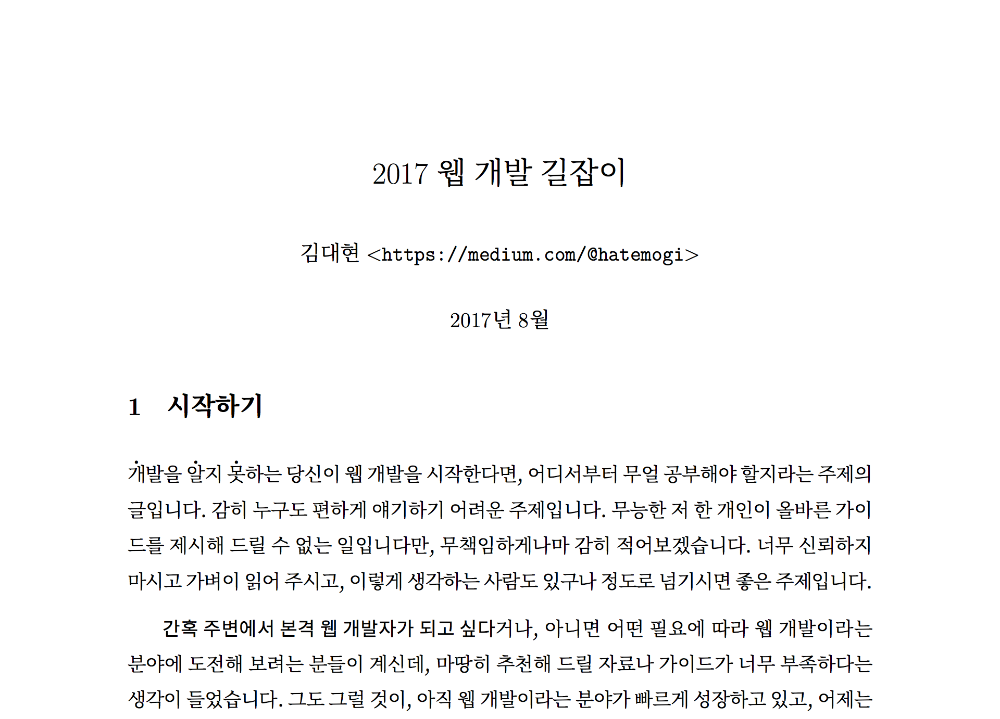
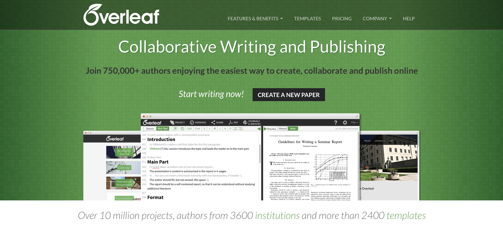
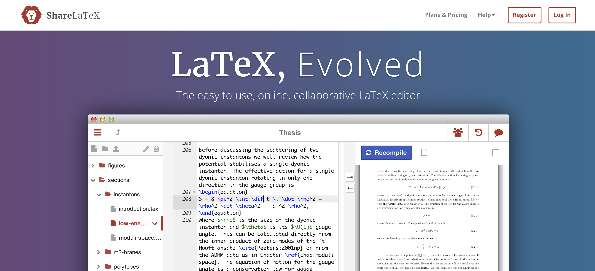
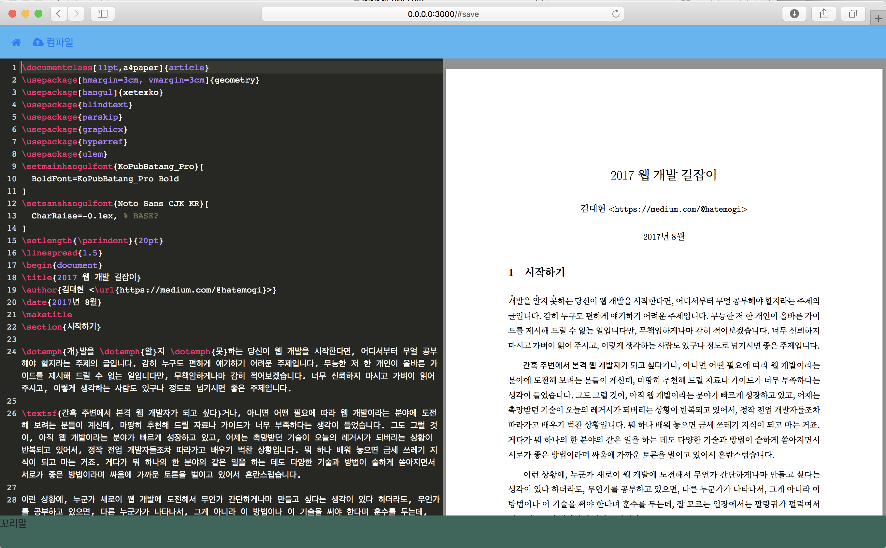
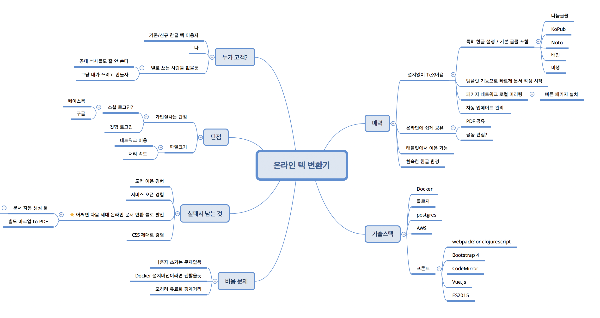

# 한글 텍(xelatex) 빌드 웹 서비스 아이디어

TeX은 글을 책 등의 출력물로 만들기 위한 조판 시스템입니다. 보통 보고서 정도를 쓰는 워드프로세서는 우리에게 익숙하지만, 조판 시스템은 단어 자체가 생소합니다. 워드 프로세서는 글의 내용이 주연이고, 그걸 예쁘게 종이나 책으로 찍는 게 조연이라면, 조판 시스템의 경우 어떤 글을 "예쁘게" 책으로 만들어 내는 게 주연이라는 점이 다른 것 같습니다.

때문에, 출판 업계에 있지 않은 우리 일반인들에게는 사실 "조판 시스템"이라는 건 접할 일도 없고, 쓸 필요도 별로 없습니다만, 연구 결과의 발표 시기가 중요한 과학 논문을 쓰는 학자들이, 스스로 조판을 해서 조판 과정과 절차를 생략해 빠르게 결과물을 내기 위해 이 TeX이라는 시스템을 쓴다고 합니다. 보통 텍(TeX)을 더 편리하게 감싼 라텍(LaTeX)을 써서 작성하는데, 여러 강점 중 특히, 이공계 논문을 쓰는데 빼어난 매력이 있나 봅니다. 우선 수식 표현이 강력한 데다, 잘 만들어진 템플릿을 쓰면 조판에 대한 어려운 작업 없이도, 본문 내용만 작성하면, 과학자가 만든 것치고 아주 유려한 결과물을 얻을 수 있기 때문인가 봅니다.

이 글은, 개인 취미 프로젝트로, LaTeX 작성/빌드 웹서비스를 만들어 볼까 하는 막연한 아이디어를 글로 정리한 것입니다. 아직 아이디어일 뿐이고, 결과물이 공개될 확률은 낮습니다만, 그저 이런 아이디어가 "그럴싸하다 or  아니다"를 스스로 곱씹어 볼 수는 있을 것 같습니다. 그리고, 혹시나 읽으신 분 중에, 더 좋은 아이디어를 덧붙여 주시거나, 아니면 "그건 이래 이래서 별 의미 없다"라는 조언을 주셔도 좋을 것 같습니다. 시간 낭비를 미리 줄여주는 것도 도움이 되는 일이지요.

## 어쩌다 온라인 텍 빌드 툴 아이디어로 샜나

얼마 전 제 미디엄에서 "웹 개발 입문" 연재 글을 가볍게 책으로 엮자는 제안을 받았습니다. 평소 개발 책을 번역해보고 싶기도 하고, 아예 직접 써보고 싶기도 했지만, 그래도 이렇게 엉성한 내용을 책으로 찍기에는 종이가 아깝다는 생각이 들더군요. 조금 고민하다가, 그냥 이걸 PDF 문서 하나로 만들거나, 아니면 전자책으로 형태로 가볍게 엮어서 무료로 나누는 정도라면 괜찮을 것 같다는 생각이 들었습니다.

저는 macOS를 쓰기에, Pages 같은 워드 프로세서로 작성해 PDF로 전환해도 되고, 아니면 iBooks Author를 써서 전자책으로 만들어도 나름대로의 목적을 빠르게 달성할 수 있겠습니다.

먼저, iBooks Author로 전자책 포맷으로 만들어봤는데, 꽤 괜찮더군요. 미디엄에서 보는 포맷과 또 다른 느낌이 있습니다.  epub은 아무래도 읽는 사람이 자유롭게 글꼴이나 글자 크기를 조정해서 읽을 수 있고, iPad 같은 태블릿에서 보기에도 편리한 장점이 있어 보입니다.

다음으로, PDF 문서로 만들면, 작성된 종이나 글꼴이 고정되어 결과물에 남은 걸 그대로 보게 되는데, 아무래도 PDF는 전자문서의 사실상 표준인지라 더 친숙한 감이 들기도 합니다. Pages 같은 워드 프로세서로 만들면 간단히 PDF로 저장할 수 있지요.

그러다가, 뜬금없이 이제껏 얘기만 듣고, 직접 써본 적은 없는 TeX도 실험해보고 싶어졌습니다. 앞으로 계속 쓸지는 모르겠지만, 한번쯤 간단한 문서 하나 직접 작성하는 경험은 해보고 싶었습니다.

## 로컬 리눅스에 TexLive 설치

우선, 개념을 잡는 노력도 꽤 필요하고, 각종 툴을 설치하고 실행해 보는 것도 다소 복잡한 편이었습니다만. 의외로 한글은 아주 잘 출력됐습니다. 한글로 텍을 쓸 수 있게 노력해주신 많은 분들이 있었기 때문이겠지요. 제 경우 TexLive라는 텍 패키지(텍 관련 여러 소프트웨어를 한꺼번에 설치할 수 있는 모음)를 로컬 Docker에 설치해서 돌려봤습니다. macOS에 유닉스 계통 툴을 깔다 보면, X 시스템을 비롯한 잘 알지 못하는 소프트웨어들이 설치되어 관리가 어려워지기 때문에, 심리적 부담이 있어서, 그냥 로컬에 리눅스 가상 환경이나 Docker 컨테이너에 설치해보는 편이 나아 보였습니다. 어쩌면 macOS용 TexLive 패키지가 아주 잘 되어있어서 괜한 노파심일지도 모르겠지만요.

사실, 설치와 실행은 큰 걱정이 없었는데, 한글 문서 처리가 잘 되지 않을까 봐 걱정이 됐습니다. 하지만, 아주 부드럽게 한글 문서가 출력되는 모습에 큰 안도감과 노력해주신 분들에 대한 감사한 마음이 들었습니다.

그래서, 변환해 본 문서의 모습은 이렇습니다.

그저 평범한 결과물이지만, 나름 기대했던 TeX을 써봤다는 느낌 때문인지, 괜한 정이 가고, 이걸 더 활용해보고 싶다는 생각이 듭니다. 조금 쓸 줄 알면 꽤 유용할 텐데, 그동안 왜 접해보지 않았을까 하는 아쉬움도 살짝 들고 말이죠.

그래서, 이걸 제 전문 분야인 웹 개발 쪽으로 살짝 옮겨보면 어떨까 하는 생각이 이어집니다. 우선, 이걸 설치하고, 써보는 일 조차가 큰 장애물이기 때문에, 웹브라우저로 접속해서 슬쩍슬쩍 써보는 것만으로도 간편하게 고급진 한글 PDF 문서를 만들어 낼 수 있다면 좋을 것 같다는 아이디어로 이어진 거죠.

## 기존 서비스

찾아보니, 이미 온라인에서 웹브라우저로 텍 시스템을 쓸 수 있는 서비스가 있었습니다. 오버리프(Overleaf)와 쉐어라텍(ShareLatex)이라는 서비스가 널리 쓰이는 것 같습니다. 월 이용료를 내고 온라인에서 편리하게 라텍 문서를 작성하고 결과물을 얻을 수 있습니다. 최근 두 서비스의 회사가 합병한 것 같습니다.

오버리프에서 한글 텍 패키지를 써보니, 의외로 한글 문서가 잘 출력됐고, 쉐어라텍은 아예 서비스도 한글화 돼 있었습니다. 한국에서 쓰는 사람도 꽤 있나봅니다.

이미 잘 운영되는 선점 유료 서비스가 있는 마당이라, 이걸 상용 서비스로 만들겠다는 시도는 무모할 것 같고요, 단지 기술적 흥미로 개인적으로 구현해보는 재미 정도가 남은 것 같습니다.

## 현재 프로토타입

개발 중인 프로토타입 서비스의 모습입니다.  웹 브라우저에서 URL만 치면, 화면 왼쪽에 TeX 에디터가 보이고, 오른쪽에는 작성 중인 .tex 본문으로 생성한 PDF 문서를 보여줍니다. 적당히 작성하다가, "컴파일" 버튼을 누르면 뒷단의 도커 컨테이너가 PDF문서를 생성하고, 해당 PDF 문서로 오른쪽 화면을 갱신해 줍니다.

## 아이디어 현황

지금까지의 아이디어를 마구 적어 본 모습입니다. 텍을 처음 접하는 사람들이 자기 컴퓨터에 힘들게 설치하고 배우기 전에, 과연 이 시스템이 유용한지, 힘든 노력을 들여서 배울만한 가치가 있는지를 미리 체험하기에 도움이 되지 않을까 생각합니다.

지금까지 해본 바로는, 문서를 PDF로 컴파일하는 시간도 걸리고, 그걸 네트워크로 전송하는 시간도 짧지는 않을 것이기 때문에, 컴퓨팅 리소스와 네트워크 비용 문제가 있고, 또 사용자 입장에서도 딜레이가 있기 때문에, 로컬 시스템에서처럼 널리 쓰이지는 않을 것 같다는 생각입니다. 그리고 단순히 PDF 문서를 그대로 웹브라우저에 내려줬더니 macOS의 사파리나 크롬에서는 잘 보이는데, iOS의 사파리에서는 그저 첫페이지만 떨렁 보이고 스크롤을 못하는 문제가 있네요. PDF.js 같은 자바스크립트 라이브러리로 HTML5 canvas로 그려내는 방법도 있습니다만, 거기까지 도전할 단계는 아닌 것 같고, 아직은 그야말로 시험해보는 측면에서는 유용할 것 같기도 합니다.

## 마무리

어떠신가요? 관련해 떠오르는 생각 있으시면, 편하게 답글 달아주시면 도움이 될 것 같습니다. 감사합니다.
