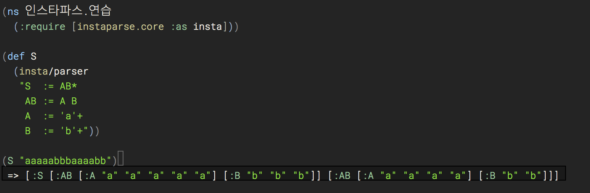
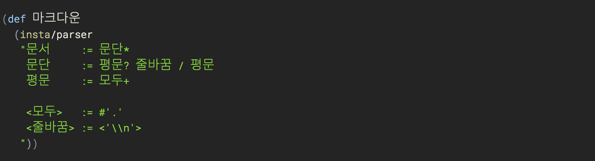

# 마크다운 파서 만들기 (2) - 인스타파서 연습

지난 글에서 [마크다운 파서를 만들게 된 이유를 나름대로 합리화 하고, 인스타파서라는 라이브러리를 써보겠다][지난 글]고 적었다. 목표는 마크다운 문서로부터 [Tufte CSS][]로 포장한 HTML 문서를 만드는 것인데, 조금 돌아가기로 한 셈이다. 돌아가다보면 뭘하려 했는지 잊는 낭패를 볼 때가 있으니 중간중간 목표를 상기토록 하자.

> 마크다운 파서를 직접 만들어서 [Tufte CSS]를 적용한 HTML 문서를 마구 찍어내 보자.

## 인스타파서: 클로저용 파서 생성기

> What if context-free grammars were as easy to use as regular expressions?

[지난 글][]에서 소개한 대로 [인스타파서(instaparser)][Instaparser]는 클로저에서 쓸 수 있는 CFG와 [PEG]를 같이 써서 파서를 만들 수 있는 라이브러리다. CFG가 모호성을 감안한 문법을 상대하는 반면, [PEG]는 우선순위를 두어 결정적(determistic) 파스 트리를 만들어 낸다고 했다.

클로저 프로젝트에 아래 의존성을 추가하고,

    [instaparse "1.4.1"]

그리고는 `instarparser.core` 네임스페이스의 `parser` 함수에 CFG+PEG로 정의한 문법을 문자열로 넘기면, 순식간에 멋진 나만의 파서가 생긴다. 완전 매직!

## 연습 문법

연습으로,

    S  := AB*
    AB := A B
    A  := 'a'+
    B  := 'b'+

이런 규칙의 파서를 만들건데, 먼저 이 문법이 무슨 의미인지 알아보자.

파서의 시작 규칙을 의미하는 첫번째 규칙 `S`는 `AB`가 있으면 매칭되는데, 옆에 `*`가 붙이면, 여러 번 반복해도 된다는 뜻이다. 정규식과 마찬가지로 `+`는 1번 이상을 의미하고, `*`는 0번 이상을 의미한다. 즉, 이 파서는 `AB`가 여러번 나오는 (또는 아무것도 없는) 텍스트를 이해할 수 있다.

두번째 규칙 `AB`는, `A`에 이어 `B`가 따라오는 것이다. 역시 정규식과 비슷한데, 사이에 규칙 이름을 구분할 수 있도록 공백이 있다는 점이 다르다.

마지막 두 규칙은 차례로, 문자 `a`와 `b`가 한번 이상 반복된 구문을 이해한다. 이처럼 따옴표로 실제 텍스트 내용을 표시한다.

그래서, 이 문법으로 만든 파서에 `aaaaabbbaaaabb`라는 텍스트를 주면,

    [:S
      [:AB [:A "a" "a" "a" "a" "a"]
           [:B "b" "b" "b"]]
      [:AB [:A "a" "a" "a" "a"]
           [:B "b" "b"]]]

이런 구조로 이해하는 파서를 만드는 것이다. 그런데, 인스타파서의 `parser` 함수를 어떻게 쓰면 되냐면,

    (instaparse.core/parser "S  := AB*
                             AB := A B
                             A  := 'a'+
                             B  := 'b'+ ")

이렇게 그냥 정의한 규칙을 문자열로 넘기면 된다. 진정 이게 파서를 만든 거라고? 정말 정규표현식(regex)처럼 간단히 쓸 수 있다. 만세!

첫 소스니까, 전체 내용을 한 번 보고 넘어가자.

소스 내용을 자세히 설명해보자. `인스타파스.연습` 네임스페이스를 쓰는 클로저 소스(`.clj`)파일이고, `instaparse.core` 네임스페이스를 `insta`라는 별칭으로 부르며 읽어들였다. 그런 뒤 `S`를 정의(def)했는데, 그 내용은 위에 설명한 `parser` 함수에 문법 규칙을 문자열로 넘긴 결과로 만든 파서이다. 즉, 심볼 `S`에는 인스타파서가 만들어준 파서가 담겨있다. 파서는 사실 클로저 레코드(defrecord)인데, 이 레코드가 `IFn`을 확장하고 있어서, 함수처럼 바로 호출할 수 있고, 인자로 분석할 텍스트를 보내면 된다. 그렇게 `"aaaaabbbaaaabb"`라는 텍스트를 인자로 넘겨 호출한(파싱한) 결과를 마지막 줄에 보인 것이다.

설명은 길었지만, 하는 일도 간단하고 만들기도 쉽다. 아참, 그리고, 네임스페이스를 한글로 적어서 당황스러울 수 있는데, 미리 양해를 구하겠다. 얼마전 <http://한글코딩.org>에서 한글로 코딩하자고 주장했던 사람인지라, 한글로 예제 코드를 보여드릴 예정이다. 크게 거슬리진 않을 것이다, 아마도?!

또, 비록 이 글은 클로저 소스로 설명하지만, 전체 문맥을 이해하기에는 문제없을 것이다.여러분이 즐겨 쓰는 언어에도, [PEG]로 검색하면 분명 훌륭한 라이브러리를 찾을 수 있을 테니, 그 라이브러리로 직접 함께 해보시면 더 즐거울 것 같다.

## 첫 번째 마크다운 파서

[Tufte CSS]: http://edwardtufte.github.io/tufte-css/
[Instaparser]: https://github.com/Engelberg/instaparse
[PEG]: https://en.wikipedia.org/wiki/Parsing_expression_grammar
[지난 글]: https://medium.com/happyprogrammer-in-jeju/마크다운-파서-만들기-1-합리화와-사전조사-932a269b7233
