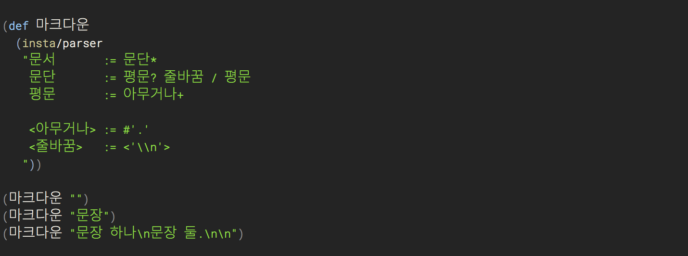

# 마크다운 파서 만들기 (2) - 인스타파서 연습

지난 글에서 [마크다운 파서를 만들게 된 이유를 나름대로 합리화 하고, 인스타파서라는 라이브러리를 써보겠다][지난 글]고 적었다. 목표는 마크다운 문서로부터 [Tufte CSS][]로 포장한 HTML 문서를 만드는 것인데, 조금 돌아가기로 한 셈이다. 돌아가다보면 뭘하려 했는지 잊는 낭패를 볼 때가 있으니 중간중간 목표를 상기토록 하자.

> 마크다운 파서를 직접 만들어서 [Tufte CSS]를 적용한 HTML 문서를 마구 찍어내 보자.

## 인스타파서: 클로저용 파서 생성기

> What if context-free grammars were as easy to use as regular expressions?

[지난 글][]에서 소개한 대로 [인스타파서(instaparser)][Instaparser]는 클로저에서 쓸 수 있는 CFG와 [PEG]를 같이 써서 파서를 만들 수 있는 라이브러리다. CFG가 모호성을 감안한 문법을 상대하는 반면, [PEG]는 우선순위를 두어 결정적(determistic) 파스 트리를 만들어 낸다고 했다.

클로저 프로젝트에 아래 의존성을 추가하고,

    [instaparse "1.4.1"]

그리고는 `instarparser.core` 네임스페이스의 `parser` 함수에 CFG+PEG로 정의한 문법을 문자열로 넘기면, 순식간에 멋진 나만의 파서가 생긴다. 완전 매직!

## 연습 문법

연습으로,

    S  := AB*
    AB := A B
    A  := 'a'+
    B  := 'b'+

이런 규칙의 파서를 만들건데, 먼저 이 문법이 무슨 의미인지 알아보자.

파서의 시작 규칙을 의미하는 첫번째 규칙 `S`는 `AB`가 있으면 매칭되는데, 옆에 `*`가 붙이면, 여러 번 반복해도 된다는 뜻이다. 정규식과 마찬가지로 `+`는 1번 이상을 의미하고, `*`는 0번 이상을 의미한다. 즉, 이 파서는 `AB`가 여러번 나오는 (또는 아무것도 없는) 텍스트를 이해할 수 있다.

두번째 규칙 `AB`는, `A`에 이어 `B`가 따라오는 것이다. 역시 정규식과 비슷한데, 사이에 규칙 이름을 구분할 수 있도록 공백이 있다는 점이 다르다.

마지막 두 규칙은 차례로, 문자 `a`와 `b`가 한번 이상 반복된 구문을 이해한다. 이처럼 따옴표로 실제 텍스트 내용을 표시한다.

그래서, 이 문법으로 만든 파서에 `aaaaabbbaaaabb`라는 텍스트를 주면,

    [:S
      [:AB [:A "a" "a" "a" "a" "a"]
           [:B "b" "b" "b"]]
      [:AB [:A "a" "a" "a" "a"]
           [:B "b" "b"]]]

이런 구조로 이해하는 파서를 만드는 것이다. 그런데, 인스타파서의 `parser` 함수를 어떻게 쓰면 되냐면,

    (instaparse.core/parser "S  := AB*
                             AB := A B
                             A  := 'a'+
                             B  := 'b'+ ")

이렇게 그냥 정의한 규칙을 문자열로 넘기면 된다. 진정 이게 파서를 만든 거라고? 정말 정규표현식(regex)처럼 간단히 쓸 수 있다. 만세!

첫 소스니까, 전체 내용을 한 번 보고 넘어가자.

소스 내용을 자세히 설명해보자. `인스타파스.연습` 네임스페이스를 쓰는 클로저 소스(`.clj`)파일이고, `instaparse.core` 네임스페이스를 `insta`라는 별칭으로 부르며 읽어들였다. 그런 뒤 `S`를 정의(def)했는데, 그 내용은 위에 설명한 `parser` 함수에 문법 규칙을 문자열로 넘긴 결과로 만든 파서이다. 즉, 심볼 `S`에는 인스타파서가 만들어준 파서가 담겨있다. 파서는 사실 클로저 레코드(defrecord)인데, 이 레코드가 `IFn`을 확장하고 있어서, 함수처럼 바로 호출할 수 있고, 인자로 분석할 텍스트를 보내면 된다. 그렇게 `"aaaaabbbaaaabb"`라는 텍스트를 인자로 넘겨 호출한(파싱한) 결과를 마지막 줄에 보인 것이다.

설명은 길었지만, 하는 일도 간단하고 만들기도 쉽다. 아참, 그리고, 네임스페이스를 한글로 적어서 당황스러울 수 있는데, 미리 양해를 구하겠다. 얼마전 <http://한글코딩.org>에서 한글로 코딩하자고 주장했던 사람인지라, 한글로 예제 코드를 보여드릴 예정이다. 크게 거슬리진 않을 것이다, 아마도?!

또, 비록 이 글은 클로저 소스로 설명하지만, 전체 문맥을 이해하기에는 문제없을 것이다.여러분이 즐겨 쓰는 언어에도, [PEG]로 검색하면 분명 훌륭한 라이브러리를 찾을 수 있을 테니, 그 라이브러리로 직접 함께 해보시면 더 즐거울 것 같다.

## 첫 번째 마크다운 파서

스샷에 나와있는 문법만 추려서 다시 보자.

    문서 := 문단*
    문단 := 평문? 줄바꿈 / 평문
    평문 := 아무거나+

    <아무거나> := #'.'
    <줄바꿈>   := <'\n'>

[인스타파서][Instaparser] 튜토리얼을 읽었다면, 다 이해할 내용이지만, 복습삼아 차근히 설명해보자.

1. 먼저, 이 파서는 첫번째 규칙이 `문서 := 문단*`으로, 이 파서가 분석할 문서는 여러 문단으로 구성된 텍스트라는 의미이다.
1. `문단`은 평문으로 시작해서 줄바꿈 문자로 끝나거나, 평문 없이 바로 줄바꿈 문자로만 끝나거나, 평문으로 시작해서 줄바꿈 문자 없이 끝나도 된다. `/` 연산은 `|`와 비슷하게 `~ 또는 ~`라는 대안 선택을 의미하는데, 우선순위가 앞에 있어서, 앞의 매칭 조건이 실패해야만 그 다음 조건에 대한 매칭을 시도한다는 점이 다르다.
1. `평문`은 `아무거나`가 한 번 이상 반복되면 된다.
1. `아무거나`는 어떤 문자가와도 매칭된다.
1. `줄바꿈`은 개행문자를 의미한다. 소스코드에는 백슬래시가 두 번 나왔는데, 문자열 안에 있기 때문에 이스케이프처리를 한 것 뿐이다.

`아무거나`와 `줄바꿈` 규칙명을 부등호로 감쌌는데, 이는 결과 파스 트리에 해당 규칙이름을 따로 표시하지 말라는 의미이다. `줄바꿈` 규칙처럼 규칙의 오른쪽 부분(RHS)에 부등호로 감싼 기호가 있으면, 그 감싼 내용을 매칭하되, 파스 트리에 아예 드러내지 않는다. 즉 이 경우, 줄바꿈 문자가 텍스트에 있어야만 매칭되지만, 결과 파스 트리에는 보이지 않게 된다.

말로 적으니 조금 어렵게 느껴지는데, 직접 따라서 개발해 볼 때, 부등호를 감싸보고 풀어보고 해보면 바로 이해되는 내용이니, 일단은 그냥 넘어가도 될 것이다.

전체를 요약하면, 여러 문장이 있는 텍스트를 받아서, 개행문자(\n) 기준으로 나눈 각 줄마다 문단으로 잘라주는 파서를 만드는 것이다. 즉, 마크다운에서 각 줄마다 `
`태그로 감싼 HTML 블록을 만들 준비가 된 거다.

그래서, 소스코드에 있는 예제를 실행해 보면 아래의 결과를 보인다.

    (마크다운 "")     ; => [:문서]
    (마크다운 "문장") ; => [:문서 [:문단 [:평문 "문" "장"]]]
    (마크다운 "문장 하나\n문장 둘.\n\n")
    ; => [:문서 [:문단 [:평문 "문" "장" " " "하" "나"]] [:문단 [:평문 "문" "장" " " "둘" "."]] [:문단]]

첫 번째는 `문단`이 하나도 없었던 빈 문서를 뜻하고, 두 번째는 `문단`이 하나 있는 `문서`이고, 그 한 `문단`은 하나의 `평문`으로 구성됐으며, `평문`의 안에는 `"문"`과 `"장"`이라는 `아무거나` 글자가 들어있는 것이다. `아무거나`는 규칙을 정의할 때 `<>` 부등호로 감싹기 때문에 결과 파스 트리에 드러나지 않았다.

그러면 이렇게 구한 파스 트리를 HTML로 변환한다면, 이 트리를 순회하며, 단순히 `문단`을 `
`태그로 치환하면 될 것이다. 그럼 결국, `"문장 하나\n문장 둘.\n\n"`는,

    
문장 하나

문장 둘.

이런 HTML 조각으로 만들어 내게 된다.

[Tufte CSS]: http://edwardtufte.github.io/tufte-css/
[Instaparser]: https://github.com/Engelberg/instaparse
[PEG]: https://en.wikipedia.org/wiki/Parsing_expression_grammar
[지난 글]: https://medium.com/happyprogrammer-in-jeju/마크다운-파서-만들기-1-합리화와-사전조사-932a269b7233
