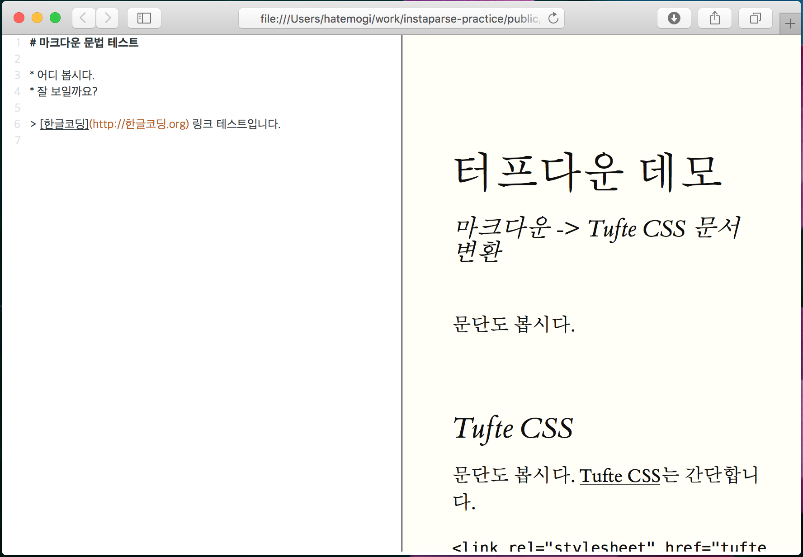

# 마크다운 파서 만들기 (3.5) - 빛의 놀이 중

[(1) 마크다운 파서를 만들게 된 이유를 나름대로 합리화하고][1], [(2) 인스타파스라는 클로저용 라이브러리를 써서 연습하고][2], [(3) 어둠의 영역에서 헤맨 얘기를 적었다][3]. 그리곤 지난 며칠간 희미한 빛줄기를 보고 무작정 그 빛을 따라 가고 있다. 다행히 그 빛줄기는 꽤 굵어지고 있어서, 아마도 광명을 찾을 수 있을 것 같다.

엊그제까지는 연재를 4편이나 5편에는 마무리하려는 생각에 글 쓰는 일은 잠시 미루고, 데모 프로젝트를 열심히 개발하고 있었다. 지난 글을 올린 게 벌써 닷새 전이니, 이쯤에는 글이 하나 적어야 할 것 같다는 생각이 든다.

그런데, 잠시 다른 일이 생겨서(정확히 말하면 내가 일을 벌였기에), 이 프로젝트는 닷새쯤 더 쉬어 가야 할 것 같다, 글 사이가 너무 뜨면 "혹시 이 프로젝트가 좌초된 건 아닐까?" 걱정하실 분이 계실지도 모르니, 중간 점검을 위한 글을 하나 남겨 보자.

## 희망의 빛줄기

> 왜 마크다운 문법을 한 번에 분석하려고 집착했을까?

어둠의 영역에서 헤매다 깨달은 자문이었다. 단 한 세트의 CFG/PEG 문법 규칙으로부터 파스 트리(parse tree)를 한 번에 만들어 내려는 노력은 괜한 고집이었다. 사실 고집이었다기보다 "그래야만 하는 줄 알았다"라는 표현이 더 적확하다. 파서 생성기를 쓰는 이상 단칼에 멋진 파스 트리를 뽑아 내겠다는 허세였을까?

마크다운은 크게 블럭수준(block-level) 마크업과, 인라인(span-level) 마크업으로 나뉜다. 그렇다면, 블럭 구조 먼저 쪼개 놓고, 인라인 마크업을 두 번째에 처리하면, 문법상 모호하게 겹치는 부분을 파격적으로 줄여낼 수 있을 것 같다는 착안을 얻었고, 실제 코드로 작성해보니, 오히려 더 우아해진 느낌이다. 아마도 내 자식 같은 코드에 콩깍지가 씌웠나 보다.

## 빛줄기를 얼싸안은 코드


위의 `parse` 함수는 (1) 문자열(`text`)을 받아서, (2) 마지막에 줄바꿈(LF) 문자로 끝나지 않은 경우 덧붙인다. 그러면 분석 과정을 단순화할 수 있다. 그리고는, (3) `block/parse`로 블럭 단위로 분석을 한번 진행한다. 그러면 아직 인라인(span-level) 마크업은 따로 하지 않은 파스 트리가 만들어진다.

예를 들어,

    # 빛의 놀이중

    *신나는* 개발놀이!

이런 원문(text)을 넣어서 여기까지 (3)까지 돌렸다면,

    [:문서
      [:큰제목 "빛" "의" " " "놀" "이" "중"]
      [:문단 [:문장 "*" "신" "나" "는" "*" " " "개" "발" "놀" "이" "!"]]]

위의 파스 트리를 구하게 된다. `문단` 내 `문장`의 `*신나는*`은 `[:이탤릭]`으로 분석해야 하는데 아직 처리하지 않은 것이다.

이런 방식으로 전문의 골격을 뽑아두고, 이탤릭/볼드/링크 처리 등의 인라인 레벨 분석은 마지막에 처리하면 된다. 파스 트리를 순회하며 `[:문장]`부분만 찾아서 분석하자.

파스 트리에 양념을 첨가하는 일은 자주 있는 일인지라, 인스타파스에도 관련 함수가 들어있었다. 클로저 기본 라이브러리로도 아주 쉽게 처리할 수 있는 일이지만 편의를 위해서 말이다.

``` clojure
(insta/transform {:키워드 변환함수} 파스트리)
```

변형(transform) 함수는, 그 전에 만들어 낸 `파스트리`의 특정 요소들을 찾아, `변환함수`를 적용한 결과로 바꿔친다. 내가 하려는 작업은 `[:문장]`부분만 찾아서 인라인 레벨 분석을 하면 되니, `변환함수` 자리에 `span/parse`를 넣으면 된다.

아, 아름답다. (내 코드 말고, 인스타파스!)

## 함수형 언어

잠깐 다른 얘기로, 이렇듯 함수형 언어는 참 편리하다. 객체지향 패러다임은, "누구에게 어떤 일을 해달라 요청"하는 주체 중심으로 세상을 바라보지만, 함수형 패러다임은 "이런 데이터를 갖고 이런 일을 하라"며 행위를 중심으로 바라본다는 점이 다른 것 같다. 그리고 위의 코드에서처럼, "그 일을 하는 과정에 필요하다면 이런 함수(행위)를 쓰렴"이라며 고차함수(HOF, Higher-Order Function)를 넘긴다. 초점이 "누가 하는가"에 있는 객체지향과 "무얼 하느냐"에 있는 함수형 스타일 사이에서 선택한다면, 난 행위 중심인 함수형에 끌리는 것 같다. 사실 누가 하든 무슨 상관인가? 잘 해주면 그만이지.

물론 예를 들어, 내경우 애플이 새 제품을 내놓으면 믿을만하고 사고 싶은 욕심이 드는 것도 사실이지만, 사실 애플이 좋은 제품을 만들어낸 행위가 있었기에 그런 판단으로 이어지는 거지, 애플이 했다고 무조건 믿을 만하다는 뜻은 아니지 않은가? 최종 판단은 제품이지, 브랜드가 아니지 않은가? 브랜드야 휴리스틱으로 대략적 판단의 기준을 제시할 뿐.

## 남의 코드는 어떨까?

어색한 비유는 그만두고 다시 원래 주제로 돌아오자. 이쯤 돼서야 남의 코드를 살펴봤다. 마크다운의 창시자인 존 그루버의 코드를 받아봤다. 사실 마크다운 사이트는 종종 찾아가서 문법을 확인하곤 했는데, 그의 샘플 코드를 받아서 열어보긴 처음이다.

파일을 내려받아, 압축을 풀었는데 느낌이 좋지 않다. 눈에 띄는 파일명이,

    Markdown.pl

이었다. 확장자가 `pl`이다. 이런 펄 확장자 볼 때마다 필이 좋지 않다. 내 개인 취향은 펄 언어와는 잘 맞지 않나 보다. 열어보니, 펄의 강점인 정규식 처리의 향연이다. 웁쓰! 깜짝 놀라 에디터 창을 얼른 닫았다.

이미 인스타파스 소개글에 유혹당했기 때문인지, 이렇게 정규식을 도배해서 처리하는 것보다는, CFG/PEG 돌려가며 쓰는 게 더 좋아 보인다, 개취.

## 클로저스크립트

결국, 이런 아이디어로 모종의 작업을 했으면, 어떤 형태로든 결과를 보이는 것이 좋다. 그리고 그 결과로 가장 좋은 형태는 다른 사람이 직접 써볼 수 있는 시연용 웹 페이지를 만드는 것일 테다.

그래서, 지금까지 작업하던 클로저 코드를 조금 손봐서 클로저스크립트로 돌릴 수 있게 다듬었다. 클로저만으로 데모 웹 페이지를 만들어서 보이려면, 허로쿠(Heroku)나 구글 앱 엔진(GAE) 같은 곳에 별도 서버를 띄워서 돌려야 하겠지만, 클로저스크립트로 자바스크립트 코드를 떨어내서 처리하면, 정적 웹페이지만 어딘가 올려놓으면 서버 운영의 부담 없이 데모 페이지를 돌릴 수 있다. 젤 만만하고 훌륭한 깃헙 페이지에 올려놓고 잊으면 그만.



그렇게 만들고 있는 웹페이지의 현재 모습. 코드미러(CodeMirror)를 써서 마크다운 코드를 편집하는 에디터를 왼쪽에 두었고, 오른쪽에는 그걸 [Tufte CSS]로 변환한 HTML 페이지를 곧바로 보여 주려 한다.

어떤가? 괜찮아 보이는가?

## 중간 점검

* 클로저와 클로저스크립트는 참 훌륭하다.
* 인스타파스 라이브러리도 참 아름답다.
* PEG 파서 생성기는 나중에도 요긴히 쓸 일이 있겠다.

그럼, 이 정도로 이번 편을 여기까지 적고 한 일주일 후에 다시.

[Tufte CSS]: http://edwardtufte.github.io/tufte-css/
[인스타파스]: https://github.com/Engelberg/instaparse
[1]: https://medium.com/happyprogrammer-in-jeju/마크다운-파서-만들기-1-합리화와-사전조사-932a269b7233
[2]: https://medium.com/happyprogrammer-in-jeju/마크다운-파서-만들기-2-인스타파서-연습-12b2291a9f8b
[3]: https://medium.com/happyprogrammer-in-jeju/마크다운-파서-만들기-3-어둠의-영역-be10d140e6b9
