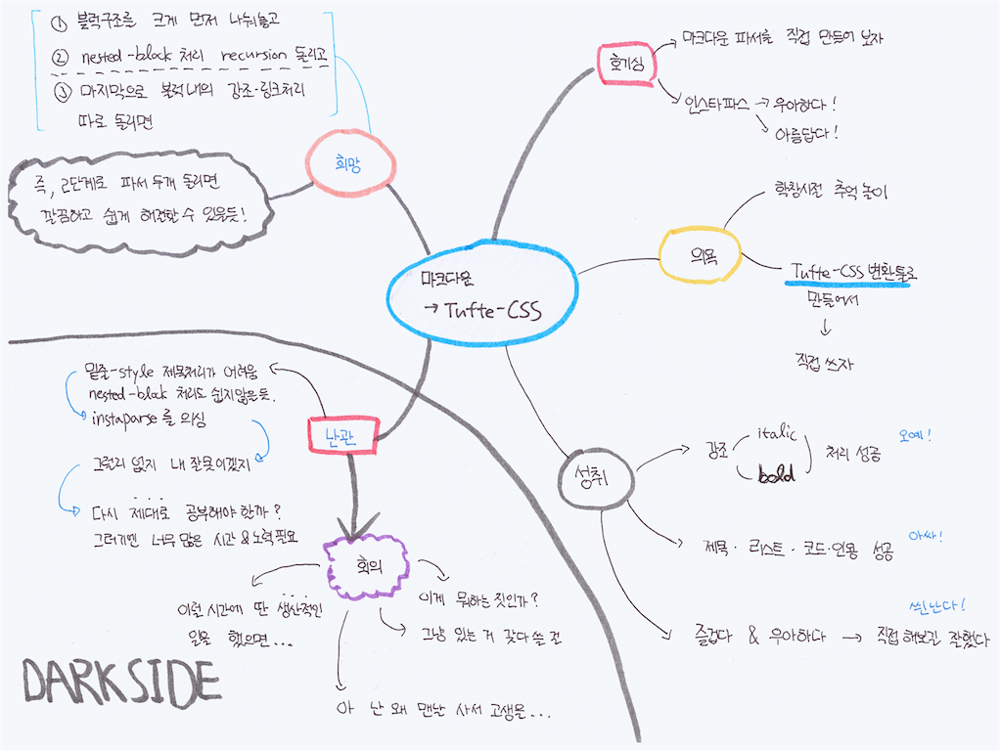
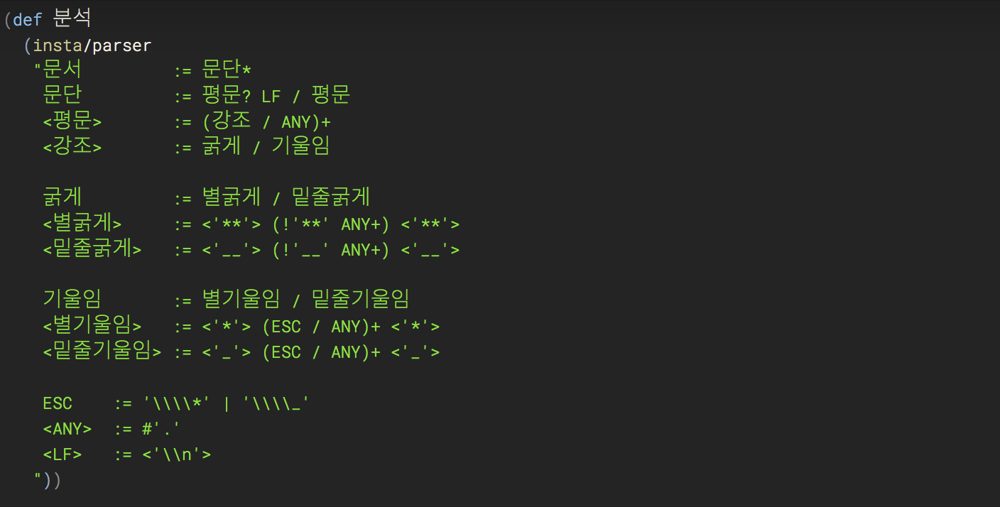
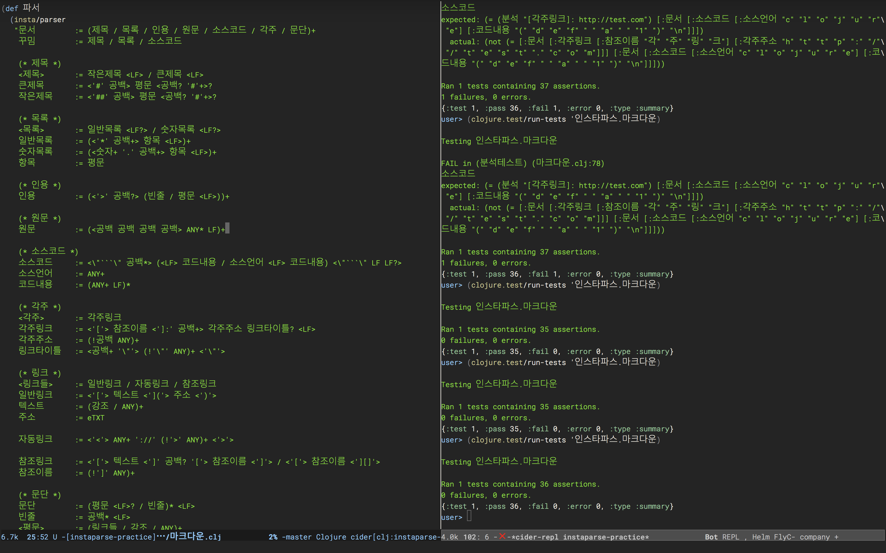
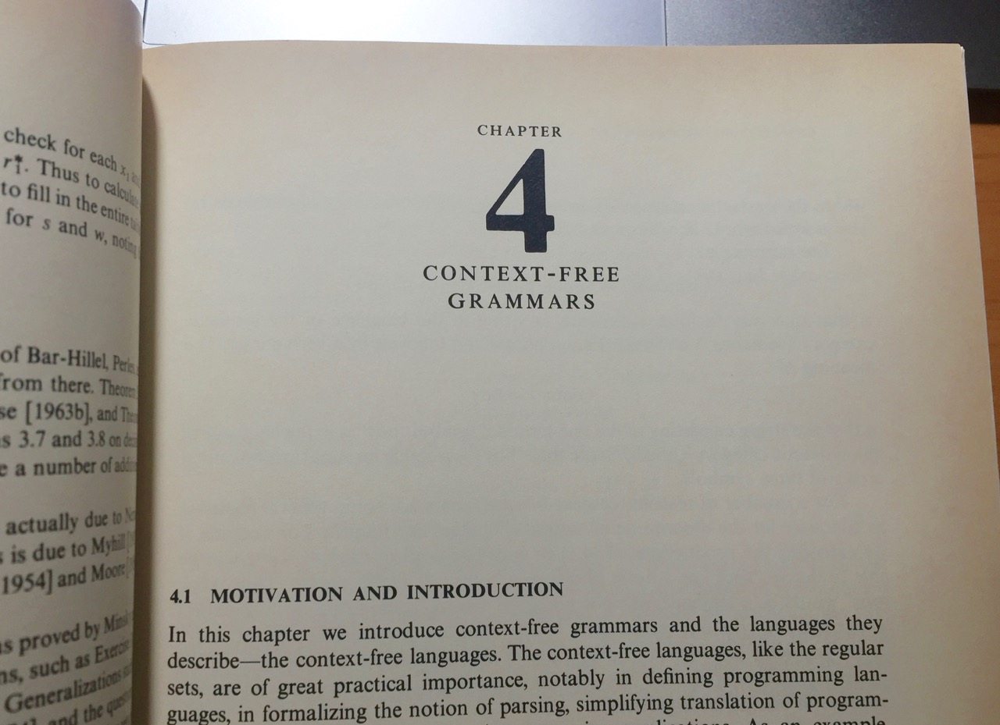

# 마크다운 파서 만들기 (3) - 어둠의 영역

[마크다운 파서를 만들게 된 이유를 나름대로 합리화하고][1], [인스타파스라는 클로저용 라이브러리를 써서 연습해 봤다][2]. 아직 몇 편의 글을 더 쓸지, 그리고 결론이 어떻게 날지는 본인도 모른 채, 무작정 연재 글을 쓰고 있다. 한참 돌아가고 있지만, 목표는 아래와 같다.

> 마크다운 파서를 직접 만들어서 [Tufte CSS]를 적용한 HTML 문서를 마구 찍어내 보자.

이 글을 쓰는 지금까지, 위 그림의 항목들을 "의욕"부터 시계방향으로 돌며 방황하고 있다.

## 1단계: 호기심

[Tufte CSS][] 웹 문서를 편하게 만들어 보겠다는 생각은 어디서 나왔을까? 얼마 전 간단하게나마 홀로 웹사이트를 하나 만드는데 마크다운 문서를 많이 썼는데, 그럴 때 잘 정리한 문서 스타일이 있으면 좋겠다는 생각이 들었고, 개인 웹사이트를 따로 정리할 때도 필요하리라는 생각도 합쳐진 것 같다.

그러다, 클로저와 클로저스크립트용으로 쓸 수 있는 [인스타파스][] 라이브러리를 발견했는데 참 우아하고 아름다웠다. 꼭 한 번 써보고 싶다는 의욕으로 이어졌다.

## 2단계: 의욕

직접 간단한 문법으로 조금 연습해보니, 오래전에 배웠던 파서 생성기라는 주제를 다시 보는 재미가 있었고, 제대로 된 마크다운 파서를 손쉽게 만들 수 있을 것 같은 기대도 커졌다.

어쨌건, 호기심은 의욕으로 발전해서, 조만간 목표를 달성할 수 있을 것 같다. 신난다!

## 3단계: 작은 성취

마크다운의 *이탤릭* 표현과 **볼드체** 처리도 간단히 처리했고, 주요 문법들도 차근차근 하나씩 추가로 구현했다. 역시 [인스타파스]를 써서 마크다운을 처리하는 일은 즐겁고 우아하다.

인스타파스를 써보길 잘했다는 생각이 든다. 오예!

## 4단계: 난관 - 어둠의 영역

그러나, 계속 순조로운 것은 아니었다. 마크다운 기본 문법에는 제목을 두 가지 스타일로 표현하는 데, 하나는,

     # 큰 제목

     일반 문단.

이렇게 쓰고, 다른 방식은,

     큰 제목
     ======

     일반문단.

이렇게 제목 아랫줄에 밑줄을 긋듯이 기호를 붙여서 표현하는 것이다.

그런데, 하던 대로 문법을 추가하고 테스트를 돌렸는데, 기존 문법들이 어긋나기 시작했다. 살펴보니, 다른 문법을 처리하는 부분에서 우선순위가 원하는 방식과 달리 매칭되어 틀린 결과를 보였다.

어디가 문제일까? 방금 추가한 두 번째 제목 스타일을 위한 문법을 빼고 다시 테스트하니, 문제없이 잘 돌았다. 새로 제목 스타일의 문법을 추가한 것이 문제를 일으킨 건 맞는데, 왜 문제가 되는지 아무리 봐도 잘 모르겠다.

다행히, [인스타파스]에는 [추적(Tracing)](https://github.com/Engelberg/instaparse/blob/master/docs/Tracing.md)기능이 있어서,

    (분석 "마크다운 **볼드** 텍스트" :trace true)

라고 호출해보면, 화면 가득히 문법을 분석하는 과정을 확인해 볼 수 있다. 그 긴 추적 로그를 눈과 손으로 쫓아가며 뒤져보니, "밑줄제목 스타일" 문법을 순회하고 나면, 기존 강조처리 문법의 우선순위(/) 선택이 원하는 값과 다르게 나왔다.

잘 안되는 이유는 무얼까? 이리저리 해보다가, 어둠의 영역에 발을 딛는다.

> 인스타파스의 오류는 아닐까?

아, 이런 진하게 다크한 포스라니. 무슨 문제가 생기면 참 쉬운 게 남 탓하는 건데, 대부분의 경우는 내 문제로 결론 난다. 그런데도 시련이 찾아오면, 불쑥불쑥 남을 탓하는 고약한 의심이 올라온다.

그리고, 만약 밑줄 제목을 포기하더라도, 인용구 내에서도 다시 재귀적으로 꾸밈 처리를 해야 하는 문제와 불릿리스트 안에 코드나 인용구가 첨부되는 "중첩처리"가 쉽지 않아 보인다.

이렇게 시작된 *다크포스*는 순식간에 내 마음을 장악해 버린다. 요새 우리 집에 문제로 보이는 곰팡이 포자가 이런 속도로 퍼지고 있겠지.

* 인스타파스의 문제일 거야.
* 밑줄 제목은 포기할까? 그렇게 중요한 건 아니잖아?
* 이게 뭐하는 짓이지? 그냥 잘 나와있는 파서를 쓸 걸.
* 난 왜 꼭 사서 고생하는 길을 택하다가 낭패를 볼까?
* 이럴 시간에 딴 생산적인 일을 했어야 하는 건데...

이렇게 진하게 어두운 영역에서 표류하다가, 애써 마음을 고쳐먹는다.

1. 인스타파스를 분석해보자.
1. 다른 PEG파서 생성기를 써보자.

[인스타파스] 소스를 열어봤더니, 기본 지식이 없는 나로서 분석할 자신이 없었다. 이걸 분석하려면, [그 PEG 논문](http://www.brynosaurus.com/pub/lang/peg.pdf)은 물론이고, 기존 CFG 지식까지 열심히 파고들어 공부해야 가능할 법 싶다.

아, 이것도 공부의 기회이긴 하지만 잘 이해할 자신도 없고, 이렇게 깊이 내려갔다가는 목표는 잊고 익사할 것 같다. 벌써 며칠이 흘렀는가?

어둡다, 어두워.

## 5단계: 희망의 빛줄기

다시 마음을 가다듬어, 남 탓하는 일은 그만두고, 내 문제에 집중했다. 오래전 학창 시절의 오토마타 책도 꺼내보고, 무슨 정성이었는지 따로 사둔 두꺼운 프로그래밍 언어 구현 책도 뒤적인다. 공부할 엄두는 나지 않았고, 그저 힌트를 찾으려 했던 것 같다.

하도 오래전 책이라, 책장이 색이 누렇고 벌겋게 발했는데, 그 분위기가 묘하다. 어둠의 영역에서 방황 중이라 그런지, 저 책장들처럼 내 젊음도 발해버린 기분이 들어 더 어두워진다. 젠장!

그러다가, 정상적인 CFG 문법인데도, 분석하기 어려운 경우에 대한 설명이 눈에 띄었다. LL(1)이니 LR(k)니 역시 뭔지 모를 어려운 용어들이 보였는데, 이쯤되니 의욕과 호기심이 무너져서 더 살펴 볼만큼의 혈당이 남아 있지 않았다.

그런데, 그 설명을 보노라니, 밑줄제목과 다른 문법이 앞에서 겹치는 (둘 다 정상적으로 매치되는) 부분이 눈에 들었다. 처리하고자 했던 제목 분석은 다른 문법 요소와 겹치는 앞부분이 많아서, 사실 인스타파스가 분석에 성공하는 것만으로도 대단한 것이었다.

그렇게 저 먼 곳에 한줄기 가느다란 빛줄기가 보였다.

> 왜 마크다운 문법을 한 번에 분석하려고 집착했을까?

어차피 마크다운 문법은 모호하고, 일반적인 파서로 분석하기에 편한 문법은 아니다. 사람이 쓰는 이메일 텍스트를 거의 그대로 쓰되 약간의 마크업을 처리할 수 있는 지조가 있는 언어이지, 프로그래밍 언어 문법처럼 딱딱 끊어지는 문법은 아닌 거다.

그리고, 어차피 참조링크(링크의 주소가 문서 맨 마지막이나 다른 위치에 나오는 링크)등을 변환해 내려면, 파스 트리를 두번 순회해야한다.

> 파스 트리를 두 번 순회할 거라면, 파스 트리 생성을 두 단계에 걸쳐하면 왜 안된단 말인가?

마크다운은 크게 블럭수준(block-level) 마크업과, 인라인(span-level) 마크업으로 나뉘는데, 블럭 구조 먼저 쪼개 놓고, 인라인 마크업을 두번째에 처리하면, 문법상 모호하게 겹치는 부분을 파격적으로 줄여낼 수 있을 것 같다.

1. 초벌 구이: 제목, 문단, 인용, 코드등 블럭 구조만 쪼개 놓자.
2. 본 구이: 각 블럭 내에 인라인 마크업을 마저 쪼개자.

이러면, 파서용 PEG문법을 쓰기도 편하고, 인용 내의 코드 같은 중첩 문법 처리도 가능할 것 같다.

다행히, 이렇게 어두운 영역을 벗어난 것 같다. 같은 날 지인의 바베큐 파티에 참석한 자리, 다른 개발자 H가 내게 물었다.

> 대현님, 왜 그거 하고 있는 거예요?

단순히, 이유를 묻고 있는 거지만, 그 질문의 뉘앙스는 서로가 잘 안다, 뭔가 원래 하려던 일에서 많이 돌아가고 있으니 정신 바짝 차려야 한다는 뉘앙스. 만약 이 빛줄기를 만나지 못한채 이 질문을 들었다면, 그 즈음에 포기하고 다른 길로 갔을 지도 모르겠다.

그러나, 다행인지 불행인지, 한줄기 빛줄기를 찾았으니, 조금 더 가보자. 폼 나는 결론을 내려 고집하지 말고, 그저 담담히 목표에 다가가 보자.

그럼, 이번 편은 여기까지.

[Tufte CSS]: http://edwardtufte.github.io/tufte-css/
[인스타파스]: https://github.com/Engelberg/instaparse
[1]: https://medium.com/happyprogrammer-in-jeju/마크다운-파서-만들기-1-합리화와-사전조사-932a269b7233
[2]: https://medium.com/happyprogrammer-in-jeju/마크다운-파서-만들기-2-인스타파서-연습-12b2291a9f8b
