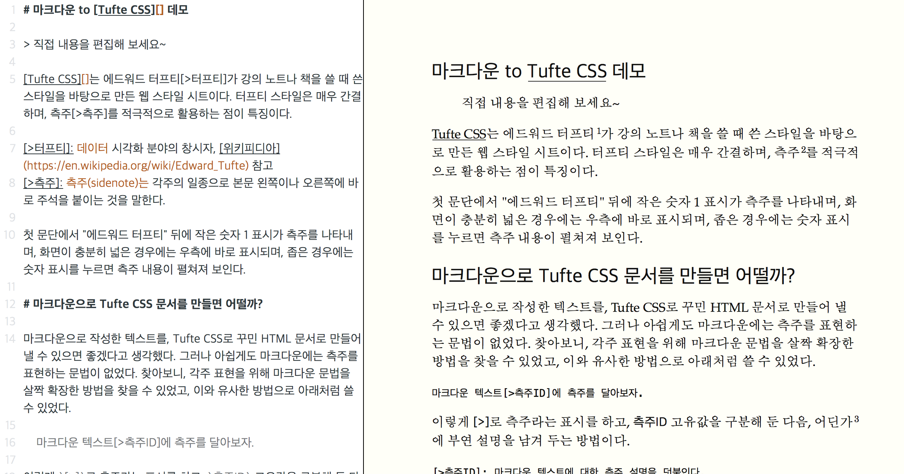
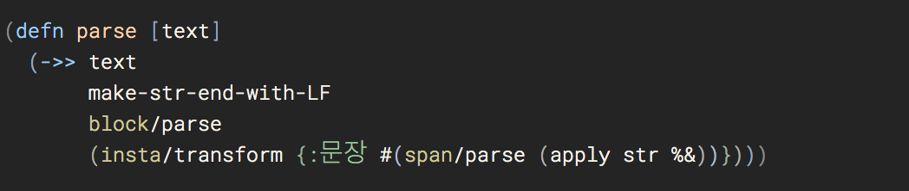
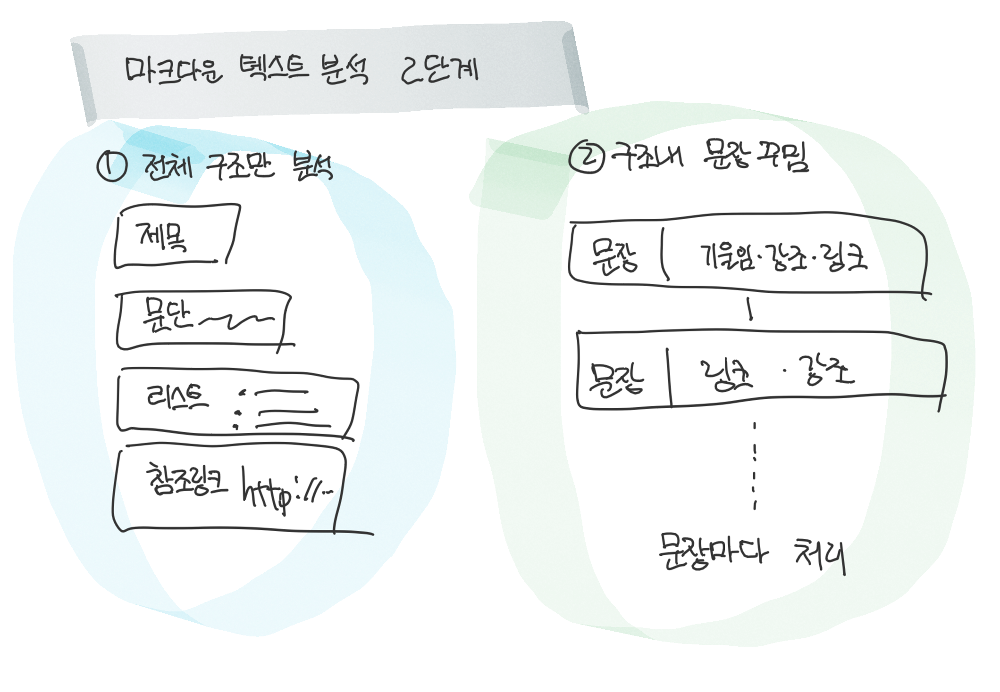
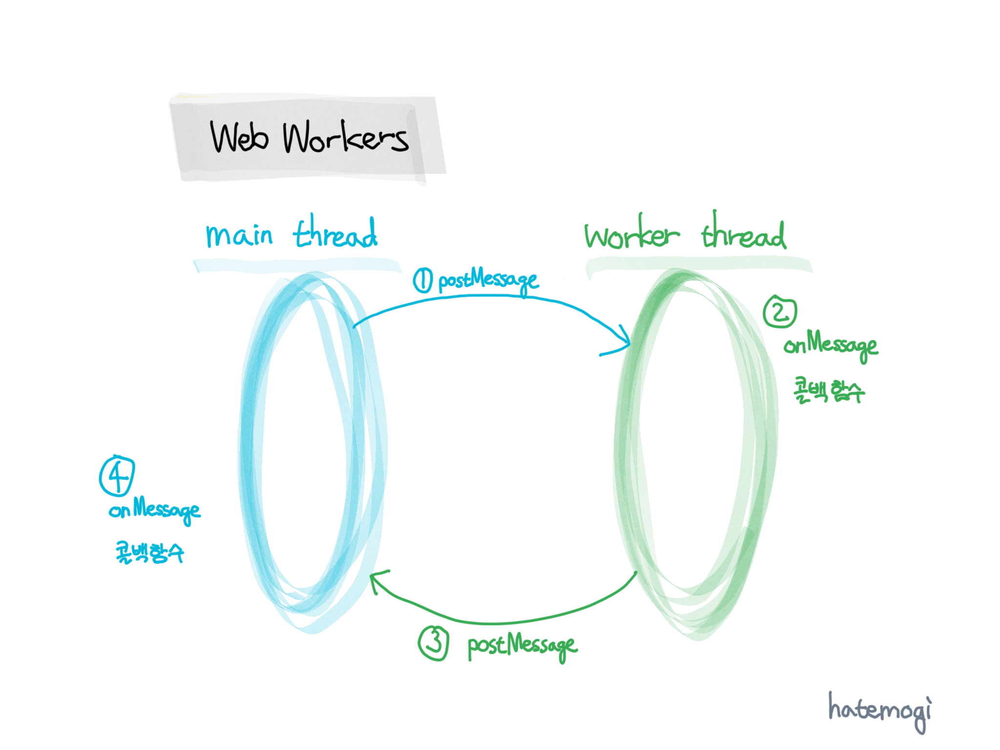

# 마크다운 파서 만들기 (4) - 마무리 및 회고

> 마크다운 문서를 [Tufte CSS]로 꾸며진 웹 문서로 생성하자는 목표로 프로젝트를 진행했습니다. 이번 편은 그 다섯 번째 글로, 그 프로젝트의 마무리로 데모 페이지를 보이고, 그간 배우고 느낀 점을 공유합니다.

[(1) 마크다운 파서를 만들게 된 이유를 나름대로 합리화하고][1], [(2) 인스타파스라는 클로저용 라이브러리를 써서 연습하고][2], [(3) 어둠의 영역에서 헤맨 얘기를 적었다][3]. 그러다 간신히 [(3.5) 희망의 빛줄기를 발견했][3.5]으나, 그사이 다른 할 일이 있어서, 잠시 중단했다가 이제야 마무리했다. 드디어 대망의 마무리 글이다.

# 온라인 데모를 먼저 보자

그간 장황한 과정을 거쳐, Tufte CSS를 위한 마크다운 파서를 직접 만들었다. 그리고 직접 만든 파서를 써서 즉시 변환해 보이는 웹페이지를 만들었다. 잠깐 아래 이미지를 [클릭][demo]해서 직접 써볼 수 있다.

[][demo]

화면 크기에 따라 (반응형 웹!) 왼쪽이나 상단에 온라인 마크다운 에디터가 보이고, 그 에디터 본문을 편집하면, 그 자리에서 바로 Tufte CSS에 맞게 변환된 HTML페이지가 우측이나 하단에 보인다. 오우 예~!

참고로, 이 데모는 마크다운 문법의 일부와 [Tufte CSS]를 위한 측주 문법을 지원한다. 실험적인 코드라서 일반적인 용도로 실용하기에는 아직 부족하다.

이하, 데모 페이지를 개발하며 배우고 느낀 점을 정리해보자.

# 어려웠던 문제

과연 CFG/PEG 파서로 마크다운 텍스트를 잘 분석할 수 있을지 불확실한 상태에서 [헤매이다][3], 두 번에 걸쳐 처리하면 되겠다는 생각이 떠올랐다.

마크다운 텍스트의 주요 골격(문단)을 먼저 쪼개 놓고, 문단의 내용을 다시 분석하는 방법이다.

이렇게 두 번에 걸쳐 처리하니, 원하는 형태로 분석해낼 수 있었다.

# 속도 문제

라이브 에디팅으로 보여주는 데모 페이지는, 화면을 반으로 나눴다. 한쪽에 [CodeMirror]로 온라인 텍스트 에디터를 붙였고, 다른 한쪽에 곧바로 변환 결과를 보여주는 화면을 준비했다. 텍스트 에디터의 내용이 바뀔 때마다, 개발한 마크다운 파서를 돌려서 HTML을 얻어내서 원래 페이지의 내용을 교체해서 보이려 했다.

그런데, 처음 작성한 파서가 느려서, `keyDown/keyUp` 이벤트에 분석 처리를 넣었더니, 에디터를 편집하기에 불편했다. 사실 '라이브 에디팅'이라는 게, 반드시 곧바로 정확히 반영돼야 하는 것은 아니고, 1초 남짓한 시간 안에 최종본이 반영돼 보이면 된다.

처음에는 데모 페이지에 첨부한 텍스트 기준으로 1초 남짓 분석 시간이 걸렸다. 이 정도면 한 번 분석에 필요한 시간은 참을만한 정도인데, 매 키 입력마다 분석을 하기에는 너무 느렸다. 그래서, 텍스트를 빠르게 입력하면 중간은 여러 번 건너 뛰고, 마지막 내용에 대해서만 분석하는 방법을 노렸다. 그 정도면 데모에서 보일만한 성능 수준은 될 것 같다.

타이머(setInverval)를 걸어두고, 이따금씩 바뀐 내용을 확인해 최종본에 대해서만 분석했는데, 자바스크립트 환경은 단일 스레드(single thread)로 동작하기 때문에, 결국 분석에 걸리는 1초 남짓 동안은 에디터에 텍스트를 입력할 수 없었다. 중간중간 매우 버벅거려서 꼴사나웠다.

# 웹 워커

그래서 이참에 [웹 워커(Web Workers)][WebWorkers]를 공부해서 적용해보기로 했다. 모던 웹브라우저의 자바스크립트 환경에서, 백그라운드 스레드(thread)를 돌릴 수 있는 기능이다. 오래 걸리는 작업들을 별도 스레드에 처리하도록 넘겨놓고, 결괏값을 메인 스레드가 돌려받아서 처리할 수 있다.

위 그림에서 `main thread`는 웹브라우저에 로딩된 자바스크립트가 실행되는 일반 스레드이고, 오른쪽의 `worker thread`가 웹 워커로 띄운 스레드이다. 이 두 스레드는 서로 격리된 컨텍스트에서 실행되고, `postMeassage` 함수로 서로 메시지를 주고받을 수 있다. 각 스레드는 `onMessage` 콜백 함수를 통해서 다른 스레드가 요청한 내용을 받아서 각자 할 일을 처리한 뒤, 필요에 따라 다시 결과메시지를 돌려주면 된다.

이번 프로젝트의 경우, 마크다운 파서를 워커 스레드로 준비해두고, (1) 메인 스레드에서는 [CodeMirror] 에디터의 내용이 바뀌었을 때, 그 텍스트를 워커 스레드에 전달한다. 그러면 (2) 워커 스레드가 마크다운 텍스트를 분석해서 HTML 텍스트로 만들어 내고, (3) 그 결과를 메인 스레드에 돌려준다. 그러면 메인 스레드는 그 내용을 미리보기 화면에 뿌려주면 된다.

이렇게 하면, 마크다운 텍스트를 분석하는 작업을 별도 스레드가 처리하므로, 데모 페이지의 텍스트 에디터는 버벅거리지 않고 원활하게 처리된다. 오우 예에~!

# Tufte CSS를 적용해 본 느낌

Tufte CSS로 웹페이지를 보니 꽤 깔끔했고, 특히 측주를 쓰는 방식은 아주 마음에 들었다. 여기에 한글 글꼴을 잘 골라서 지정한다면 더욱 좋을 것 같다. 나름의 철학(?)이 있어서 일부러 단색 위주로 꾸민 것이 Tufte CSS의 특징이지만, 소스코드를 보이는 부분에서는 색상을 좀 넣으면 좋지 않을까 하는 생각도 든다. 개발 블로그 용도로 쓴다면, 결국 소스코드의 일부를 보이는 일이 많을 테니 말이다.

이번에는 측주만을 공략했는데, 나머지 문서 요소들도 적절히 표기해서 쓸 수 있게 개발하면 웹 문서를 깔끔하게 작성하기에 편리할 것 같다.

# 개발하며 배운 점

* 클로저와 클로저스크립트는 참 훌륭하다.
* [인스타파스] 라이브러리도 참 아름답다.
* PEG 파서 생성기는 나중에도 요긴히 쓸 일이 있겠다.
* 텍스트 분석 과정을 두 번 이상 나눠서 처리하니 편리했다.
* 자바스크립트 환경에서도 [웹 워커(Web Workers)][WebWorkers]로 백그라운드 스레드를 쓸 수 있다.

# 결론

마크다운의 문법을 조금 확장해서, Tufte CSS의 측주를 표현하는 파서를 만들어 봤다. 실험적으로 만들었고, 기본적인 처리에 측추 처리를 덧붙인 것에 불과하지만, 나머지 Tufte CSS를 위한 처리도 어렵지 않게 구현할 수 있을 것으로 보인다. 그리고, 그 과정에서 배운 'PEG-style 파서 생성기'와 '웹 워커'도 언젠가 다시  유용하게 쓸 수 있을 것 같다.

# 회고

간단하게 넘어갈 일을, 참 멀리돌아서 실험해보는 일을 저질렀다. 종종 사이드 프로젝트를 진행하는 일은 좋은 일이지만, 이렇게 너무 많은 시간을 할애하게 되면 다소 지겨워지기도 한다.

처음 생각에는 1주일 정도 작업하려 했는데, 중간에 다른 일을 한 시간을 빼더라도, 결국 2주 넘게 쓴 것 같다. 다음에는 더 집중해서 진행해서 늘어지지 않도록 하자. 그리고, 아무리 작은 프로젝트라도 신중하게 시작해야겠다. 자칫하면 이번처럼 너무 많은 시간과 에너지를 쓰게 되니까 말이다. 너무 늘어져서 마무리 즈음에는 의욕이 많이 사그라들었다.

그리고 가장 중요한 문제(?)로, 과연 기존 마크다운 파서를 손봐서 쓰는 것과 비교해서 더 나은 작업이었을까? 글쎄, 이왕 이미 직접 만들어서 배워가며 구현한 입장에서 보자면, 더 나은 쪽이었다고 말해야겠지. 솔직히 말하면, 언젠가 한 번 해볼 작업이었긴 해도, 다시 하라면 조금은 더 망설일 것 같다.

효율을 고민한다면, 아마도 꽤 비효율적인 일이었다고 말해야 하겠고, 재미를 따진다면 꽤 재미있었다고 할 수 있다. 특히, 중간에 어둠의 영역에서 헤매다가, 광명을 찾았을 때의 짜릿함은 개발자로서 누리는 커다란 즐거움이다. 결국 개발자는 어떤 문제를 해결하는 사람이고, 그 문제를 해결할 때 보람을 느끼는 거지.

> 요약하면, 재미도 있고 배운 것도 있지만, 효과적인 일은 아니었다고 말할 수 있겠다.

그래도 참 재밌었다고 강조하자. 난 긍정적인 사람이..... 될 거니까. ㅎ

# 관련글

* [(1) 합리화와 사전조사][1]
* [(2) 인스타파스 연습][2]
* [(3) 어둠의 영역][3]
* [(3.5) 빛의 놀이중][3.5]

[Tufte CSS]: http://edwardtufte.github.io/tufte-css/
[인스타파스]: https://github.com/Engelberg/instaparse
[WebWorkers]: https://developer.mozilla.org/en-US/docs/Web/API/Web_Workers_API/Using_web_workers
[1]: https://medium.com/happyprogrammer-in-jeju/마크다운-파서-만들기-1-합리화와-사전조사-932a269b7233
[2]: https://medium.com/happyprogrammer-in-jeju/마크다운-파서-만들기-2-인스타파서-연습-12b2291a9f8b
[3]: https://medium.com/happyprogrammer-in-jeju/마크다운-파서-만들기-3-어둠의-영역-be10d140e6b9
[3.5]: https://medium.com/happyprogrammer-in-jeju/마크다운-파서-만들기-3-5-빛의-놀이-중-8e5c5c20f7e3
[demo]: http://hatemogi.github.io/tufdown
[CodeMirror]: https://codemirror.net
