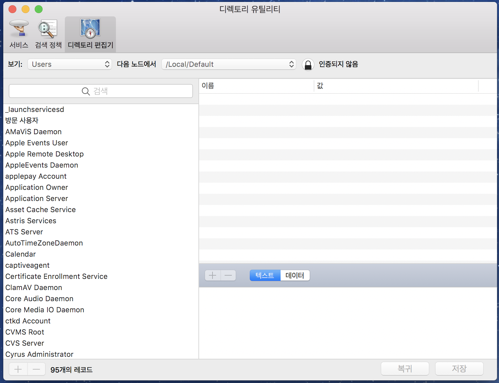

# LDAP 프토토콜 맛보기

업무로 LDAP 서버를 만들게 됐습니다. 잘 만들어진 라이브러리를 가져다 쓰든, 아니면 이미 만들어진 LDAP 서버를 조금 수정해서 쓰든, 아니면 심지어 직접 바닥부터 만들어 쓰든지 기본적으로는 LDAP 프로토콜의 기본적인 내용을 이해해야 하겠기에, 기본적인 내용을 정리해 봅니다. 이 글은 위키피디어의 LDAP문서를 공부하며 나름대로 정리한 글이라고 볼 수 있습니다.

> https://en.wikipedia.org/wiki/Lightweight_Directory_Access_Protocol

## LDAP이 뭔가요?

LDAP은 Lightweight Directory Access Protocol의 약자로, 인터넷 기반의 분산 디렉터리 서비스를 제공하는 공개된 프로토콜입니다. 인터넷 기반과 공개된 프로토콜은 쉽게 이해가 되는데, 분산도 애매하고, 디렉터리 서비스는 뭔지 쉽게 와 닿지 않습니다.

인터넷 기반의 공개 프로토콜이고 이 분야의 표준이나 다름없어서, 각종 애플리케이션에서 기본적으로 지원하고 사용하는 프로토콜입니다. 마치 HTTP가 HTML 문서를 주고받는 표준인 것처럼, LDAP이 디렉터리 서비스를 위한 표준 프로토콜인 것이지요.

## 디렉터리 서비스

디렉터리 서비스도 제게는 좀 생소한데, 쉽게 생각하면, DNS도 디렉터리 서비스의 일종입니다. 어떤 이름을 기준으로 대상을 찾아 조회하거나 편집할 수 있는 서비스인데요, DNS의 경우 도메인 이름을 기준으로 IP주소 같은 데이터를 접근하는 디렉터리 서비스라고 볼 수 있습니다. 그 외에도 다양한 분야에 확장해 쓸 수 있고, 실제로도 널리 다양한 방법으로 쓰이고 있습니다.

사용자, 시스템, 네트워크, 서비스, 애플리케이션 등의 정보를 (주로 트리 구조로) 조회하거나 관리합니다. 회사에서 구성원의 조직도나 팀별 이메일 주소 등도 LDAP 서비스로 관리하고는 합니다. 흔하게는 특정 영역에서 이용자명과 패스워드를 확인하여 인증하는 용도로도 쓰입니다.

제가 예전에 다니던 회사도 사내 조직도 정보나 각 구성원의 인트라넷 아이디와 패스워드를 LDAP 서비스로 관리했기에, 사내 관리 툴을 만들려면 LDAP 프로토콜로 인증처리를 붙였던 기억이 나네요. 이렇게 구성원 주소록도 디렉터리 서비스의 관리 대상이 될 수 있고, 시스템을 구성하는 서비스에 대한 정보도 담고 관리할 수 있습니다. 사실상 아무런 데이터가 들어가도 무방해 보입니다. 무언가 트리구조로 검색하고 편집하기 좋은 경우라면 말이죠.

## 흔한 LDAP 클라이언트

회사에서 관리하는 임직원 데이터베이스 등은 흔히 LDAP 서버로 운영되므로, 서버는 그걸 생각하면 쉽고, 클라이언트의 경우, 각종 주소록 애플리케이션을 생각하면 쉬울 수 있겠습니다. 당장 우리가 쓰는 스마트폰들도 내부적으로 LDAP클라이언트가 내장돼 있어서, 어떤 주소록 용도의 LDAP 서버에 연결해서, 내 스마트 폰의 주소록과 쉽게 동기화해 쓸 수 있습니다.

## Lightweight

제 경우, 예전에 LDAP프로토콜 클라이언트로 붙어서 사내 관리 툴을 개발하며 인증을 붙일 때 써봤었는데, 단순한 사원 패스워드 인증에 쓰기에는 과도히 복잡해 보였기에 대체 어느 부분이  `Lightweight`라는 건지 궁금했었습니다. 위키 문서를 조금 살펴보니, 이 경량의 의미가, 프로토콜 스펙상의 가벼움을 얘기하는 것이 아니라, 통신 네트워크 대역폭 상의 가벼움을 의미하는 것이더군요. LDAP의 부모인 DAP 프로토콜에서 인터넷 프로토콜 통신 부분만 떼어서 발전된 게 LDAP인데, 인터넷 프로토콜로 데이터를 조금만 주고받아도 되게끔 설계됐다고 합니다. 그러니 프로토콜 자체가 가볍고 간단할 거라는 연상은 조금 어긋날 수도 있겠지요.

그리고, 조금 살펴보니, 이게 아이디/패스워드 인증보다는 더 많은 일을 할 수 있으니, 할 수 있는 역량에 비하면 실제로도 가벼운 프로토콜일 수도 있겠습니다.

## LDAPv3

LDAP도 주 버전이 여럿 있는데, 요새 쓰는 것은 v3입니다. 기존 시스템이 v2라면 따로 대응해야 하겠지만, 요새 입장에서는 v3만 파악해서 지원해도 될 것 같습니다.

## 바이너리 프로토콜

LDAP은 기본적으로 바이너리 프로토콜입니다. 메시지 내용이 ASN.1이라는 언어로 메시지를 표현하고, 이 메시지를 BER(Basic Encoding Rules)라는 포맷으로 인코딩하여 주고받습니다. 이 BER인코딩이 바이너리라서 이 내용을 텍스트로 알아볼 수는 없습니다. HTTP나 SMTP처럼 기본적으로는 텍스트 프로토콜이고, 중간중간 바이너리 데이터가 인코딩돼 들어있는 것과는 대조적입니다. 텍스트 포맷인 HTTP 프로토콜은 오가는 메시지의 대강의 내용은 사람이 눈으로 알아볼 수 있지만, LDAP은 그렇지 않은 셈입니다.

게다가 ASN.1과 BER도 생소할 수 있는데, 대충 생각해보면, JSON과 그걸 나름의 인코딩 스킴으로 표현한 MessagePack과의 관계가 아닐까 생각해 봅니다. 더 공부해보다 보면 다르게 보일 수도 있겠습니다.

## 비동기 프로토콜

HTTP 프로토콜의 경우, 기본적으로는 클라이언트가 요청을 보내고, 해당 요청에 대한 응답을 받고자 기다립니다. 일종의 동기식 메시지 프로토콜이지요. Keep-Alive 방식을 쓰더라도, 한번에 하나의 메시지를 요청하고 받습니다. 이미지 파일 등의 리소스를 한꺼번에 받으려면 커넥션을 여러 개 열어서 받지요? HTTP/2의 경우는 다르겠습니다만 말이죠.

LDAP의 경우에는 세션(커넥션) 하나를 열어서 여러 메시지 요청을 보낼 수 있고, 각각의 요청에 대한 응답이 다른 시점에 올 수 있습니다. 응답마다 어떤 요청에 대한 응답인지에 대한 아이디가 있을 테고요. 요청 메시지들의 순서와 그에 대응하는 응답 메시지들의 순서가 다를 수도 있습니다.

## LDAP의 디렉터리 구조

LDAP 서버에는 여러 엔트리(entry)가 트리구조로 들어있습니다. 각각의 엔트리는 다수의 속성을 갖고, 각 속성은 (이름, 값+) 형태로 있습니다. 이름 하나에 한 개 이상의 값이 바인딩될 수 있습니다. 각 엔트리는 DN(Distinguished Name)이라는 고유값으로 지칭됩니다. 고유값인데, 그 값에서 어디에 속한 엔트리인지 파악할 수 있습니다. 디렉터리의 파일이라고 치자면,

    /home/hatemogi/ldap.md

같은 전체 경로가 DN이라고 볼 수 있고, 그중에 `/home/hatemogi` 이 부분이 그 상위 엔트리의 DN인 셈입니다.

## LDAP이 지원하는 명령어들

대부분의 네트워크 서비스와 마찬가지로, LDAP 클라이언트가 LDAP 서버에 커넥션을 열어서 각종 요청 메시지를 보내는데요, 이 요청 메시지에 들어갈 명령어들은 이렇습니다.

* StartTLS - 보안 암호화를 위해 현재 세션을 TLS로 업그레이드하는 확장 명령어입니다. 비표준으로 평범한 LDAP을 TLS 커넥션 위에서 쓰는 방법도 있습니다만, 현재의 표준은 일단 세션 열어서 열자마자 StartTLS로 업그레이드하는 방법인 것 같습니다. SMTP 프로토콜도 이런 식으로 돼 있습니다.
* Bind - 인증하고 LDAP 프로토콜 버전을 명시합니다.
* Search & Compare - 디렉터리 엔트리를 검색해서 조회합니다. 특정 엔트리에 어떤 속성 값이 있는지도 확인할 수 있습니다.
* Add - 새 엔트리를 추가합니다.
* Delete - 특정 엔트리를 삭제합니다.
* Modify - 특정 엔트리의 속성 값을 추가/제거/변경합니다.
* ModifyDN - 특정 엔트리의 디렉터리 위치를 바꾸거나 이름을 바꿉니다.
* Abandon - 직전에 보낸 요청을 취소해달라는 요청입니다만, 서버가 무시해도 무방합니다. 유명무실한 명령어일 것 같군요.
* Unbind - 더 이상 할 일이 없어 커넥션을 끊기 전에 보내는 명령입니다. 서버는 이 명령을 받으면, 해당 클라이언트를 위해 확보했던 리소스를 다 해제하면 되겠습니다.

## LDIF

앞서 언급한 대로 LDAP 프로토콜로 오가는 메시지는 바이너리 데이터이므로, 개발하면서 문제 상황을 파악하고 해결하는데 불편할 것 같습니다. 오가는 데이터를 mitmproxy 같은 훌륭한 프록시로 떠 본다 하더라도 쉽게 알아볼 수는 없는 거지요. 그런 상황을 위한 것일까요? 평문으로 표현하는 스펙이 있더라고요.

디버깅이나 로깅 목적으로 상황별로, 해당 포맷으로 남겨서 확인하면서 개발하면 될 것 같습니다. 관련한 변환 툴이나 라이브러리를 쉽게 찾을 수 있으면 좋겠습니다.

## 관련 도구들

네트워크 클라이언트를 만들 때는 믿을만한 서버가 있으면 편하고, 반대로 서버를 만들 때는 믿을 만한 클라이언트가 있으면 편합니다. 그리고 그 클라이언트/서버가 유연하게 조절해 쓸 수 있으면 더욱 좋습니다.

macOS의 경우 OS 기본으로 `디렉토리 유틸리티`라는 앱이 들어있어서, 임의의 LDAP 서버에 붙어서 무언가 확인해보기에 좋을 것 같습니다. 아직 써보진 않았지만, 첫인상은 좋아 보이는군요.

## 마무리

이상 LDAP 프로토콜의 기본적인 내용을 정리해봤습니다. 아직 개발 시작에 앞서 재빨리 정리한 내용이라 부정확한 내용이 많을까 걱정도 됩니다만, 그래도 혹시나 LDAP 관련 개발을 하시게 될 분들에게 조금이나마 도움이 되기를 바랍니다.

## 참고문서

* [위키 - LDAP](https://en.wikipedia.org/wiki/Lightweight_Directory_Access_Protocol)
* [메인스펙 - RFC4511](https://tools.ietf.org/html/rfc4511)
* [위키 - BER encoding](https://en.wikipedia.org/wiki/X.690#BER_encoding)
* [위키 - LDAP Data Interchange Format](https://en.wikipedia.org/wiki/LDAP_Data_Interchange_Format)
* [위키 - List of LDAP software](https://en.wikipedia.org/wiki/List_of_LDAP_software)
