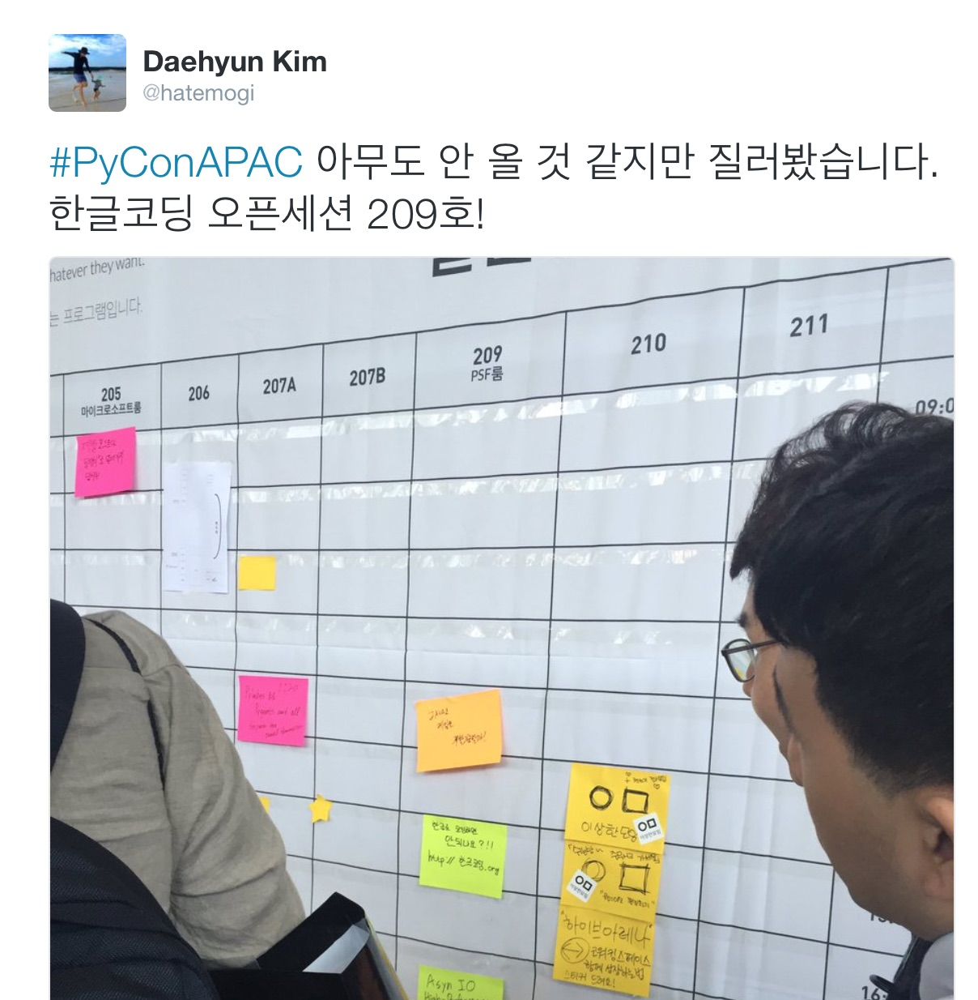

# 파이콘 2016 라이트닝 토크 발표 후기

> 이 글은 파이콘 APAC 2016에서 라이트닝토크에 참가한 얘기입니다만, 파이콘에 대한 얘기가 주제는 아니고, 파이콘에서 라이트닝 토크에 참가했던 "나"에 대한 얘기입니다. 다분히 일기느낌이 강하겠지만, 나름의 배움을 공유하는 의미도 있기를 기대합니다.

프로그래밍 언어중에 파이썬(Python)이라는 언어가 있다. 세계적인 사용자 층도 두텁고, 꽤 실용적인 언어인데다, 국내에서도 인기가 많다. 내 개인 취향에는 파이썬이나 루비(Ruby)나 비슷해 보이고, 그 둘 중에는 루비에 관심이 쏠리기에, 상대적으로 그닥 관심 없는 프로그래밍 언어다.

내겐 무덤덤한 언어임에도 파이콘 APAC 2016 소식을 듣고 관심이 일었다. 국내에서 개발자 컨퍼런스가 흔치 않은데 그 중 꽤 흥하는 컨퍼런스인 것 같아서 한 번 참석하고 싶었고, 평소 온라인에서 관심 두고 살펴보는 개발자들도 참석한다는 소식에 한 번 그 분들의 발표를 듣고 싶기도 했다. 기회가 닿는다면 가서 오프라인 안면도 트고 뻘쭘하게나마 인사라도 나누면 좋겠다는 생각도 들었다. 과연 내 소극적인 성격에 가능할런지는 모르겠지만.

적당한 설렘을 품고, 이른 시간에 지하철을 타고 코엑스로 이동. 봉은사 쪽 입구로 들어섰더니, 전면에 메인 스폰서인 카카오의 부스가 커다랗게 자리잡고 있다. 카카오에서 행사 지원 나온 직원 분들 중 아는 분이 많았다. 몇달 전, 퇴사후에야 처음으로, 인사나눈 동수님도 보였는데, 반가운 인사를 건냈는데 좀 차가운 반응이었다. 왜 그런지 조금 관찰해보니, 가위바위보 이벤트 프로그램을 주최하는 준비를 밤새 하느라 아웃오브넋 상태였나 보다. 그밖에도 오랜만에 뵌 분들도 있었는데, 어쩌면 내가 아직 그냥 제주에서 근무하고 있는 줄 아셨을 수도 있겠다. 퇴사 인사를 열심히 다닌 것도 아니고, 워낙 많은 사람이 근무하는 회사니까 말이다. 그렇다고, 그런 자리에서, "아, 참 저 퇴사했어요."라고 뜬금없이 묻지도 않은 얘기를 꺼내기도 뭐하고 말이다. 근데 뭐 사실, 내가 퇴사했건 말건 큰 차이는 없었다. 어차피 오랜만에 본 사이고, 그저 가벼운 안부를 묻는 정도면 충분하니까, 괜히 나 혼자 어색해 했는지도 모르겠다.

괜한 감상에 얘기가 늘어졌는데, 설레임과 함께, 파이썬을 잘 모르는 개발자로서의 뻘쭘함을 지닌채 키노트부터 열심히 듣기 시작했다. 참석했던 여느 컨퍼런스와는 달리 한결 여유롭게 들었다. 일단 파이썬을 잘 모르기도 하거니와, 그저 분위기를 살피려는 목표가 컸으니 말이다. 여유롭게 접근하니 더 편안하고 즐거웠다. 파이썬이라는 프로그래밍 언어를 공통 화제로 모인 개발자가 이렇게 많다니 놀라울 따름이다. 열심히 동분서주하는 스탭분들도 괜히 고마웠고, 프로그래밍에 열정적인 참가자들도 괜한 친근감이 일고 말이다. 내게는 단순히 공부하는 기회라기 보다는, 하나의 축제처럼 느껴졌다.

트랙 발표와 더불어, 행사의 일부로 오픈세션토크(OST)라고, 참가자 중 누구라도, 어떤 주제로라도 작은 모임을 열어서 다른 참가자들과 얘기를 나눠 볼 수 있는 기회가 있었다. 파이썬과 전혀 관계없는 주제도 얼마든지 환영하는 분위기였기에, 나도 한번 재미 삼아 "한글코딩"을 주제로 열어봤다. 얼마전 [한글코딩.org 실패기](https://medium.com/happyprogrammer-in-jeju/한글코딩-org-개발기-실패기-f69bd4bc55c6)를 적었었는데, 그저 실패로 끝나지는 않았을지도 모른다는 생각을 들게 하는 nacyot님의 답글도 있었고 해서, 한번 더 얘기를 꺼내보고 반응을 살피고 싶은 욕심에 말이지.

아무도 관심이 없을 것 같아서, 흥행실패했을 경우의 심리적 보호막을 위해, 일부러 시간을 촉박하게 잡아서, 1시간 뒤의 시간표에 포스트잇을 붙였다.

사실 한글코딩.org 오픈하고 주변 반응들에 맥이 빠졌었는데, 그런 실패(?)도 다 나름 얘기의 재료와 그 다음 진행의 밑거름이 된다는 점이 흥미로웠다.
흔히 성공은 추구하고 실패는 피해야 하는 걸로 생각하지만 실패해서 데미지(?)가 있지 않은 이상 다 모종의 과정일지도 모르겠다.
이번 발표는 흥행면에서 성공적이었지만, 과연 얼마나 설득할 수 있었는가에서는 여전히 실패일듯. 그러나 성공과 실패는 “일시적”인 순간의 결과일 뿐, 이후의 관점에서 또 어떤 재료로 활용되며 다른 일들에 영향을 줄 지는 모르는 일.
어쨌건 중요한 건 “번거롭거나 살짝 두렵더라도” 일단 지르는 마인드. 리스크가 너무 크지 않다면 말이지.
그런면에서 이번 라이트닝 토크의 리스크는, 끽해봐야 망신살. 근데 어차피 그 대부분의 사람들은 날 모른다. 그리고 다른 리스크로는 또 부정적인 코멘트들을 듣는 것. 이 점이 신경 쓰이긴 했는데 잘된 결과적 뷰에서 평가하자면, 감당해 볼만한 리스크였던듯.
재밌었어.
