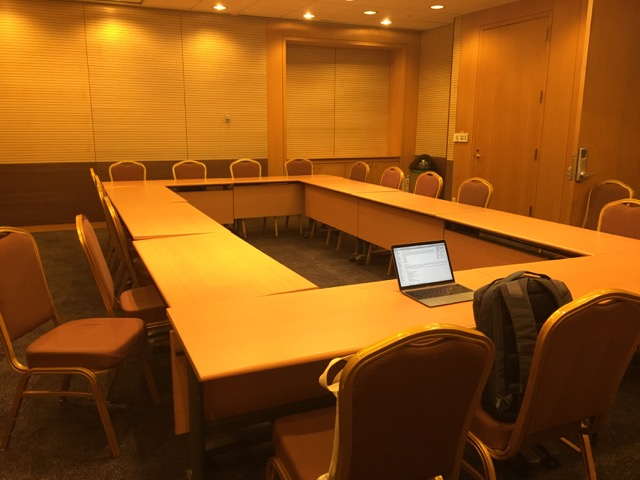
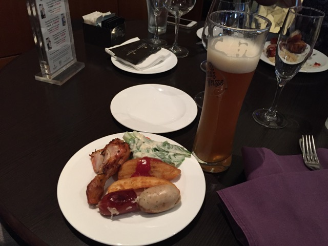

# 파이콘 2016 라이트닝 토크 발표 후기

> 이 글은 파이콘 APAC 2016에서 라이트닝토크에 참가한 얘기입니다만, 파이콘에 대한 얘기가 주제는 아니고, 파이콘에서 라이트닝 토크에 참가했던 "나"에 대한 얘기입니다. 다분히 장황한 일기 같은 느낌이 강하지만, 나름의 배움을 공유하는 의미도 있기를 기대합니다.

프로그래밍 언어중에 파이썬(Python)이라는 언어가 있다. 세계적으로 사용자층이 두텁고 꽤 실용적인 언어인데다, 국내에서도 인기가 많다. 그러나, 내 개인 취향에는 파이썬이나 루비(Ruby)나 비슷해 보이고, 그 둘 중에는 루비쪽에 관심이 쏠리기에 상대적으로 그닥 관심 없는 프로그래밍 언어다.

내겐 무덤덤한 언어임에도 파이콘 APAC 2016 소식을 듣고 관심이 일었다. 국내에서 개발자 컨퍼런스가 흔치 않은데 그 중 꽤 흥하는 컨퍼런스인 것 같아서 한 번 참석하고 싶었고, 평소 온라인에서 관심 두고 살펴보는 개발자들도 참석한다는 소식에 한 번 그들의 발표를 듣고 싶기도 했다. 기회가 닿는다면 가서 오프라인 안면도 트고 뻘쭘하게나마 인사라도 나누면 좋겠다는 생각도 들었던 것. 과연 내 소극적인 성격에 가능할런지는 모르겠지만.

그런 기대를 품고, 이른 시간에 지하철을 타고 코엑스로 이동했다. 봉은사 쪽 입구로 들어섰더니, 전면에 메인 스폰서인 카카오의 부스가 커다랗게 자리잡고 있다. 카카오에서 행사 지원 나온 직원 분들 중 아는 분이 많았다. 몇 달 전, 그러니까 퇴사 후에야, 처음으로 인사 나눈 동수님도 보여서 반가운 인사를 건냈는데 좀 차가운 반응이었다. 왜 그런지 조금 관찰해보니, 가위바위보 이벤트 프로그램을 주최하는 준비를 밤새 하느라 아웃오브넋 상태였나 보다. 서울 근무시절에 알고지내던 분들도 있었는데, 어쩌면 내가 아직 그냥 제주에서 근무하고 있는 줄 아셨을 수도 있겠다. 퇴사 인사를 제대로 한 것도 아니고, 워낙 많은 사람이 근무하는 회사니까 말이다. 그렇다고, 그런 자리에서, "아, 참 저 퇴사했어요."라고 뜬금 없이 묻지도 않은 얘기를 꺼내기도 뭐하고 말이다. 근데 뭐 사실, 내가 퇴사했건 말건 큰 차이는 없었다. 어차피 오랜만에 본 사이고, 그저 가벼운 안부를 묻는 정도면 충분하니까, 괜히 나 혼자 어색해 했는지도 모르겠다.

암튼, 괜한 감상에 얘기가 늘어졌는데, 설레임에 더불어 파이썬을 잘 모르는 개발자로서의 뻘쭘함을 지닌채 키노트부터 재밌게 듣기 시작했다. 참석했던 여느 컨퍼런스와는 달리 한결 여유롭게 들었다. 일단 파이썬을 잘 모르기도 하거니와, 그저 분위기를 살피려는 가벼운 목표였으니 말이다. 그렇게 여유롭게 접근하니 더 편안하고 즐거웠다. 파이썬이라는 프로그래밍 언어를 공통 화제로 모인 개발자가 이렇게 많다니 놀라울 따름이다. 열심히 동분서주하는 스탭분들도 괜히 고마웠고, 프로그래밍에 열정적인 참가자들도 괜한 친근감이 일고 말이다. 내게는 단순히 공부하는 기회라기 보다는, 하나의 축제처럼 느껴졌다.

트랙 발표와 더불어, 행사의 일부로 오픈스페이스토크(OST)라고, 참가자 중 누구라도 아무 주제로나 작은 모임을 열어서 다른 참가자들과 얘기 나눠 볼 수 있는 기회가 있었다. 파이썬과 전혀 관계 없는 주제도 얼마든지 환영하는 분위기였고, 다소 업된 기분에 힘입어 나도 한번 재미 삼아 "한글코딩"을 주제로 열어봤다. 얼마전 [한글코딩.org 실패기](https://medium.com/happyprogrammer-in-jeju/한글코딩-org-개발기-실패기-f69bd4bc55c6)를 적었었는데, 그저 실패로 끝나지는 않았을지도 모른다는 생각을 들게 하는 nacyot님의 답글도 있었고 해서, 기운 내서 한번 더 얘기를 꺼내보고 반응을 살피고 싶은 욕심에 말이지.

혹시나 흥행에 실패했을 경우의 심리적 상처를 최소화 하기 위해, 일부러 시간을 촉박하게 잡아서 1시간 뒤의 시간표에 포스트잇을 붙였다. 아무도 안 오더라도, 사람들이 무관심하기 때문이 아니라 시간이 촉박했기 때문이라는 핑계를 대기 위해서 말이다.

그렇게 자진해서 OST를 열고, 그 회의실에 약속 시간보다 일찍 가서 자리를 잡았다. 넓직한 회의실에는 시원한 에어콘이 빵빵하게 돌고 있었다. 약속 시간이 됐지만 정적이 흘렀고, 혹시나 하는 마음에 계속 기다려봤으나, 결국 아무도 오지 않았다. 한 명 쯤은 회의실을 잘못 찾아 들어올 법도 한데, 그런 일도 없었다.

처음에는 내가 혹시 회의실을 잘못 찾아 와 있는 건 아닐까도 생각해 봤으나, 역시 그저 아무도 안 온 것이었고, 난 썰렁한 회의실에서 스트레칭을 했다. 사람이 없어서 썰렁한 게 아니야, 단지 에어컨이 너무 과한 것 뿐이라며 말이다. 그래도, 심리적 보호막을 쳐 두었기 때문인지, 그다지 실망스럽진 않았다. 그래도 난 시도해봤으니 그걸로도 충분하다는 그런 생각을 하며, 다시 원래대로 컨퍼런스를 즐겼다.

그런데 거기서 끝이 아니었다. 첫날 마지막 순서로 라이트닝 토크라는 걸 했다. 정식 컨퍼런스 세션보다는 가볍고 압축된 주제로 딱 5분간만 발표를 할 수 있단다. 심지어, 5분이 경과하면 마이크를 뺐고, 무대에서 끌어내린다니 스릴 넘쳤다.

> 오, 흥미진진한데?

눈빛을 반짝이며 관심을 집중해 들었는데, 한 디자이너의 발표가 아주 인상적이었다. 어쩌다 코딩을 배우게 됐다는 얘기를 하는데, 심지어 데일리 커밋을 하고 있었다! 이건 부러움+대단함+부끄러움의 콤보가 물결 치는 상황!

> 대다나다! 심지어 디자이너라고?!

무언가 내가 잘하고 싶은 것을 남이 잘하면 그 사람이 대단해 보인다. 그말은 즉, 내가 데일리 커밋을 하고 싶은데 잘 못하고 있다는 뜻이기도 하다. 아무튼, 그 강한 여운에 진동을 느끼며, 제럴드님과 약속했던 소소한 뒷풀이를 열었다.

> 으아, 서울 맥주 맛있다!

우리는 컨퍼런스에 참석한 사람들이니까, 각자 듣고 배운 내용을 서로 공유하며 안주 삼아 맥주를 조금 들이키기 시작했으나, 주제는 이내 곧 우리의 최근 공통 관심사인 "바이크 라이딩"으로 빠졌다. 짧고 가볍게 뒷풀이를 파하고, 지하철을 타고 이동하는 길에도 아까의 여운이 계속됐다. 발표자들이 부럽기도 했고, 나도 뭔가 막 얘기를 해보고 싶다는 생각이 이어졌다. 술기운에 그 에너지는 증폭되고.

> 까짓 거, 나도 해보까?

비록 파이썬은 모르지만, 마침 재료는 있다. "한글코딩"을 주제로 아무도 찾아오지 않는다면, 내가 무대로 올라가면 되는 것 아닌가! 오히려 훨씬 많은 청중을 한 번에 상대할 수 있는 기회다. 그 에너지가 계속 감돌며 잠들 때까지도 계속 아이디어는 떠올랐다. 5분 동안 얘기할 거리들이 자연스럽게 떠올랐다고나.

그렇게 잠이 들었다 깬 다음 날 아침, 지하철로 50분 남짓 이동하면서 아이폰 메모장에 열심히 스크립트를 적었다.

> 그래, 이 정도면 라이트닝 토크 신청해도 될 것 같다.

사실, "실패기"에도 적었듯, "한글코딩" 관련해서 사람들의 반응은 차갑다 못해 공격적으로 느껴질 때도 있어서 이런저런 두려움도 있었다. 말하고자 하는 주제도 두렵고, 또 그 많은 사람들 앞에서 발표하다 망신을 당하지는 않을까 하는 두려움도 있었다.

평소, 발표자와 나는 다른 존재고, 발표는 완벽해야하며, 그러므로 난 발표할 수 없다고 생각했는데, 이번에는 뭔가 다른 생각이 들었다. 우선 라이트닝 토크는 세션에 비해 청중의 기대치가 낮게 느껴졌고, 짧은 시간이라는 제한을 핑계로 완벽하지 않아도 될 것 같다. 까짓거 실망스러운 발표라면 어떤가? 내가 얻을 것은 무엇이고 잃을 것은 무엇인지 정작 따져보니, 별로 잃을 게 없었다. 끽해봐야 약간의 망신을 하는 건데, 거기서 날 아는 사람은 별로 없어 보인다.

그리고 망신이라는 게, 내 체면이나 평판이라는 게 있다는 가정하에 일어날 수 있는 일인데. 당최 내게 있는 게 뭐란 말인가? 난 아무도 아닌 걸.

> 오케 고고씽!

그렇게 둘째날 아침에 선 결심에 이어, 고스란히 발표 준비에 빠져들었고, 천만 다행히도 무사히, 아니 심지어 어쩌면 성공적으로 발표를 마쳤다.

https://youtu.be/46UkzB-3z3Y

https://www.youtube.com/watch?v=pJHC3DtI_ds

글쎄, 청중들에게 어떤 느낌으로 "한글코딩" 행위가 다가갔는지는 모르겠지만, 나름의 "메시지"는 충분히 잘 전달한 것 같다.

## 배운점

사실 한글코딩.org 오픈하고 주변 반응들에 맥이 빠졌었는데, 그런 실패(?)도 다 나름 얘기의 재료와 그 다음 진행의 밑거름이 된다는 점이 흥미로웠다. 흔히 성공은 추구하고 실패는 피해야 하는 걸로 생각하지만 실패해서 데미지(?)가 있지 않은 이상 다 모종의 과정일지도 모르겠다.

이번 발표는 흥행면에서 성공적이었지만, 과연 얼마나 설득할 수 있었는가에서는 여전히 실패일듯. 그러나 성공과 실패는 “일시적”인 순간의 결과일 뿐, 이후의 관점에서 또 어떤 재료로 활용되며 다른 일들에 영향을 줄 지는 모르는 일.

어쨌건 중요한 건 “번거롭거나 살짝 두렵더라도” 일단 지르는 마인드. 리스크가 너무 크지 않다면 말이지.
그런면에서 이번 라이트닝 토크의 리스크는, 끽해봐야 망신살. 근데 어차피 그 대부분의 사람들은 날 모른다. 그리고 다른 리스크로는 또 부정적인 코멘트들을 듣는 것. 이 점이 신경 쓰이긴 했는데 잘된 결과적 뷰에서 평가하자면, 감당해 볼만한 리스크였던듯.

재밌었어.
