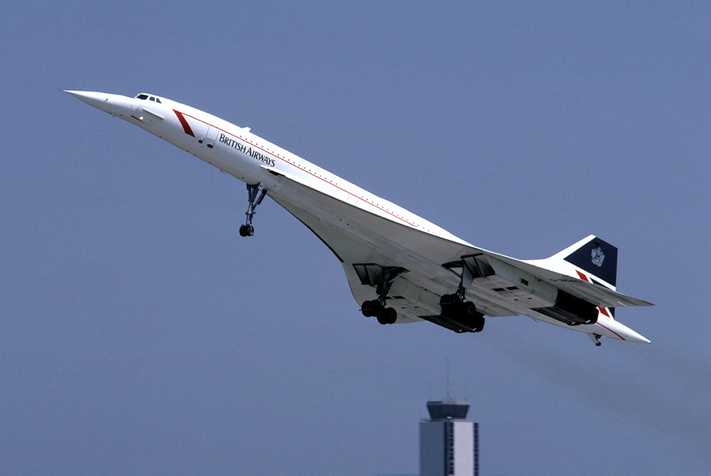

# 스타웍스 개발기 (2.5) - 동일 제품 소식

스타벅스에서 WiFi 연결을 편하게 처리하는 macOS 용 앱을 만들며 개발 과정을 글로 남기고 있습니다. 프로젝트 개요와 스타벅스 WiFi 구성을 나름 분석한 내용은 앞서서 적은 글에 정리해 두었지요.

* 스타웍스 개발기 (1)
* 스타웍스 개발기 (2)

설렁설렁 필요 이상의 설명을 하며 개발하고 있었습니다. 그러던 어제, 제 페이스북 피드에 제게 태그가 걸린 게시물이 뜹니다.

음, 이게 뭔 일인가? 종욱님이 제가 만들고 있는 앱과 동일한 내용의 "이미 공개된 앱" 소식을 전해주었는데요, 개요를 살펴보니, 이미 어떤 개발자가 같은 형태의 앱을 공개한 것 같습니다. 사실 이미 사파리 익스텐션으로 구현한 게 오래전이라, 이미 따라하는 입장이라서 독창성은 없는 프로젝트입니다만, 그래도 이미 macOS용 앱 형태로 있다는 것은 조금 더 김이 빠지네요.

## 그럼 그만둘까? QUIT, QUIT, QUIT, ESC! ESC!

근데, 이미 투자한 시간과 정리한 내용이 너무 많습니다. 사실 이럴 때, 단순히 투자한 시간이 아까워서 마음에 걸린다면, "매몰 비용의 오류"를 피할 줄 알아야합니다. 이미 투자한 비용(시간)을 회수할 수 있는 것이 아니라면 깔끔히 잊고 빠지는 것이 추가적인 낭비를 막을 수 있는 길입니다. 매몰 비용의 오류에 빠져 허우적 거린 세계적인 실패작 "콩코드 여객기"를 떠올리면서 말이죠.

https://en.wikipedia.org/wiki/Concorde#/media/File:British_Airways_Concorde_G-BOAC_03.jpg

그런데, 이미 전 그런 합리적인 결정을 내릴 수 있는 단계를 넘어섰습니다. 아마도 콩코드 프로젝트에 관련된 사람들도 합리적인 결정으로부터는 한참 떨어진 상황에서 계속 악수를 둔 것이겠지요. 사실 그런 초대형 프로젝트에 관련된 사람들이 좀 똑똑한 인재들이었겠습니까? 하물며 저같은 어리석은 개발자야 더 말할 것도 없지요. 인간은 결코 합리적인 동물이 아닙니다. 합리적이려 부단히 노력하지만, 비이성적인 감정상태를 벗어나지 못하는 존재죠.

## 자, 그럼 합리화!

거창하게 인간 존재에 대한 고찰을 하든말든, 어쨌건 이럴 때, 우리는 "인지부조화"라는 불편한 심리를 겪게 됩니다. 이미 동일한 프로젝트가 잘 공개돼 있는 마당에 더 작업하는 것은 낭비다라는 이성적인 판단과, 그럼에도 더 진행하고 싶다는 욕구가 상충하는 거지요. 그러면, 어떤 형태로든 심리 상태나 판단을 바꿔야 그 불편한 심리 상태에서 벗어날 수 있습니다.

어떤 합리화를 통해서 불편한 마음을 떨칠 수 있을까요?

1) 외면하기 - 이미 공개된 프로젝트가 있다는 것을 부정한다.
2) 차별하기 - 아니야, 내가 만든 것이 더 다른 무언가가 있다.
3) 차원나누기 - 아냐 네 프로젝트의 실용성은 제품도 제품이지만, 개발 과정 공유라는 더 큰 목표가 있어! 단순한 소프트웨어가 아니라고! 그리고 어쨌건 난 macOS 앱 개발연습을 하고 싶었던 거잖아?

사실, 외면하거나 부정하는 것은 너무 뻔해서 스스로도 속기 어렵습니다. 2번과 3번이 사실 그럴싸한 방안입니다. 그렇게 갑시다. ㅎㅎ 사실 실제로도 그렇게 생각합니다. 다른 사람들에게도 기존에 없던 유용한 소프트웨어를 제공하는 것은 개발자로서 참 기쁜 일이지만, 아쉽게도 그렇지 못하다고 하더라도 남은 기쁨(Joy)이 여럿 남아있습니다.

## 어차피 억지스러운 합리화를 하는 마당에...

그러면, 합리화 단계를 넘어서고 나면 우리는 "자기확증편향"에 빠지게 됩니다. 역시 내 결정이 맞다는 내용의 근거를 더 탄탄히 하는 거지요. My Way에 심취하는 단계랄까요?

처음 인용한 종욱님의 말씀이 재미있습니다. "역시 발명은 동시 다발적으로 이뤄지는 건가요?"라고 말씀하셨는데, 어쩌면 어떤 불편한 상황을 인지하는 것과, 그걸 해결하기 위한 아이디어가 여기저기서 비슷한 시기에 드러난다는 말씀인지도 모르겠습니다. 뭐 직접 만나서 얘기를 더 해보면 자세한 뉘앙스를 더 알아볼 수 있겠지만, 그렇게까지 중요한 사안은 아니니까요.

아무튼, 아이디어라는 것은 사실 생각해 낸 입장에서는 뭔가 독창적이고 나만의 것일거라 생각하고, 그 자체로만으로도 가치가 있을 거라 여기는 심리가 발동합니다만, 사실 아이디어 자체는 쓰레기입니다. 전 그렇게 생각해요. 어떤 아이디어건 아이디어를 갖고 있는 사람은 널리고 널렸습니다. 그걸 실현하고 안하고/못하고의 차이가 일단 너무 크고, 또 실현하다고 하더라도 어떻게 실현했느냐가 생각보다 많은 차이가 납니다. 비슷하게 실현했더라도 누가더 효과적으로 꾸준히 하는지의 차이도 크고요. 그 쓰레기가 보석이 될지, 계속 쓰레기로 남을지는 실행하는 사람의 역량과 운에 달려있습니다. 아이디어의 대부분은 쓰레기로 남겨집니다.

## 잠깐 다른 얘기로, 마이피플이라는 앱을 아시는지?

아시는 분이 많을 지 모르겠지만, 카카오톡과 경쟁했던 마이피플이라는 앱이 있습니다. 전 그 프로젝트의 극초기 멤버였고, 프로토타이핑과 초기 개발을 담당했었지요. 전체 아키텍쳐 그림과 네트워크 설계도 함께 그렸습니다.

개발 마무리 단계에 이르러서도 여러 정책적 문제로 출시 시기가 늦어져서, 카카오톡이 먼저 출시됐고, 당시 Daum 이라는 큰 회사가, IWILAB이라는 작은 스타트업의 앱을 베껴 만들었다는 비난도 들었었습니다.

글쎄요, 완전한 진실이야 누가 알겠습니다만, 적어도 초기 개발팀의 일원으로서 저희는 카카오톡의 존재를 알고 개발하기 시작한 것은 아니었어요. 사실 그 시기에 카카오톡, 마이피플 말고도 비슷한 앱은 우후죽순 많았었습니다. 그 모든 앱이 사실 오리지널을 따지자면, 다 "WhatsApp"의 아류작이었습니다. 어느 누구도 오리지널리티를 주장하기는 스스로 창피한 상황이었지요.

아무튼, 좀 아쉬웠던 것은, 우리 개발팀이 나름 개발하면서 왓츠앱과의 차별점을 구현한 단체 채팅 같은 핵심기능이 카카오톡에도 거의 그대로 보였다는 점입니다. 우리 개발팀은 카카오톡의 존재를 몰랐으니, 오히려 역으로, 카카오측에서 우리 정보를 얻어가서 구현한 것은 아닐까 하는 망상까지도 했었지요.

그런데 이성적으로 따져보면, 사실 다 망상인 것이 맞습니다. 사실 그 누구라도 왓츠앱이라는 오리지널을 보고 추가적으로 생각할 수 있는 뻔한 아이디어가 "단톡방"입니다. 그 외 음성 채팅이나 화상 채팅도 당연한 연장선이구요. 그리고, 과연 왓츠앱이라는게 과연 오리지날이었을까요?

아무튼, 결과는 대한민국 사람 누구나 알듯이, 다양한 제품의 경쟁에서 카카오톡이 승리했습니다. 번외로, 네이버에서 만들었던 비슷한 제품은 폭망했는데요, 네이버 재팬에서 따로 만든 버전이 훌륭해서 상황을 반전 시킨 LINE도 있습니다. 모르는 분들은 그게 애초에 네이버의 제품인 줄 알지만, 그렇지 않습니다. 네이버 "재팬"의 제품입니다. 같은 아이디어라고 하더라도 누가 더 잘 구현하느냐에서 차이가 극명하기도 합니다. 아이디어의 촛점이 아주 미묘하게 다른데도, 결과적으로는 큰 차이가 드러나기도 합니다. 당시 PC 메신저 시장에서 MSN을 누르고 탑을 달려줘서 괜히 통쾌했던 NateOn도 비슷한 제품을 내놓았었습니다. 심지어 PC네이트온과 상호 통신이 가능했습니다. 초기 카톡은 PC버전은 없었습니다. 어쩌면 상식적으로는 이미 PC와도 메시지를 주고 받을 수 있는, 그리고 막대한 유저풀을 갖고 있는 네이트온이 압도적으로 유리할 것 같았는데, 결과는 그렇지 않았죠. 아이디 기반이 촛점이었는지, 아니면 스마트폰으로 세상이 이동하면서 "전화번호"가 촛점의 대상이었는지의 사소한 차이가 이렇게 크게 결과적으로 달라졌습니다. 그외에도 사소하지만 결과적을 매우 다른 디테일들이 많았을 겁니다.

그리고 또 인생만사 흥미로운 점은, 당시에는 대기업이 조그만 벤처의 제품을 베껴만든다는 욕을 먹었었는데, 그 조그만 벤처가, Daum이라는 대기업을 인수해 버리는 일도 생기기까지 하니 거 참 나름 드라마틱하지요?

아~~! 사실 마이피플 얘기는 잘 안하는데, 어쩌다 보니 이렇게 막 떠들게 됐네요. 마이피플이라는 네 글자는, 사실 저말고도 여러 사람의 가슴 아프게 하는 주제라서, 그냥 잠자코 있는 편이 낫습니다. 저는 그나마 내상이 깊지 않은 편. 아무튼 이 내상 덕분에 인생의 교훈을 얻었습니다.

오리지널리티는 오리가 ㅈㄹ하는 소리임.

## 자 이제 구차한 변명은 그만

아아아~~ 구차해!

잠시, 별의별 생각까지 연장됐습니다만, 사실 그렇게 거창한 내용은 아니고, 아주 사소한, 정말 사소한 작은 앱 개발 연습에 불과합니다. 고작 스타벅스 와이파이 연결 앱을 만드는 일을 가지고 "마이피플"까지 거들먹 거리다니, 며칠 후 이불킥을 시전하겠지요.

암튼, 이런 스토리와 함께, 남은 프로젝트 마저 진행해 보겠습니다.

계속 관심 가져주세요~ 굽신굽신.
