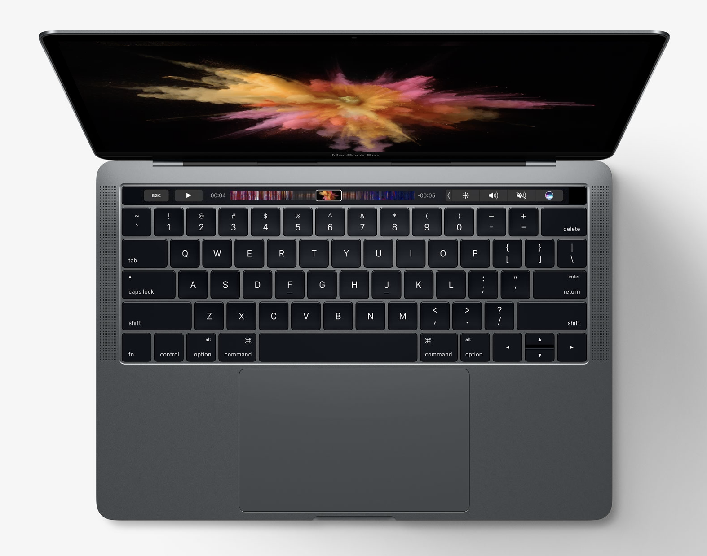
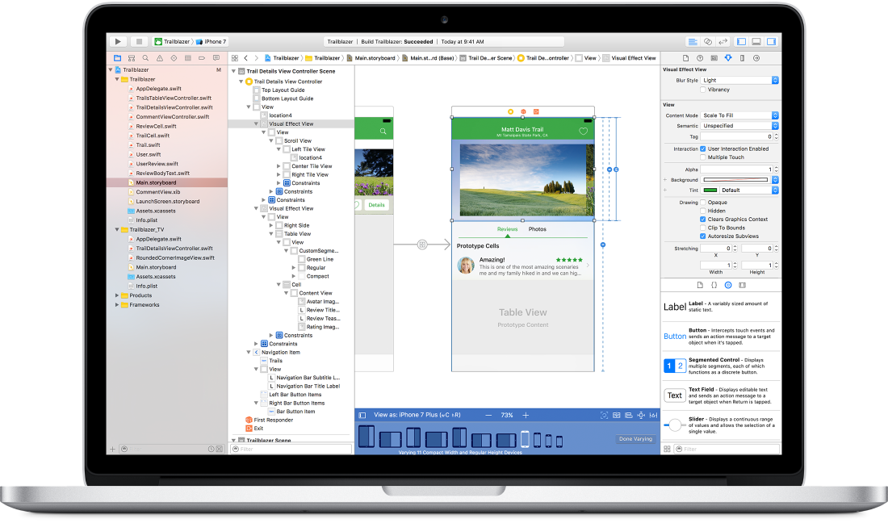
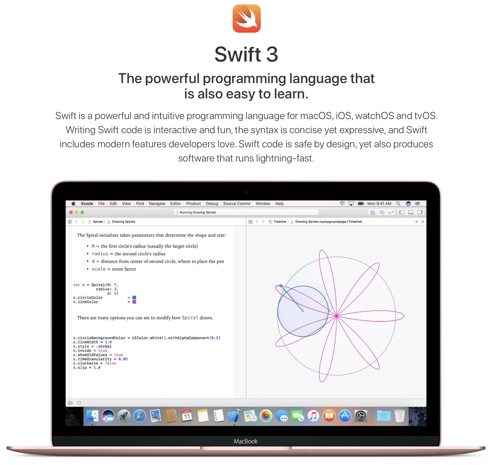

# 스타웍스 개발기 (4) - macOS 앱을 개발하기 위해 필요한 것

> macOS용 스타벅스 WiFi 자동 연결 앱을 만들며 기록을 남기고 있습니다. 그간 바쁘다는 핑계로, 개발 기록을 남기기는 커녕 개발 작업 자체도 밀리고 있습니다. 오랜만에, 아니 드디어, 그 (4)편을 남깁니다. 오늘은, 개발에 필요한 전반적인 사전 지식과 필요한 도구들을 소개할까 합니다. 꼭 스타웍스라는 앱 뿐만 아니더라도 일반적인 macOS용 앱을 만든다면 이런 것들이 필요하구나 라고 이해하시기 좋으리라 기대합니다.

## MacBook Pro 같은 장비 필요

너무 당연한 얘기인가요? 윈도 애플리케이션을 개발하려면 윈도가 필요하고, 맥용 앱을 개발하려면 맥이 있어야하는 거죠. 그러나 한편, 안드로이드 스마트폰 같은 경우는 윈도나 맥이나 리눅스 환경에서 따로 개발하고 테스트하고 나서 최종적으로 "다른" 목표 장비에 앱을 얹을 수도 있습니다. 이렇게 개발 환경과 운영 환경이 다른 경우를 전문용어로 "크로스플랫폼 개발"이라고 한다고 아는체 해봅니다. 또 다른 예로, 게임 콘솔인 플레이스테이션 같은 게임기에 올리는 게임 소프트웨어도, 개발은 윈도 PC에서 하는 것으로 알고 있습니다.

그런면에서, "macOS용 앱을 PC에서 개발할 수는 없나?" 생각할 수도 있지만, 아쉽게도(?) 그렇지는 않습니다. 꼭 macOS 장비가 필요합니다. 첫번째 허들이죠. 비싼 맥 장비가 필요해요. 뽀대나는 맥북프로 한 대 장만하십시다. 상태 좋은 중고로 사도 괜찮아요.

## 개발도구 Xcode 설치

윈도에 비주얼 스튜디오가 있고, 안드로이드 개발을 위해 안드로이드 스튜디오가 있지요. 흔히 Java 애플리케이션 개발할 때 쓰는 Eclipse나 IntelliJ같은 툴도 아우러서 그런 도구들을 통합개발환경(IDE, Integrated Development Environment)라고 합니다. "뭐가 통합된 거냐?"면, 아재의 아재들이 개발하던 시절에는 개발 절차 마다의 갖가지 과정의 도구들이 따로 놀던 시절이 있었습니다(물론 지금도 애써 따로하려면 따로 할 수 있습니다). 소스코드 편집은 별도 에디터에서 하고, 컴파일러 따로 돌리고, 링커 따로 돌리고, 디버거 따로 돌리고, 이런 저런 도구들을 따로 골라서 쓰던 시절이 있었는데요, 지금은 있는지도 모르겠는 볼랜드(Borland)라는 개발 도구 회사에서 출시한 터보 파스칼(Turbo Pascal)이 그 모든 도구들을 하나의 도구 안에서 쓸 수 있게 했고, 당시 메이저 언어였던 C환경을 위한 Turbo C까지 상업적 성공을 거두면서 널리 퍼지게 됩니다. 볼랜드는 지금으로 치자면 인텔리J를 개발하는 JetBrain사와 비슷한 존재일지도 모르겠습니다. 규모면에서는 더 컸을지도 모르겠네요. 아아, 아재 티나는 발언이겠지만, 옛 추억의 공감대를 느끼는 분들도 계실듯?

예전에 필름 카메라로 사진 찍을 때, 필름 넣고 찍고, 인화하고 현상하고 다 따로 했지만, 요새는 용어조차 생소하지 않나요? 스마트폰으로 찍고 거기서 바로 주고 받고 각자 스마트폰에서 보잖아요? 가끔 사진 프린트하는 거고. 마찬가지로 개발도 이제는 한 도구 안에서 거의 다 합니다.

저 학교 다닐 때, 교수님들이 펀치카드에 구멍 뚫어서 개발하던 시절 얘기하곤 하셨는데, "그래서 나보고 어쩌라고? 나도 천공카드 뚫어서 하라는 말씀이신가?"라는 생각이 들었는데, 지금 제가 그런 얘기하는 꼴이네요. 후후. 암튼, 그런 이유로 지금은 그냥 평범해 보이는 개발도구인 것들을 여전히 통합개발환경(IDE)이라고 부릅니다.

간단한 얘기를 빙빙 둘렀습니다. macOS나 iOS개발에는 Apple 사에서 제공하는 통합 개발환경인 Xcode를 받아서 쓸 수 있습니다. 한 때 잠깐 유료로 판매한 적이 있었지만, 요새는 무료로 다운 받아서 쓸 수 있습니다.

이렇게 생겼습니다. 이 개발도구 하나로 소스코드도 작성해 개발하고 테스트하고 디버깅하고 애플 앱스토어에 올릴 아카이브도 만들고, 심지어 UI 구성요소 디자인까지 다 합니다. 모든 기능이 다 있는만큼 하나하나 알면서 쓰기는 꽤 방대하겠지만, 애플에서 잘 작성해 둔 튜토리얼 문서를 보고 하나씩 따라해보면서 익히면 조금씩 익숙해지는 것 같습니다.

## 개발 언어 Swift 학습

애플이 좀 독보적이자 독단적입니다. 다른 플랫폼들은 이미 상용화에 성공한 프로그래밍 언어를 써서 개발도구를 구축하는데, 애플은 자기네들만의 프로그래밍 언어를 만들어버렸습니다. 구글 안드로이드 앱을 개발하려면 이미 성공한 Java 프로그래밍 환경을 쓰는데, macOS나 iOS 개발을 위해서는 스위프트(Swift)라는 새로운 언어를 따로 배워서 써야 합니다. Xcode에서 소스코드를 작성하는 부분에는 이 스위프트라는 언어 문법으로 코드를 작성합니다.

그래도 몇 년 전까지는 Objective-C라고 좀 생소하긴 해도 외부의(?) 프로그래밍 언어를 썼었는데, 이제는 애플이 아예 언어 자체를 직접 만들어 버렸습니다. 개발자 입장에서는, 아무래도 프로그래밍 언어라는 것이, 하나 배우려면 익숙해지는데 오랜 기간과 노력이 필요해서 꽤 부담되는 일입니다. 두번째 허들! 다행인 것은 언어가 매우 간결하고 신식이라, 배우고 활용하기는 편하다는 점을 꼽을 수 있겠습니다. 그래도 쉬운 일은 아니죠.

(근사한 전문가용 개발환경에 더불어, 학생들 코딩 교육용으로도 많이 쓰려나 봅니다.)

## macOS 환경에 쓰이는 프레임워크 학습

조금전 프로그래밍 언어를 배우는 일도 만만치 않은 일이라고 말씀드렸습니다만, 사실 더 어려운 것은 목표로 하는 개발 환경의 갖가지 구성요소와 활용 방법을 배우는 것이 더 큰 일입니다. 우리가 학교에서 영어를 배우더라도, 영어 문법자체는 쉽게 외우거나 배우더라도, 실생활에서 써먹는 것과 큰 차이가 있는 것과 마찬가지입니다. 프로그래밍 언어를 배우는 일은, 그 기본적인 문법을 배우는 일이고, 실제 의미있는 프로그램을 만들려면, 의사소통이 가능한 수준의 어휘도 알아야하고 관용구도 알아야하고, 실전 경험도 쌓아야 하는 일이 필요하지요.

맥에서 기본적으로 쓰는 API들은 뭐가 있는지, 어떻게 불러다 써야 하는지, 그 입력과 출력은 무언지, 화면 구성요소는 어떤 게 있으며, 상황별로 어떤 걸 쓰는게 제일 적절한지, 그 각각의 구성 요소를 준비하고 보이고 반응하는 건 어떻게 하는 건지, 일일이 배워가야 합니다.

다른 환경의 개발도 마찬가지입니다. 백엔드 개발에 많이 쓰이는 자바를 배웠더라도, 그 위에서 또 스프링 프레임워크라는 옛 전화번호부 만한 책 두권 정도의 어마무지 방대한 내용을 살펴 봐야 하지요. JPA같은 기본적인(?) 것들을 알아보는 데도 두꺼운 책한 권이 따로 필요할 정도입니다. 백엔드 개발자가 같은 자바를 쓰는 안드로이드 앱을 개발한다고 해서 그렇게 편한 것만도 아닙니다. 어차피 안드로이드 환경의 공부를 따로 해야 하거든요. 같은 Java 프로그래밍 언어라서 쉬울 것 같지만, 그건 그저 첫 계단을 쉽게 오르는 것에 불과합니다.

## 쉬운 일은 아니지만 어려운 일도 아닙니다

이 모든 걸 새로 적응하며 배워가는 게 꽤 어려워 보이고, 또 평소 개발자의 이미지들이 좀 드라마 같은데서 괴팍한 천재로 그려지는 면이 있어서 나는 할 수 없을 것 같다는 생각이 들 수도 있지만, 꼭 그렇지도 않습니다. 어차피 사람이 쓰라고 만들어 놓은 도구고, 배워다 쓰는 거는 노력과 시간이 필요해서 그렇지 어려운 일이 아닙니다.

물론 두각을 드러내고 전문적으로 잘하는 것은 별도의 얘기겠지만, 그건 어느 분야나 마찬가지겠지요. 제가 세계 1류의 모터싸이클 라이더가 될 수는 없지만, 그냥 취미로 타는 정도는 상대적으로 아주 쉽게 할 수 있습니다. 개발도 일단 취미다 그러면 매우 쉽고, 직업으로 하는 것도 다른 분야에 비해서는 쉽다고 생각합니다. 어디나 늘 개발자 부족하다고 아우성이니까요. 수요와 공급으로 볼 때, 공급이 매우 부족한 직종입니다.
