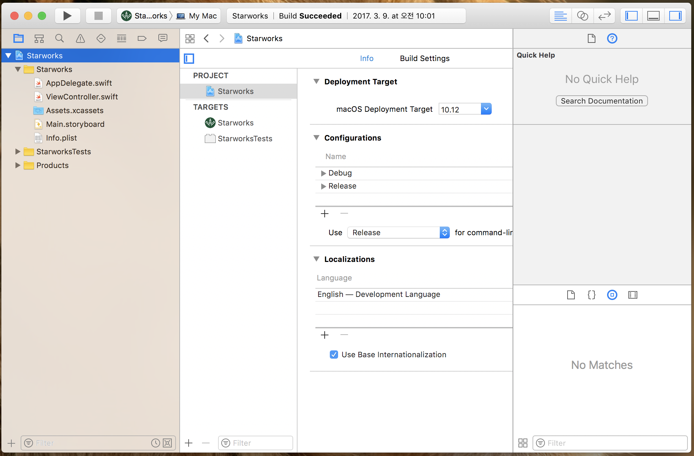

# 스타웍스 개발기 (4) - macOS 앱을 개발하기 위해 필요한 것

> macOS용 스타벅스 WiFi 자동 연결 앱을 만들며 기록을 남기고 있습니다. 그간 바쁘다는 핑계로, 개발기록은 커녕 개발 자체도 밀리고 있습니다. 오랜만에, 아니 드디어 그 (4)편을 남깁니다. 오늘은, 개발에 필요한 전반적인 사전 지식과 필요한 도구들을 소개할까 합니다. 꼭 스타웍스라는 앱 뿐만 아니더라도 일반적인 macOS용 앱을 만든다면 이런 것들이 필요하구나 라고 이해하시기 좋으리라 기대합니다.

## macOS용 앱을 개발하려면 MacBook Pro 같은 장비가 필요

너무 당연한 얘기인가요? 윈도용 응용프로그램을 개발하려면 윈도가 필요하고, 맥용 앱을 개발하려면 맥이 있어야하는 거죠. 그러나 한편, 안드로이드 스마트폰 같은 경우는 윈도나 맥이나 리눅스 환경에서 따로 개발하고 테스트하고 나서 최종적으로 목표 장비에 앱을 얹을 수도 있습니다. 이렇게 개발 장비와 운영 환경이 다른 경우도 있습니다. 전문용어로 크로스플랫폼 개발이라고 한다고 아는체 해봅니다. 또 다른 예로, 게임 콘솔인 플레이스테이션 같은 게임기에 올리는 게임 소프트웨어도, 개발은 윈도 PC에서 하는 것으로 알고 있습니다.

그런면에서, macOS용 앱을 PC에서 개발할 수는 없나? 생각할 수도 있지만, 아쉽게도(?) 그렇지는 않습니다. 반드시 macOS 장비가 있어야합니다. 첫번째 허들이죠. 비싼 맥 장비가 필요해요. 뽀대나는 맥북프로 한 대 장만하십시다. 상태 좋은 중고로 사도 괜찮아요.

## 개발도구인 Xcode 설치

윈도에 비주얼 스튜디오가 있고, 안드로이드 개발을 위해 안드로이드 스튜디오가 있지요. 흔히 Java 애플리케이션 개발할 때 쓰는 Eclipse나 IntelliJ같은 것도 포함해서 그런 도구들을 통합개발환경(IDE)라고 합니다. 아재의 아재들이 개발하던 시절에는 개발 절차의 갖가지 과정의 도구들이 따로 놀던 시절이 있었습니다(물론 지금도 애써 따로하려면 따로 할 수 있습니다). 소스코드 편집은 별도 에디터에서 하고, 컴파일러 따로 돌리고, 링커 따로 돌리고, 디버거 따로 돌리고, 이런 저런 도구들을 따로 골라서 쓰던 시절이 있었지만, 지금은 있는지도 모르겠는 볼랜드(Borland)라는 개발 도구 회사에서 출시한 터보 파스칼(Turbo Pascal) 이후로 통합개발환경(IDE)라는 것이 파격적인 성공을 거두고 널리 퍼지게 됩니다. 볼랜드는 지금으로 치자면 인텔리J를 개발하는 JetBrain사와 비슷한 존재일지도 모르겠습니다. 규모면에서는 더 컸을지도 모르겠네요. 아아, 아재 티나는 발언이겠지만, 옛 추억의 공감대를 느끼는 분들도 계실듯?

아무튼, macOS나 iOS개발에는 Apple 사에서 제공하는 통합 개발환경인 Xcode를 받아서 쓸 수 있습니다. 한 때 잠깐 유료로 판매한 적이 있었지만, 요새는 무료로 다운 받아서 쓸 수 있습니다.

이렇게 생겼습니다. 이 개발도구 하나로 소스코드도 작성해 개발하고 테스트하고 디버깅하고 애플 앱스토어에 올릴 아카이브도 만들고, 심지어 UI 구성요소 디자인까지 다 합니다. 모든 기능이 다 있는만큼 하나하나 알면서 쓰기는 꽤 방대하겠지만, 애플에서 잘 작성해 둔 튜토리얼 문서를 보고 하나씩 따라해보면서 익히는 게 배우는 방법인 것 같습니다.
