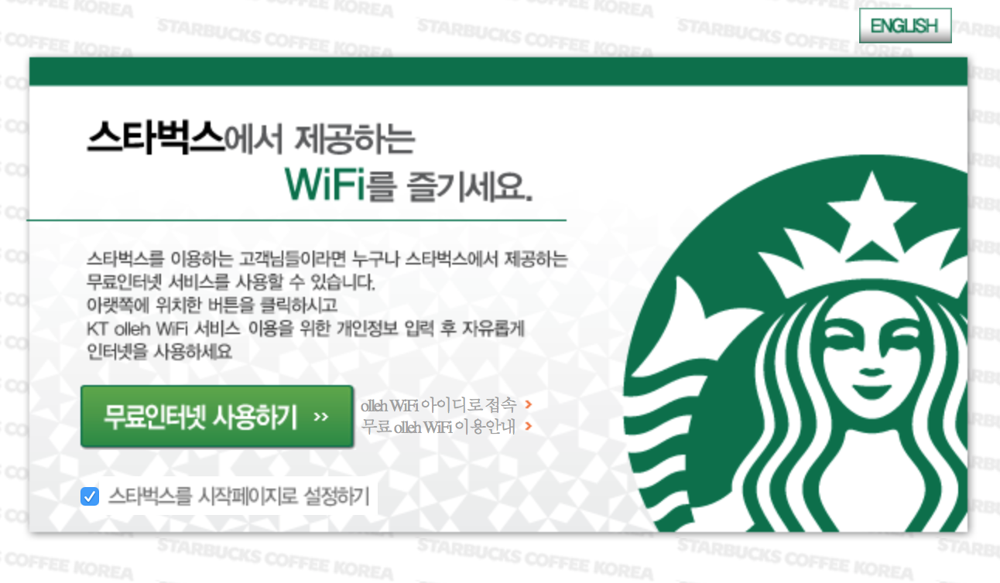
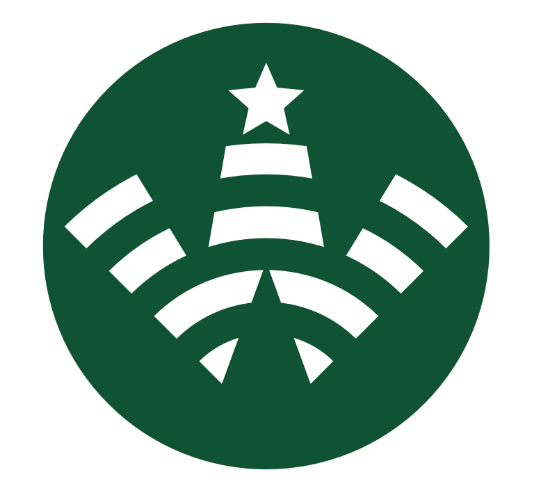
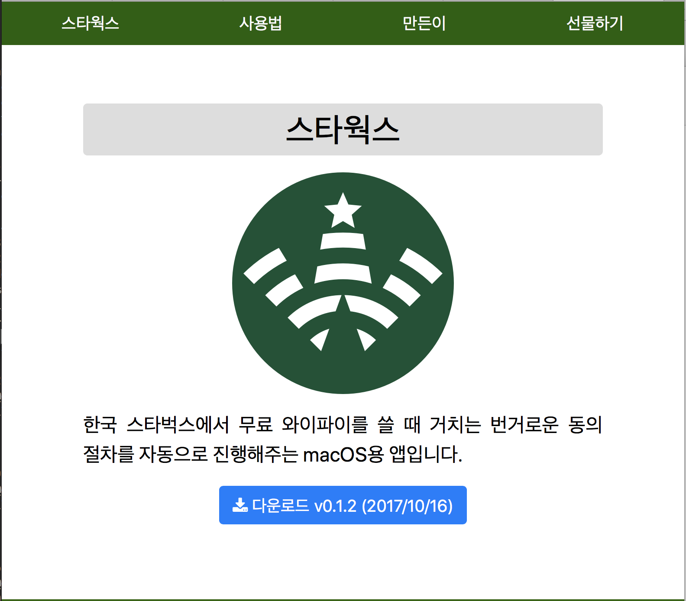
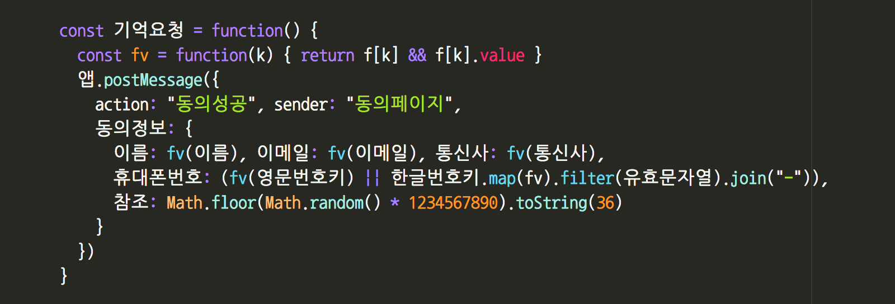

# 스타벅스 연결러 앱 공개 & 개발 후기

> 올해 초 진행하다 중단한 프로젝트를 뒤늦게 계속해서 마무리지었습니다. 스타벅스에서 무료 WiFi를 연결할 때 거치는 번거로운 과정을 자동화해주는 macOS 앱을 만들려는 프로젝트였고, 그 개발 과정을 친절히 남겨보겠다는 의욕과 함께 시작했으나, 이내 흐지부지됐더랍니다. 중간 과정은 건너뛰고, 드디어 앱만 후딱 개발해서 공개한  과정 이야기와 후기를 남깁니다. 여러분이 개발자라면, 자신도 겪었을 만한 비슷한 상황을 공감할 수 있는 내용일 테고, 개발자가 아니시라면, 개발자들은 어떤 고민을 하면서 뭔가를 만드는지 조금은 알게 되실만한 내용이리라 기대합니다.

## 스타벅스에서 만나는 불편한 화면



이 화면 보신 분 계신가요? 바로 스타벅스에서 WiFi를 쓰려면 만나는 화면! 이 화면까지는 참을 만 한데, 이름과 이메일 주소를 요구하는데다 이용약관과 개인정보보호 이용 동의를 체크해야 하는 번거로움이 있습니다. 일부러 의도한 것인지, 아니면 개발자가 번거로워서 처리하지 않은 것인지, 매번 같은 과정을 처음부터 진행해야 합니다.

저는 스타벅스를 일터 삼아서 매일이다시피 가기 때문에 그 귀찮음이 제 게으름을 뛰어넘어 "뭔가를 해야겠다"라는 의지로 변했습니다. 그래서 힘들여 macOS 앱을 만들어서 해결하겠다는 생각으로 커졌습니다.

그런데, 가만 생각해보면, 귀찮은 인증 과정에 필요한 시간과 노력보다 앱을 만드는데 필요한 정성이 훨씬 많이 들 것 같습니다. 저 개인의 손익을 따지자면 손해가 훨씬 큰 일인 거죠. 여기서 자기 합리화가 필요합니다. 만드는 노력이 훨씬 커서 낭비지만, 때로 내 집중력을 흐트러트리며 불편한 저 연결 창을 보는 것 보다 정신적으로 이로운 결과로 이어질 거라며, 그리고 난 macOS 용 앱을 만들어 보고 싶은 욕구가 있으니, 이 기회에 배우면서 만들어보는 경험을 얻게 될 거라고. 게다가, 다른 사람도 유용하게 쓸 수 있을지 모르니, 공익(?)의 측면에서느 절대 손해가 아니라며 말이죠.

> 거 참, 거창하네요.

그래서 올해 초, 아래 글들을 남기며 야심차게 진행했습니다.

* [(1) 스타벅스 WiFi 연결러 개발 시작](https://goo.gl/DPY6UD)
* [(2) 스타벅스의 WiFi 네트워크 분석](https://goo.gl/5iYVST)
* [(2.5) 오리지널의 의미](https://goo.gl/1nGfW3)
* [(3) 사파리 익스텐션과 웹킷 인젝션 ](https://goo.gl/dKc4md)
* [(3.5) 프로젝트 재시작 보고 ](https://goo.gl/nnWsQQ)
* [(4) macOS 앱 개발에 필요한 것](https://goo.gl/H121zk)

그러나, 이후 개인적인 일들로 프로젝트의 우선 순위가 밀려났고, 때마침, 스타벅스보다 자주가는 카페도 생기고, 다른 재미있는 일들에 우선 순위가 넘어갔지요. 지금 돌이켜보면, 당시 상황에 몇 가지 바쁜 일이 생긴 것도 있고, 결정적으로는 당장 해야하는 코드 작성보다, 코딩 패러다임에서 방황했던 것이 문제였던 것 같습니다. 평범한 이벤트 기반(Event Driven) 방식으로 개발하다가, FRP(Functional Reactive Programming)방식으로 바꿔 만들까 하는 욕심이 나서 정작 코딩은 안하고 딴 짓만 하게 됐던 거지요. 뭔가 배우면서 개발할 때의 함정 중 하나입니다. 익숙치 않은 방식을 배우면서 하려다 보면, 그 도구나 방식을 배우느라 정작 결과물에 들여야 할 노력과 정성이 다른 곳으로 새는 덫에 빠지곤 합니다. 그렇다고 익숙한 방식만으로 고수하면 발전이 없으니, 중간에서 줄타기를 잘 해야 하겠지요.

## 반 년 만에 마무리 작업

수 개월 시간이 흘렀고, 스타웍스 프로젝트와는 다른 별개 프로젝트 P도 중간에 지지부진하게 되었고, 스스로 이런 생각을 하게 되었습니다.

> 난, 참 뭔가 시작은 잘 하는데, 마무리를 어려워 하는 구나.

누구나 어느 정도는 비슷하겠지만, 이제 슬슬 "너무 이러면 안 되겠다"라는 반성이 든 거죠. 그래서, 그 다소 지겨워졌던 그 프로젝트 P를 애써 이를 악물고 마무리 지었습니다. 결과는 아무래도 만족스럽지 못하지만, 그래도 뭔가 하나 끝냈다는 성취감이 좋더라고요. 의욕과 정성이 넘치는 상태에서 잘 마무리지었으면 더 상쾌했겠지만요.

이런 상황에서, 스타웍스 앱에 쓰라고 사촌형이 그려준 로고가 생각납니다. 애써 로고까지 그려줬는데, 그냥 유야무야 되면 사촌형으로서도 아쉬울 것 아니겠습니까? 그리고 위 글들을 읽으며 응원해줬던 분들도 있는데, 결과가 조금은 궁금하지 않겠습니까?



> 그래, 거의 다 만들었던 건데, 조금 더 진행해서 마무리 짓자. 개발기 공유까지 진행하는데 무리가 있다면, 그저 앱이라도 만들어서 공개하자.

커밋 로그를 보니, 3월 24일이 지난 번 마지막 커밋이었고, 이번에 다시 시작한 작업이 9월 23일부터였으니 반 년 정도 잠자고 있던 코드였네요.

## 스타웍스 v0.1.2 공개

다시 개발 작업을 한지 3주만에 0.1.2 버전을 공개했습니다. 주변 지인들에게 공개했던 0.1.0 버전이 있었고, 몇몇 문제를 해결해서, 이제는 모르는 분들이 써도 괜찮을 것 같더라고요. 앱을 다운로드 받을 수 있는 웹사이트도 만들어서 나름 친절한 설명과 함께 올려두었습니다. (불친절하다고요? 개발자가 이 정도면 꽤(!) 친절한 겁니다 ㅋ)

주변 지인께 써보시라 권하고, 마음에 들면 SNS 공유를 부탁드렸습니다.  그 중 특히 산솔님이 소개해주신 글이 설득력이 강했는지 꽤 많은 분이 소식을 접했고, 생각보다 많은 분들이 앱을 보시고 다운로드도 받은 것 같습니다. 공개한지 얼마 안됐다는 점과, 목표 사용자 층이 매우 얇다는 점을 고려하면 꽤 많이 받아주신 것 같습니다.



뿌듯한 일이죠. 혹시 맥북(프로)를 쓰시면서 스타벅스에 자주 가신다면, 해당 앱 깔아서 띄워 놓으시면 편리하게 사용하실 수 있습니다.

## 개발하며 배운 점

개발기에 정리한 내용에도 대략 정리했습니다만, 스타웍스 앱은, macOS 앱 안에 WebKit 엔진으로 커스텀 웹 브라우저를 붙여 놓고, 해당 웹 브라우저의 문맥과 앱이 웹 소켓으로 메시지를 주고 받으며 스타벅스의 동의 화면이 나온다면 앱이 기억한 동의 정보를 대신 입력해주는 구조로 개발했습니다. 기존에도 이 스타벅스의 와이파이 연결 문제(?)를 해결하기 위해 크롬과 사파리용 확장 프로그램이 나와있는데, 그 방식과는 달리 각각 장단점이 있지요.

###  ECMAScript 2015 (ES6)

아무튼, 앱과 웹 화면을 넘나들며 건드려야 하다보니, 웹 페이지 측의 자바스크립트 코드도 열심히 작성할 필요가 있었습니다. 한가지 편했던 점은, 이 자바스크립트 코드가 결국 내장된 커스텀 WebKit 브라우저에서만 잘 보이면 되므로, 자바스크립트 코드 호환성 문제가 간단해진다는 점이었습니다. 호환성을 고려한다면 오래전 방식의 자바스크립트(ES5) 코드로 작성했겠지만, 지금 상황에서는 요새의 자바스크립트(ES6, aka. ECMAScript 2015)로 개발할 수 있는 거지요. 사소하게는 `let`/`const` 같이 지역 변수와 상수 선언 구문도 있고, 번거로운 세미콜론도 이제 없어도 됩니다.

그렇다고 ES6의 전부를 쓸 수 있는 것은 아니지만, 거의 대부분을 쓸 수 있습니다. 그리고 DOM Element에도 예전에는 없었던 함수들이 생겨서, 이제는 jQuery 없이도 문제 없는 수준인 것 같습니다. 거창하게 Vue.js를
쓴다면 꽤 우아하게 할 수 있겠지만, 그냥 날 것의 자바스크립트 코드로도 충분한 거죠.

``` javascript
document.querySelector("img[alt='동의']")
```

이런 식으로, CSS 쿼리 셀렉터로 DOM 요소를 찾아낼 수 있습니다. 그 외에도 많은 부분들이 요새의 웹 기술로는 jQuery의 필요성이 많이 줄어든 상황인 것 같습니다. 특히 이제는 Vue.js나 React를 쓰는 분위기니 더더욱 불필요해 진 거고요. 관련해서 아래 사이트에서 어쩌면 여러분 코드에도 jQuery 없어도 될지도 모른다는 설명이 잘 나와있습니다.

(영문) http://youmightnotneedjquery.com

결국 스타웍스의 경우, 완전히 통제된 환경에서 고작 서너 페이지만 잘 처리하면 되는 상황이어서, jQuery나 Vue.js같은 라이브러리 없이도 잘 처리할 수 있는 상황이었습니다. 조금 복잡도가 올라간다면 Vue.js나 React를 쓰면 될 테니, 이제 jQuery의 입지는 아주 좁아졌다고 봐도 되지 않을까 합니다.

### 한글코딩

평소 주장대로, 그리고 제 개인 프로젝트이니만큼, 부담없이 한글로 코딩했습니다. 스타웍스 앱에 작성한 스위프트(Swift), 자바스크립트(Javascript), CSS등에 한글로 표기한 부분이 꽤 있지요. 역시 혼자 작성하기에는 참 편리합니다. 애써 영어로 전환할 필요 없이 함수 수준에서 한글로 이름을 지으니 쓰고 읽기가 참 편합니다. 함수명에 의도가 한글로 잘 드러나니, 별도로 주석을 많이 달 필요도 줄어들고요.



앞으로도 개인 프로젝트에는 한글로 많이 작성할 것 같습니다.

그러나, 아직 한글 도메인명은 조금 이른 것 같습니다. "스타웍스.com"의 경우, 동작 자체는 이제 어디서나 문제가 없기는 한데, 사소하게는 페이스북 페이지에 노출되는 URL이 그냥 xn--.com 처럼 국제 도메인명을 지원하지 않고 있어서, URL이 이상해 보이는 문제가 있습니다. 한글코딩 때와는 달리 네이버에 검색 사이트 등록을 할 때에도 아주 매끄럽게 잘 처리되어서, 곧 검색 노출이 될 것 같습니다만, 그래도 거슬리는 부분이 더러 있습니다.


https://twitter.com/starworksapp/status/920883109968592896

링크된 사이트 안내 카드에 URL 부분이 눈에 거슬립니다.

## 기프트웨어

개인적으로는 무료 소프트웨어를 좋아하지 않습니다. 물론 사용자 입장에서 유용한 소프트웨어를 공짜로 쓸 수 있는 게 돈을 내는 것보다 당장은 더 좋습니다만, 그런 구조로는 지속성이 없지요. 제가 예전에 다닌 회사가 결국은 광고로 돈을 버는 회사인 셈인데, 그 기본은 다수의 이용자를 확보한 뒤, 광고를 적절히 노출할 기회를 활용해서 광고주에게 돈을 받는 구조입니다. 사실 페이스북이나 구글도 광고 회사이긴 마찬가지입니다. 기술은 잘 활용하는 수단이고, 목적은 광고로 수익을 내는 회사인 거지요. 문제는 이런 회사들의 경우 광고의 가치가 높은 서비스, 즉 아주 많은 사람들이 쓸만한 서비스 자체, 또는 그 서비스에 유입을 높여주는 서비스에 집중하기 마련입니다.

그래서 무언가 기대 가치 규모가 적은 서비스들은 적은 수익으로도 문제가 없거나, 아니면 아에 수익이 없어도 괜찮은 단체나 개인이 만들게 되지요. 적은 사람들이 쓸 소프트웨어 서비스라면 유료로 비용을 지불하는 것이 서비스 개발이나 유지에 도움이 됩니다. 없는 가치를 만들어 내서, 이용자가 내는 비용보다 나은 가치를 제공하면 되는 거지요. 한편, 이미 큰 회사들이 무료로 제공하는 고품질의 서비스를 쓰는데 익숙한 소비자들이, 유료 서비스를 이용하는 데에 인색해지기 쉬운 상황이지만 그래도 요새는 유료 앱을 사는 것이 꽤 흔한 일이기에 소프트웨어에 돈을 지불하는 것에 꽤 관대해진 것 같습니다.

한국 스타벅스에서 맥북을 이용하는 사람들을 위한 앱이요? 글쎄요, 무료로 공개해도 많아야 천 명은 쓰게 될까요? 천 명이 매일 쓴다고 해도 광고 수익이 의미 있을 플랫폼은 아니고, 유료로 판다고 해도 백 명은 구매하실까요?  그래서 이런 사소한 소프트웨어는 아예 개발자가 만들 노력을 시작하기도 쉽지가 않습니다. 한마디로 수익성이 없는 거지요. 아예, 수익 따위는 생각하지 않고, 그저 개인 경험이나 보람을 목적으로 하는 것이 현실적인 것 같습니다. 보람이 목적이라면 더 많은 사람이 유용하게 쓰는 것이 나을 테니 무료로 하는 편이 좋을 것 같습니다.

하지만, 저같은 개인 개발자가 무언가 개발할 거리가 있을 때, 조금이라도 의욕을 내어 노동을 하는 데에 작더라도 당근이 있다면 더 좋을 것 같기는 합니다. 하다못해, 애플 개발자 프로그램을 등록하는 비용이나 도메인 비용만이라도 충당할 수 있다면, 조금 더 많은 개발자들이 부담없이 소규모 사용자에게도 유용한 소프트웨어를 만들게 되지는 않을까 하는 생각이 드는 거죠. 그러다 어쩌다 정말 유용한 소프트웨어가 번듯한 수익을 내는 사례가 많아진다면,  더 좋은 선순환의 고리를 탈 것도 같고요. 아아, 이런 거창한 생각은 그냥 그럴듯한 포장이고, 그냥 뭔가 제 노동에 대한 가시적 대가에 욕심이 났다고 사실대로 고백합시다.

결국, 무료로 일단 공개는 해서 사용자는 천 명까지 바라보면서, 약간의 수익을 얻겠다는 욕심을 부렸습니다. 흔히 기부 방식의 소프트웨어가 그러합니다. 일단 무료로 소프트웨어나 서비스를 제공하고, 유용하게 쓰는 분들 중 일부가 응원하는 마음으로 기부금을 지불하는 거지요. 페이팔을 기부 버튼을 붙일까 잠시 고민해 보았습니다만, 아무래도 큰 의미가 없을 것 같습니다. 기부금이 들어올 가능성은 매우 낮은데, 애써 페이팔 같은 기부금 시스템을 붙이는 것도 번잡한 일입니다. 기술적으로 붙이는 것은 간단해 보이는데, 법적으로 (또는 세무상) 어떻게 해야할지 감이 오지 않습니다.

그래서 편하게, 스타벅스 기프트 카드를 받겠다는 설명을 붙여두었습니다. 평소 스타벅스 연결을 불편하게 여겼던 분들 중 일부가 이 앱을 유용하게 쓰면서 정말 편해졌다면, 커피 한 잔 쯤은 제게 선물로 사주실 수도 있지 않을까 하는 기대를 하면서 말이죠. 그래서 이른바 기프트웨어. (이런 단어를 원래 쓰는지 안 쓰는지는 모르겠네요)

과연 기프트 카드를 보내주는 분이 계실까요?

가까운 지인 두 명과, 느슨한 연결 고리의 지인 한 분이 보내주셔서, 오히려 살짝 미안해졌습니다. 앱을 공개하고 지인들에게 기프트 카드 보내달라고 떼 쓴 것 같아서 말이죠. 다행히 모르는 분 한 분이 보내주시기도 해서 조금 마음이 나아졌습니다만. 암튼, 벌써 네 분이 보내주셔서, 이 정도면 충분히 좋은 가치를 주고 받은 것 같아서 뿌듯합니다. 손익을 떠나서 감사한 일입니다.

## 더 크게 얻은 점

그리고 고마운 기프트 카드보다 더 크게 얻은 점은, 제가 즐겨하던 개발 일의 모습을 되찾은 일입니다. 기술적으로 세련되고 우아한 것들을 배우고 활용하는 것도 행복한 일입니다만, 그리고, 업무로 일하며 생계소득을 구하는 것도 아주 행복한 일입니다만, 제가 더 좋아하는 일은 사소하게나마 남들에게도 유용한 소프트웨어를 만드는 일이라는 걸 새삼 되새기게 됐습니다. 물론 그런 일로 돈을 벌 수 있으면 참 좋지만, 그게 어디 쉬운 일인가요? 제가 정말 예술가라서 내가 하고 싶은 걸 해도 누군가 가치를 높게 평가해준다면 모를까, 그렇지 않은 입장에서야, 직업적인 개발과 취미로 하는 개발을 분리해서 하는 것도 나쁘지 않은 방향인 것 같습니다.

저는 물론, 주변 개발자들을 봐도, 어떻게든 처음에는 개발이 즐거워서 시작했지만, 이내 직업적인 개발이라는 것은 그 재미가 반감되는 일들이 많기 때문에, 개발 자체에 대한 흥미가 식는 경우가 많습니다만, 그건 참 아쉬운 일인 것 같습니다. 개발이 참 재밌는 일이거든요. 재밌으면서도 유용할 수도 있는 참 좋은 분야인데, 직업화되면 거기서 또 다른 일들에 너무 바빠서, 여유 시간에까지 개발을 하고 싶지는 않아지는 거지요.

그런면에서 이런 사소한 프로젝트도, 보람도 챙기고, 스스로 재미도 되찾는 계기로 삼을 만한 일이 아닌가합니다. 어떠신가요? 보시는 여러분도 사소하게나마 작은 프로젝트 하나 막 시작해보고 싶지 않으신가요? 그렇게 시작해서 개발의 재미도 되찾고, 더불어 어쩌면 약간의 수익도 발생한다면 저로서도 참 응원할만한 일인 것 같습니다.

사소한 프로젝트 치고 참 요란한 후기 끝까지 읽어주셔서 고맙습니다.
