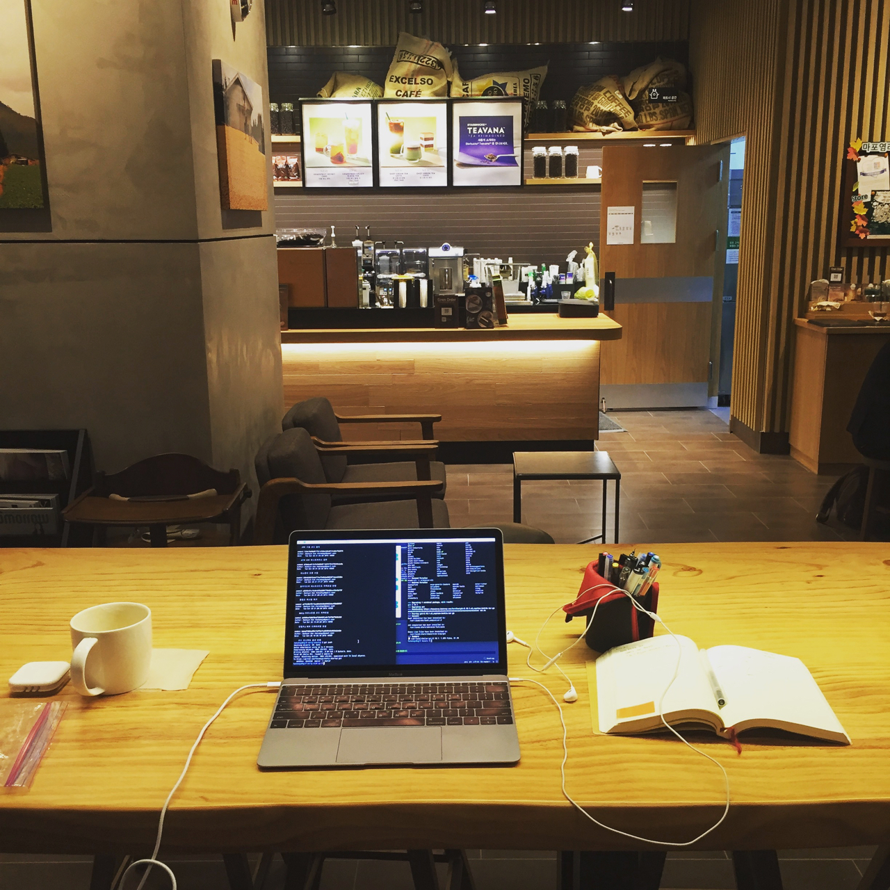
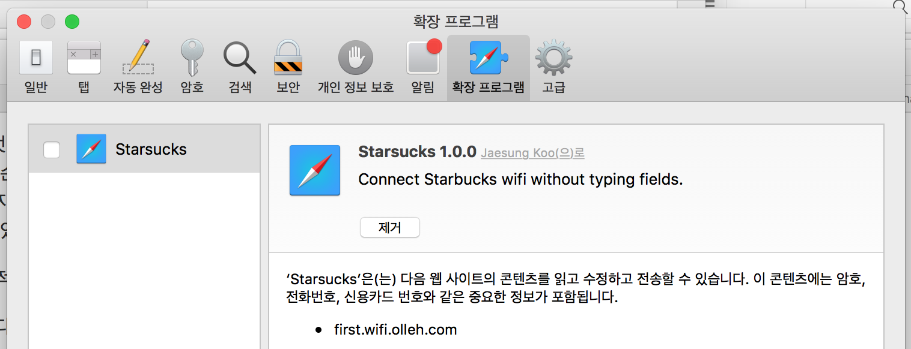

# 2017년 첫 개인 프로젝트: 스타웍스 개발기 (1) - 시작

제 미디엄 구독자 여러분 새해 복 많이 받으세요. 오랜만에 개발기 시작합니다. 올해 첫 개인 프로젝트인데, 개발하는 과정을 글로 남기려 합니다. 다 만든 다음에 정리하는 것 같은 깔끔한 맛은 없겠지만, 대신 그때마다 신선한 내용으로 내가 같이 개발하는 느낌을 줄 수 있기를 기대합니다. 댓글을 남겨주시면 관련 주제를 조금 더 설명하는 등의 상호작용도 가능하겠으나, 댓글을 남겨주시는 분이 계실지는 모르겠네요. ㅎㅎ

암튼, 이번 프로젝트는 저로서는 처음으로 macOS 앱을 만들려 합니다. 해결하고자 하는 문제는 무엇이냐면...?

이 화면 보신 분 계신가요? 바로 스타벅스에서 WiFi를 쓰려면 만나는 화면! 이 화면까지는 참을 만 한데, 이름과 이메일 주소를 요구하는 데다 이용약관과 개인정보보호 이용 동의를 체크해야 하는 번거로움이 있습니다. 일부러 의도한 것인지, 아니면 개발자가 번거로워서 처리하지 않은 것인지, 매번 같은 과정을 처음부터 진행해야 합니다.

제 경우, 스타벅스를 일터 삼아서 매일이다시피 가기 때문에 그 귀찮음이 제 게으름을 뛰어넘어 "뭔가를 해야겠다"라는 의지로 변했습니다.

그래, 이 귀찮은 문제를 해결해 보자. 이것이 올해 첫 개인 프로젝트의 시작입니다. 개발자라면 맥용 앱을 개발하는 과정을 옆에서 보는 재미가 있을 것이고, 스타벅스에서 맥북/프로를 쓰시는 (잠재고객) 분들이라면 이 글의 결과로 만든 앱을 써서, 편리하게 WiFi를 쓰실 수 있을 거예요.

## 스타벅스 만세, 그리고 한 가지 아쉬운 점

여러 카페들을 돌아다니다 일하다 보니, 카페마다의 개성과 매력이 있지만, 결국 일하기 좋은 카페는 스타벅스더라는 결론에 이르렀습니다. 저만 그런 것은 아닌지, 스타벅스에 노트북 들고 와 일하시는 다른 분들도 많아 보입니다. 그중에 맥을 쓰시는 분들도 많고요.

스타벅스의 장점이 여럿 있겠지만, 우선 일찍 열고 늦게 닫습니다. 튼튼한 책상이 군데군데 있어서 랩탑을 놓고 쓰기도 편하고, 필기를 해도 흔들리지 않아서 좋습니다. 손님이 늘 많아서 꾸준히 시끄럽기 때문에 적당한 화이트 노이즈가 유지됩니다. 조용한 카페는 오히려 가끔 시끄러운 팀이 오면 집중도가 확 떨어지지요. 그리고, 스타벅스에서 제공하는 스마트폰 앱에서 주문을 할 수도 있어서 편리합니다. 와이파이와 더불어 꽤 중요한 점으로, 전원 콘센트가 있어야 한다는 점인데, 군데군데 콘센트가 있는 자리가 꽤 있어서 문제없습니다.

그리고, 아무래도 핵심은, 전체적인 분위기가 서너 시간씩 앉아서 개발하고 있어도 눈치 보이지 않는 환경이라는 점입니다.

딱 한 가지 아쉬움이 있다면, 바로 그것은 저 귀찮은 WiFi 이용 동의 과정! 다행히 하루 한 번만 하면 됩니다. 오전에서 작업하고, 오후에 다른 매장에 가면, 오전에 동의한 내용이 남아서 별도 인증을 거치지 않습니다. 아마도 하루 단위로 인증처리를 유지해 주는 것 같습니다.

## 이미 해결한 문제

사실 아주 큰 문제는 아니고, 하루에 한 번 1분 남짓한 시간을 뺏는 미미한 번거로움이기 때문에, 그냥 무시하고 참고 넘어가도 됩니다.

근데 저만 그렇게 짜증 났던 것은 것은 아닌지, 이미 누군가 이 문제를 해결했습니다. 사파리와 크롬 확장 프로그램으로 스타벅스에서 동의한 내용을 기억했다가, 또 같은 과정을 만나면 자동으로 진행해 줍니다. 아주 훌륭합니다. 이제껏 언급한 문제를 해결하시려면 해당 확장 프로그램을 설치해 사용하시면 됩니다.

## Re-inventing the Wheel

처음에는 제가 해당 확장 프로그램의 설명서를 막 읽었는지 제대로 동작하지 않았습니다. 그래서 "아, 크롬에서는 되고 사파리를 기본 브라우저로 쓰면 안 되나 보다" 생각했더랬지요. 나중에 더 알아보니, 크롬과 사파리 모두 잘 되는 것인데, 그전에 터미널에서 시스템 옵션을 하나 꺼줘야 하더군요. 암튼, 이미 잘 된다는 점을 알았을 때는, 이미 전 나름의 개발 작업을 시작한 뒤였습니다.

어쨌건, 직접 만들어 쓰는 것도 재미있을 것 같습니다. 그리고, 좀 친절한 설명을 곁들이면, 개발자가 아닌 분들도 조금은 쉽게 쓰실 수 있지 않을까 하는 기대도 되고요.

## 사파리 확장 프로그램(extension)

조금 전, 이미 공개된 확장 프로그램(extension)이 문제를 해결했다고 말씀드렸습니다. 브라우저 확장 프로그램은 이용자가 별도로 익스텐션을 받아서 설치하거나, 아니면 온라인 익스텐션 브라우저에서 골라서 받을 수 있습니다. 마치 앱스토에서 앱을 받듯이, 익스텐션을 받을 수 있는 곳에서 받아다가 설치할 수 있으니, 받아서 쓰는 것은 꽤 편리한 편입니다.

확장 프로그램이 동작하는 방식은, 별도의 자바스크립트(.js)나 스타일시트(.css) 파일을 브라우저에 첨가해서, 특정 사이트나 전체 사이트의 내용이나 모습을 조작하는 식입니다. 광고 차단 프로그램도 특정 사이트마다의 특정 DOM 엘리먼트를 안보이게 가리거나 제거해버리는 식으로 기능합니다.

스타벅스 WiFi 로그인 확장 프로그램의 경우는, 해당 사이트를 만나면, 특정 버튼을 확장 프로그램이 대신 눌러주고, 이름과 이메일 주소도 이전에 입력한 값을 기억했다가 대신 입력해주는 식으로 작동합니다. 적절히 문제가 해결된 것이죠.

## 내가 구현한다면

이미 해결된 문제라 재미가 없어졌지만, 그래도 직접 개발한다면 어떻게 달라질까요? 아마 그냥 똑같은 방법으로 끝날 수도 있고, 아주 사소하게 달라져서 별 의미가 없을 수도 있습니다만, 일단 달려봅니다. 적어도 제게는 또 새로운 분야의 개발 경험이 쌓일 텐데, 읽으시는 분들께는 어떤 의미가 있을지 모르겠네요.

그럼, 앞으로도 부탁드립니다. 댓글/추천/공유/구독 환영합니다! 언제나 그렇듯, 추천을 누르시면 다음 편이 빨리 올라옵니다. ㅋㅋㅋ
