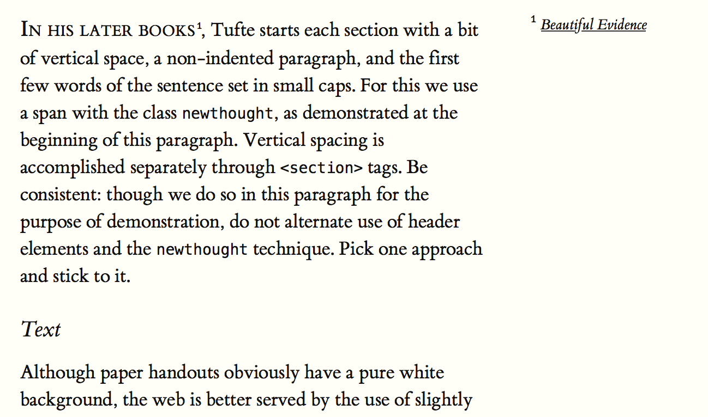

# Tufte-CSS를 보고

개발자도 글을 써야 한다. 개발자가 글을 써서 누군가에게 보일 때, 가장 좋은 방법은 언제 어디서나 접근할 수 있는 웹페이지를 올려놓고, 그 주소(URL)를 공유하는 방법일 테다. 웹페이지를 꾸미는 방법은 다양한데, 얼마 전 알게 된 [Tufte CSS]를 쓰면 꽤 유용하게 쓸 수 있을 것 같다.

[Tufte CSS]는 데이터 시각화 분야의 창시자인 [에드워드 터프티(Edward Tufte)][Edward Tufte]가 강의 노트나 책을 쓸 때 쓴 스타일을 바탕으로 했다. 터프티 스타일은 매우 간결하고 [각주와 측주](https://ko.wikipedia.org/wiki/각주)를 적극적으로 활용하는 점이 특징이다. 측주(sidenote)는 생소한 단어인데 본문 왼쪽이나 오른쪽에 바로 주석을 붙이는 것을 말한다.

터프티의 스타일을, 책 같은 인쇄물이 아니라, **웹페이지로 보기에 좋게끔 CSS로 만든 것**이 [Tufte CSS]이다. [Tufte CSS]는 [Dave Liepmann]이 만들었는데, 지금은 에드워드 터프티 프로젝트의 하나가 되었다.



그림처럼 매우 간결한 것이 특징이다. 하이퍼 텍스트 링크조차 아무런 색상 없이, 밑줄만 그어서 표시한다. 오로지 본문의 내용에 충실하다. HTML에 여러 단계(h1 ~ h6)로 나뉘는 제목 구분조차, 터프티 스타일은 단 두 단계만 쓴다.

마음에 들었다. 이걸 가져다가 HTML을 꾸미면 글 써서 공유하기에 좋겠다. 그런데, 이걸 날 HTML로 표현하자면 좀 번거롭잖아. 우리 개발자가 사랑하는 마크다운으로 표기할 방법은 없을까?

## 마크다운

다 알다시피, [마크다운(markdown)](https://daringfireball.net/projects/markdown/)은 사람이 평범히 읽을 수 있는 텍스트 표기만을 쓰되, 제목, 링크, 이미지 등의 간단한 꾸밈을 넣어서 처리하겠다는 취지의 마크업 언어다. 간단한 데다, 보통의 텍스트 에디터로 편집할 수 있고, 그러니 당연히 `diff` 처리도 편하니 개발자들이 사랑할 수밖에 없다.

> 마크다운으로 작성한 텍스트를 [Tufte CSS]로 입혀 보일 수는 없을까?

나만 이런 고민을 한 것은 아닌지, [깃헙 이슈 #21](https://github.com/edwardtufte/tufte-css/issues/21)에 활발한 토론이 이어졌다. 이슈 토론을 요약하자면, [Pandoc]을 이용하거나, [Jekyll]로 웹페이지를 만들되, 마크다운 안에 [Jekyll]에서 쓰는 Liquid 마크업을 덧붙여 쓰자는 내용이다. 그런 아이디어로 누가 벌써 [tufte-jekyll]이라는 뼈대를 만들어 놨다. 훌륭하다!

[Jekyll]을 쓴다면, 저 템플릿을 가져다가 간단히 블로그를 꾸며도 될 것 같다.

## 다른 방법은 없을까?

별도 마크업이 아니라, 마크다운을 조금 확장하는 방법은 없을까? 터프티 스타일의 나머지는 다 처리할 수 있을 것 같은데, 뜻밖에 측주는 커녕 미주조차 마크다운 문법에 없다.

미주까지는 그래도 이미 많은 사람이 고민한 것 같다. [Pandoc에도 미주를 표현하는 확장](http://pandoc.org/README.html#footnotes)이 정리돼 있다. 이 방법을 처리하게끔 자신이 쓰는 마크다운 처리기를 조금 손보면 되지 않을까?

기본 문법은 \[^1\]처럼 마크다운 링크 문법처럼 쓰되, 캐럿 기호를 앞에 붙인 숫자를 적겠다는 아이디어이다. 기존 마크다운 문법과도 잘 어울리는 표기법인 것 같다.

여기에 측주까지 더한다면, \[>1\] 처럼, 캐럿 기호 대신 부등호를 쓰면 될 것 같다.

## 구현 아이디어

평소 쓰는 마크다운 처리기는 [marked]인데, 설명을 살펴보면 렉서와 파서를 조금 건드릴 수 있게 돼 있다.

### marked에서 렉서 접근하기

``` javascript
var tokens = marked.lexer(text, options);
console.log(marked.parser(tokens));
```

``` javascript
var lexer = new marked.Lexer(options);
var tokens = lexer.lex(text);
console.log(tokens);
console.log(lexer.rules);
```

아직 직접 해 본 것은 아니라, 잘 될지 모르겠지만, 각주를 넣는 문법도 처리할 수 있게 확장하고, 제목(h1~h6)처리는 두 단계만 하게끔 축소하고, GFM이나 테이블 문법 등도 가차 없이 제거하면 마크다운을 [Tufte CSS]로 보이게 하는데 편리할 것 같다.

물론, 적절한 한글 표현을 위해 글꼴을 골라 넣고 하면 쓸만할 것 같다. 간단하게는 개인 블로그를 그렇게 꾸미면 좋겠고, 좀 더 거창하게 나간다면, 깃헙에서 웹 훅 받아서 페이지 생성해서 보여주는 웹사이트로 만들어도 재밌을 것 같고.

어디까지나 아이디어일 뿐이긴 해도, 괜찮을 것 같다.

[Edward Tufte]: https://en.wikipedia.org/wiki/Edward_Tufte
[Dave Liepmann]: http://www.daveliepmann.com
[Tufte CSS]: https://edwardtufte.github.io/tufte-css/
[Pandoc]: http://pandoc.org/
[Jekyll]: https://jekyllrb.com
[tufte-jekyll]: https://github.com/clayh53/tufte-jekyll
[marked]: https://github.com/chjj/marked
